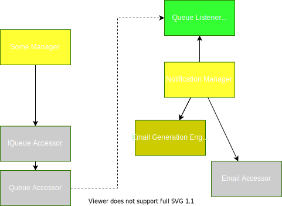
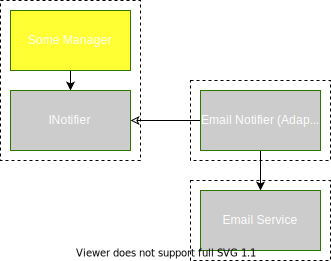

# SOLID Notification Refactor Case Study

A clear and general design for integrating notifications (email, text, push, etc) has long eluded me. However, a recent refactor using the concepts of [Synthesizing Project Organization Methods](2020-07-10-Synthesizing-Structure.md) has settled my search. Here I'll explore my refactoring experience and why the conceptual shift is generically more stable. 

*Note*: I now use SOLID Structure as the name for the code organization pattern described in [Synthesizing Project Organization Methods](2020-07-10-Synthesizing-Structure.md). 

## Current System

The system I'm working on tries to abstract notifications through an EmailAccessor that hides the SMTP framework and an EmailGenerationEngine that creates email content from data and hides a templating framework. The EmailGenerationEngine returns contracts containing address information and the full html email, which can be passed to the EmailAccessor. Some of the notifications are also made background tasks by queueing a message to a a bus and processing it in a general NotificationManager.



## New Constraints
The company I'm working for now needed to white label our system. Emails need to branded per white label customer and adapted quickly to changing product positioning. Requiring feedback cycles between developers and business people for every email just isn't a tenable solution. Instead we wanted to define email on a remote service where we could edit them visually. This meant emails must be sent by calling an api with the template ID and data instead of generated locally (at least for the popular and trusted services we researched).

## The Problem
This is a reasonable desire and completely in line with the system's notification needs, but it blew up the system's notification design.

The original design seems like reasonable services trying to hide reasonable decisions, but it only hides frameworks and doesn't hide that we rely on email or that the emails are generated locally. Further, using these services is the lowest energy decision when we allow our services to depend on external abstractions. This causes the coupling to spread to many consumers. The result is that every service that sent a notification directly knew about the organization process for sending an email and had to be changed. 

I would argue that this isn't just a flaw of the system I was working on but a general issue with trying to directly consume a shared notification service. 

First let's look at the information we want a notification system to hide
 - The notification medium (email, text, push, phone, etc)
 - How the notification contents are generated (i.e. templating, where templates live)
 - Technology used to send the notification (e.g. sendgrid, twilio, mailchimp)
 - The number and type of notifications sent (e.g. on user signup may email user but also notify a business person to follow up with them)
 - From the calling side, we want to specify the minimal information necessary and nothing specific to the notification medium

What we've just described is really an event system.

Suppose we choose a better event-like design. Only minimal data is included on the event and the event subscriber uses that information to look up the rest of the information it needs to compose and send a notification. This further abstracts the notification medium, message construction, and number of recipients from the business flow.

The flaw is the event data. What should be the minimal data contract of this general event system? Every component of the system will have a different answer for that. In my refactoring, I had events that required a just a user ID, just the ID for some other entity, and certain identity events that required both a user ID and a verification token for security purposes. 

We could have the notification system take a base object or a generic type parameter, but then how does the notification system retrieve the data? It has to know how to fetch data all the different services' events and the notification system is highly coupled to the rest of the system. We've also lost type enforcement and could be tempted to pass excessive data to the event handler.

We could have the service implement some generic handler registration, but that pushes concrete notification implementations back into each of the services and distributes framework or medium-specific code to every service. 

The notification system is trying to juggle the needs of too many consumers and has no stable solution.

## Solution 
Now let's abandon the idea of a central generalized notification/event system. Instead let's use the SOLID Structure concepts. 

This means each service defines it's own dependency abstractions, exposes extensibility to callers generically, and uses thin adapters to bridge the gap (of generic outward interfaces to specific dependency abstractions).

Creating a simple event system is the lowest energy thing I can do for a service to send an unknown notification without considering other services.  

Here's an approximation of one of my types
```cs
public struct IdentityEvents{
    public static IdentityEvents ConfirmEmail; 
    public static IdentityEvents ResetPassword; 
    public static IdentityEvents BrandRegistered; 
}

public interface IIdentityNotifier{
    void Notify(IdentityEvents event, UserId userId, SecurityToken token);
}
```
> Aside: This solves the key issue with the generalized notification system while allowing us to maintain the best aspects of that design.

I can easily write all of my identity related flows including notifications with just this notifier abstraction. It actually helps me ignore notification details in my business flow. I can trivially add new event types that are natural to the flow and decide if each gets handled later.

It's not hard to see that implementing multiple notification event handler would lead to a lot of duplicate code for templating and sending emails (though not really more duplication than I had). Fortunately, creating a generalized email service under these condiditions is much easier than the generalized event system discussed before. The adapter doesn't need to be abstracted from the fact that we're sending an email and can split off the responsibility of getting event data. This leaves the genericized email service with matching up a registered template to some identifier, applying data to the template, and sending the email. Any domain or usecase knowledge is pushed to the adapter in the same way that any notification knowledge was pushed from our service to the adapter. This means we can reuse the email service for any adapter and in any program.

The adapter has also stayed thin and focused. It is only concerned with mapping the events to the email service: ensuring the right templates are registered, fetching data needed for the template, and calling the email service with the right template ID and data.

Further, the dependency we've defined is much simpler and more generic. It better represents the idea of notifying some event in the service, allowing us to extend the service with many tightly focused implementations.



## Summary Notes

Notice how emails started as part of the business flow and got pushed out, eventually resulting in a new and clear generalized service. The selfish service design of SOLID Structure makes Single Responsibility Principle (or Information Hiding) a more natural and low energy choice. This separates out cross-cutting concerns. The cross-cutting concerns can then be collected and addressed directly. This closes the gap between our own utility implementations and potential 3rd-party solutions. Many cases (e.g. user management, payments, feature flags, logging) already have robust 3rd-party solutions which this pattern can easily consume without mixing them into core services. You may still wrap some of these utility-like concerns for framework portability, but the wrapper hides much less of their power since we are wrapping them in line with their original purpose and defer business flow adaptation to the service adapter layer.

In short, SOLID Structure helped me to discover a strong general notification system by focusing my design decisions to one service and making Information Hiding the lowest energy decision.