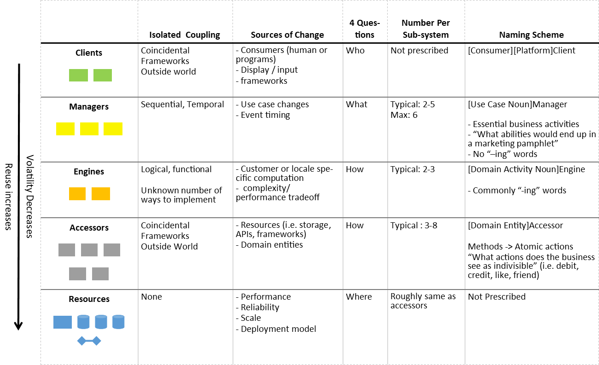
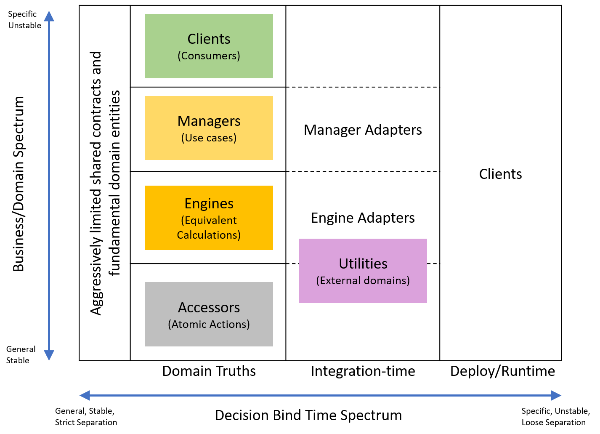

# SOLID Structure Refined Explanation

I've been thinking hard on the drivers and consequences of the SOLID Structure pattern. I want to be able to concisely explain the patterns so that others can visualize how to do it and why they'd want to. Here's a first attempt.

First, here are some posts i've written on the topic so far
- [The original idea](2020-07-10-Synthesizing-Structure.md) 
- [Notification Refactor Case Study](2020-08-05-Notification-Design.md)
- ???

## Organization
SOLID Structure effectively crosses two different layered architectures into one system: IDesign and Clean Architecture.

**IDesign**

IDesign layers code by role in the business domain. Every layer and service represents some essential aspect of the domain

**Clean Architecture**

Clean Architecture layers based on relevance to the domain. The most stable business abstractions are the foundation, then uses cases, then adapters, and finally external "mechanisms". This ordering emphasizes callers owning their abstractions so that the system moves to the convenience of the more fundamental business rules.

> Aside: creating SOLID structure is actually what helped me better understand Clean Architecture and how it differed from IDesign. The names in the layers can be distracting, focus on the names for the colored layers (also see [Robert Martin's post](https://blog.cleancoder.com/uncle-bob/2012/08/13/the-clean-architecture.html))

*Enterprise Business Rules*: sadf

*Application Business Rules*: adfa

*Interface Adapters*: asdf

*Frameworks and Drivers*: asdf

**Solid Structure**

// TODO: It may be that accessors are really just a class of manager dependency abstraction... Need to think about how that would mean with generalizing services with usecase change and also about potential code duplication. The short of this is that the IDesign service boundaries may not hold up and just clean arch will remain. I should resolve that concern before I publish

Solid Structure turns the business services of IDesign into a reusable library for the domain. Pushes services to be self-contained and defers choices of scale, deployment, and runtime to other layers similar to Clean Architecture.

Core Rules
1. Selfish (Self-contained) service design
   - Generic outward extensibility
   - Own dependecy abstractions  
2. Adapt to bridge general services to specific dependencies
3. As use cases change, services get more general

Layout

Here are the Clean Architecture layers, but with more specificity to mesh with the IDesign Layers and clarify decision-time categories.
- *Enterprise Rules / Shared Contracts and Entities*: These should only be the most fundamental and unchanging abstactions. For example, not every service needs it's own logging interface. Should be abstractions that could be shared between all company applications. 

TODO need to re-evaluate this layer because clean arch has no frameworks in the logic layer
- *Application Business Rules / Domain Truths*: The classic IDesign layers that encode the core domain. Should not directly reference external domain like utilities. May contain some limited frameworks for defining the business flows. Should never change for differences in scale or deployment. Each service should be self-contained.
- *Adapters*: Fulfills the domain dependency abstractions. May map to a lower-layer domain service or to a utility/external service. This is where decisions of scale like event systems, communication protocols, and remote calls are made. Also likely binds flexibility concerns like email or identity systems business people can manage.
- *Clients, Frameworks, and drivers*: Determines the final mix of adapters needed to deliver a running product. These are the assemblies that will be deployed to concrete infrastructure. Responsible for configuring concrete resources like databases, log stores, files stores, etc. 

## Consequences
- Guidelines for every piece of code
  - Clear division of internal domain concepts
  - Clear divisions and when/where tangential domains (usually meaning external frameworks) should be integrated
  - Clear guidance for when decisions are bound
- Reduced scope for most design decisions
  - Services are self-contained
  - Adapters have intrinsically limited scope of mapping one a single service dependency to another generic service
- Separation of scale and integration concerns from business concepts
- Easy to split code by teams, publish reusable packages
  - Services are completely isolated
  - Can easily split adapters into assemblies by service who's contract they fulfill and library that fulfills it
- Bridge the gap with libraries-style extensibility
  - Lays out our code the same way we expect of libraries
  - Our domain services become an extensible library of their own

## Waffling
- I'm not convinced that clients really belong in the business spectrum. I left them because they do relate nicely to who you expect to consume your system from a domain standpoint. Their implementation fits much more cleanly in the Bind-time spectrum though. They are the final arbitor of what mix of services and adapters are used. They are also pretty loose about mixed/consolidated deployments.
- I'm unsure if managers and clients should use an adapter layer. Managers effectively act as adapters to the clients by assembling use cases, but there is usually also some model mapping for the clients.
- I'm unsure if accessor implementations should live in the domain truth column or adapter/integration-time column. Accessor abstractions definitely live in the domain column. 

## Build Consequence Suspicions
I suspect SOLID structure will improve build times and produce more deterministic dependency chains. The IDesign-style domain services do not depend on each other and can be built in parallel. They will also have very few external frameworks. Frameworks will mostly only have to undergo one copy from an adapter to a client. Dependency chains should also have a deterministic depth (always client -> adapter -> domain service -> fundamental abstractions). Lower dependencies are have fewer dependencies of their own and are more stable. The higher up the dependency chain, the fewer assemblies. 

## Conclusion
SOLID Structure combines the benefits of IDesign and Clean Architecture to create a comprehensive system for code organization. The clear set of guidelines determines where every piece of code lives and is integrated to reliably produce resuable systems.