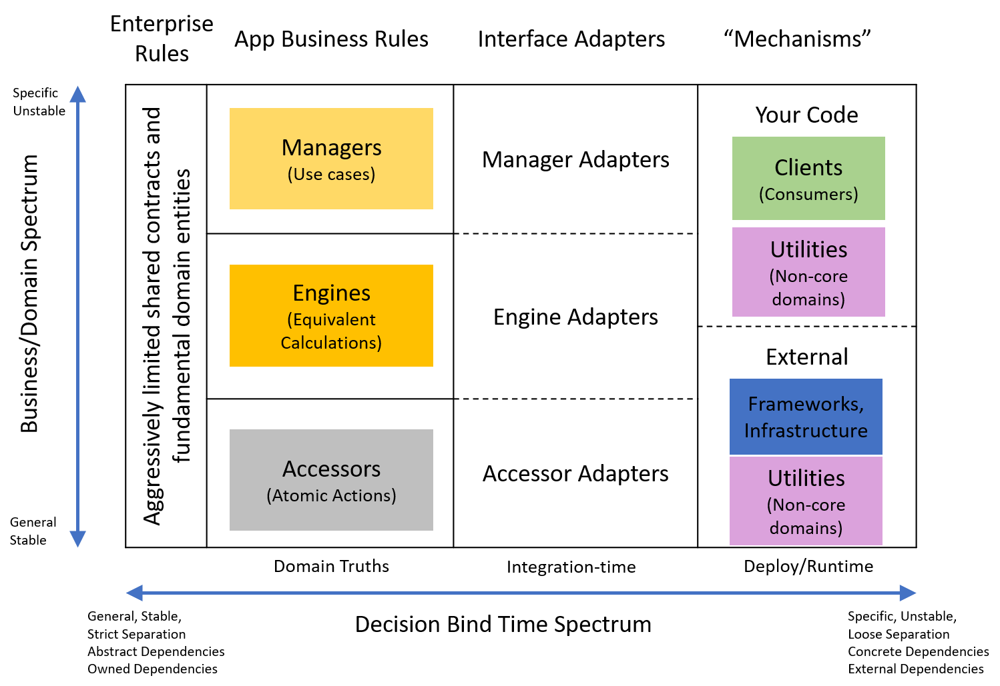

# Ports and Adapters + Domains Layers

I've been on a journey to combine iDesign and Clean Architecture (Ports and Adapters). The goal is a repeatable process for flexible architecture and domain division even with relatively low architecture experience. This requires simple rules and intuition for where each piece of code should live.

For now I'm calling it PADL architecture (Ports and Adapters with Domain Layers).

## Journey So Far
Here are other posts i've written on the topic so far
- [Original realization](../_posts/2020-07-10-Synthesizing-Structure.md)
- [Notification case study](../_posts/2020-08-14-Notification-Design.md)
- [Background task case study](../_posts/2020-09-11-Background-Task-Refactor.md)
- [Pros & Cons after a few months](../_posts/2020-09-17-Solid-Structure-Checkin.md)
- [Ports & Adapters](./2020-11-14-Ports-and-Adapters.md)
- [Incremental Accessors](./2020-11-15-Incremental-Accessors.md)
- [Accessors: Services not Servants](./2020-11-16-Accessors-Services-Not-Servants.md)

## Parent Patterns
SOLID Structure effectively crosses two different layered architectures into one system: IDesign and Clean Architecture.

### IDesign

IDesign layers code by role in the business domain. Every layer and service represents some essential aspect of the domain

While domain layers are clear, I feel iDesign doesn't provide guidance on how to keep services self-contained and composable.

### Clean Architecture

Clean Architecture layers based on relevance to the domain. The most stable business abstractions are the foundation, then uses cases, then adapters, and finally external "mechanisms". This ordering emphasizes callers owning their abstractions so that the system moves to the convenience of the more fundamental business rules.

At its heart, clean architecture is about Port and Adapter-style plugin architecture. Each service owns it's own ports for extension and others adapt to fit those ports. This keeps services self-contained and composable. 

> Aside: creating PADL is actually what helped me better understand Clean Architecture and how it differed from IDesign. The names in the layers can be distracting, focus on the names for the colored layers (also see [Robert Martin's post](https://blog.cleancoder.com/uncle-bob/2012/08/13/the-clean-architecture.html))

In contrast to iDesign, Clean Architecture and Ports and Adapters provide guidance on loose coupling, but nothing about different reponsiblities in a domain. Robert Martin did this intentionally, but I feel like it results in too many open questions for beginners to easily apply the pattern.

## PADL Guidelines
PADL crosses the domain responsiblity separation of iDesign with the bind-time clarity and flexiblity of Clean Architecture. The patterns fill each others gaps to create a reusable library for the domain. Like any good library, the components are portable with decisions of scale, deployment, extension, and runtime are pushed into swappable add-ons.

The goal is to establish clear rules for where every kind of code lives and communicates with other code. The remaining decisons for identifying domain concepts and contract design can be guided, but must be unique to every system.

Integration Rules
- Selfish Services / Ports
   - Services own their dependendency contracts (data, operations, configuration options)
   - These "ports" only know about the service that owns them
   - Accommodate other services with generic extensibility 
- Adapt to compose
   - Implement service dependency contracts with thin maps to other frameworks or services
- As use cases change, services get more general instead of adding specific paths
- No inner-layer calls (i.e. service to service or adapter to adapter)
  - the only exception is decorators, which add functionality to a contract transparently, generaly in the adapter layer

Differentiating domains
- Non-Domain
  - Anything you'd expect to find available 3rd-party solutions for
  - Activites you might drop into any application (emails, pub-sub, identity,...)
- Domain
  - Essential activities or concepts of your problem you're solving (generally a business). They apply to your problem whether or not it is being run as software
- Sub-domain
  - an set of business concepts that are useful and make sense independent of other parts of the business

Domain Layers
- Managers: Each collects a related set of use cases. Each is like an api for a flow in the system.
- Engines: Domain operations repeated across managers. Collect from repeated manager adapters
- Accessors: Domain entities repeated across managers or engines. Collect from repeated manager adapters.
  - Accessor centers around a primary domain entity and all the types that only belong to that entity
  - The accessor may not expose explicit relationships to entities of other accessors
  - In-Depth guidance available [here](./2020-11-16-Accessors-Services-Not-Servants.md)
- Utilities: Repeated non-domain concerns across other services. Collect from repeated adapters.
  - Examples: payments, identity management, pub-sub, notifications
  - May just be a thin facade to enable portability between existing 3rd-party solutions 
- Clients: Often more of an adapter between a manager and user. May be a domain layer if the client/UI serves a portable business need independent from managers. In that case it should define it's own contracts and fulfill them with adapters.  

Decorator Adapters for Cross-Cutting Concerns
- Remote or alternative communication protocols
- Move work off-process
- Security rules
- Trigger multiple adapters for one call
- Retry and timeout policies

I enjoy the Ports and Adapters analogy as a way to visualize and point to where each bit of code lives

[Ports and Adapters Visual]()

## More Details

The Clean Architecture layers decide when most decisions are made, but can be a bit unclear. Here are the layers rehashed with further guidelines.
- *Enterprise Rules / Shared Contracts and Entities*
  - These should only be the most fundamental and unchanging abstactions. For example, not every service needs it's own logging interface.
  - Facilitates smooth experience for fundamental tasks between company systems

- *Application Business Rules / Domain Truths*: The classic IDesign layers that encode the core domain. 
  - Self-contained. At most depends on the shared fundamental contracts and entities
  - Should never change for differences in scale or deployment.
  - Each may not reference any other service
  - Binds the core concepts of the business that should always be true

- *Adapters*: Fulfills the domain dependency abstractions.
  - May directly reference services and frameworks
  - Only map services to a lower-layer domain service or to a utility/external service
    - i.e Managers adapters can use engines or accessors, but not clients or other managers
  - Adapters should not call each other.
  - Adapter may be wrapped with decorators
  - Defines the options set of frameworks, scale decisions, communication protocols, notifications, etc
- *Clients, Frameworks, and drivers*
  - Determines the final mix of adapters needed to deliver a running product. 
  - These are the assemblies that will be deployed to concrete infrastructure. 
  - Responsible for configuring concrete resources like databases, log stores, files stores, etc. 

### Projects/Assemblies
The ideal would be to split every service and adapter into its own assembly. However, that could create very slow builds and assorted tooling issues.

I think a reasonable compromise is to give every service it's own namespace. This at least forces services to explicitly reference things that it shouldn't, and those references can be picked up by static code analyzers or code reviews.

I recommend organizing adapters by the service that they satisfy, and then by the implementation type. For example, `ManagerName.SqlServer.SpecificPortImplemented`. This reflects common library organization, groups components likely to be used together, and prevents excess framework inclusion (which are often heavier dependencies than a few unused adapters).

I do recommend making a hard code separation at least between the service, adapter, and client layers to keep dependencies flowing one direction. This is accomplished with projects in the .NET world. Services and adapters can be portioned off into separate repositories and packages as team or reuse forces require.

## Consequences
- Guidelines for every piece of code
  - Clear division of internal domain concepts
  - Clear divisions and when/how components should be integrated
  - Clear guidance for when decisions are bound
- Reduced scope for most design decisions
  - Services are self-contained
  - Adapters have intrinsically limited scope of mapping one service dependency to another generic service
- Separation of scale and integration concerns from business concepts
- Easy to split code by teams, publish reusable packages
  - Services are completely isolated
  - Can easily split adapters into assemblies by service who's contract they fulfill and library that fulfills it
- Bridges the gap with libraries-style extensibility
  - Our domain services become an extensible library of their own
  - Each major domain concept is portable

## Build Consequence Suspicions
I suspect SOLID structure will improve build times and produce more deterministic dependency chains. The IDesign-style domain services do not depend on each other and can be built in parallel. They will also have very few external frameworks. Frameworks will mostly only have to undergo one copy from an adapter to a client. Dependency chains should also have a deterministic depth (always client -> adapter -> domain service -> fundamental abstractions). Lower dependencies are have fewer dependencies of their own and are more stable. The higher up the dependency chain, the fewer assemblies. 

## Conclusion
This is by no means the one true code organization. It is a set of smart defaults and guidelines to kickstart an understanding of good design. The combination concepts creates a more complete ruleset to standardize design decisions not essential to the core problem being solved.
