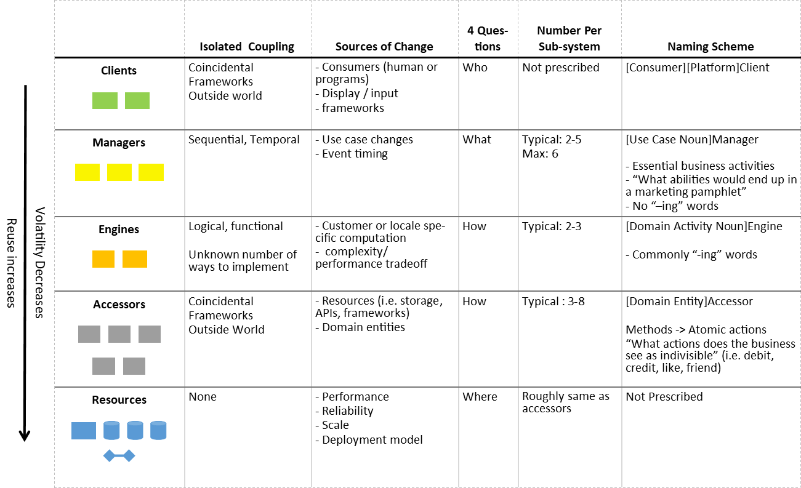

<!-- 
  Paul didn't pickup what I was putting down at all. He thought it was basically just IDesign
  He made a good point that overall architecture systems are pretty much impossible to maintain at large companies like amazon.
  What's more important is understanding the mechanism of decoupling.
  I overall agree, but that is still a high bar. How can I reposition to make it unambiguous that I'm building more specific decision processes
  as a ramp up to that understanding?
  Maybe split the general overview into its own post, focusing hard on just the two decisions I take from IDesign and Ports and adapters
  Then, in a second post, go hard on context-specific rules
  Also, list the past posts as concrete examples
 -->

# Ports and Adapters + Domains Layers

I've been on a journey to combine iDesign and Clean Architecture (or Ports and Adapters-type architecture). The goal is a repeatable process for flexible architecture and domain organization, even with relatively low architecture experience. This requires simple rules and intuition for where each piece of code should live.

For now I'm calling it PADL architecture (Ports and Adapters with Domain Layers).


## Journey So Far
Here are other posts i've written on the topic so far
- [Original realization](../_posts/2020-07-10-Synthesizing-Structure.md)
- [Notification case study](../_posts/2020-08-14-Notification-Design.md)
- [Background task case study](../_posts/2020-09-11-Background-Task-Refactor.md)
- [Pros & Cons after a few months](../_posts/2020-09-17-Solid-Structure-Checkin.md)
- [Ports & Adapters](./2020-11-14-Ports-and-Adapters.md)
- [Incremental Accessors](./2020-11-15-Incremental-Accessors.md)
- [Accessors: Services not Servants](./2020-11-16-Accessors-Services-Not-Servants.md)

## Parent Patterns
PADL effectively crosses two different layered architectures into one system. First let's briefly explore the parent patterns.

### IDesign

IDesign layers code by role in the business domain. Every layer and service represents some essential aspect of the domain



While domain layers are clear, I feel iDesign doesn't provide guidance on how to keep services self-contained and composable.

### Clean Architecture

Clean Architecture layers are based on relevance to the domain. The most stable business abstractions are the foundation, then uses cases, then adapters, and finally external "mechanisms". This ordering emphasizes callers owning their abstractions so that the system moves to the convenience of the more fundamental business rules.

At its heart, clean architecture is about Port and Adapter-style plugin architecture. Each service owns it's own ports for extension and others adapt to fit those ports. This keeps services self-contained and composable. 

> Aside: I think the names in the diagram layers can be distracting, focus on the names for the colored layers (also see [Robert Martin's post](https://blog.cleancoder.com/uncle-bob/2012/08/13/the-clean-architecture.html))


<!-- put a simple one service to one service port diagram? -->

In contrast to iDesign, Clean Architecture provides guidance on loose coupling, but nothing about different reponsiblities in a domain. Robert Martin did this intentionally, but I feel like it results in too many open questions for beginners to easily apply the pattern.

## PADL Guidelines
PADL crosses the domain responsiblity separation of iDesign with the bind-time clarity and flexiblity of Clean Architecture. The patterns fill each others gaps to create a reusable library for the domain. Like any good library, the components are portable with decisions of scale, deployment, extension, and runtime are pushed into swappable add-ons.

The goal is to establish clear rules for organizing code and how each component communicates with other code. I can also provide guidelines for identifying domain concepts and designing contracts, but the final decisions are intrinsically unique to every system.


### Integration Rules
- Selfish Services / Ports
   - Services own their dependendency contracts (data contracts, operation contracts, configuration options)
   - These "ports" only know about the service that owns them
   - Needs of other services are accommodated with generic extensibility 
- Adapt to compose
   - Implement service dependency contracts with thin maps to other frameworks or services
- No inner-layer calls (i.e. service to service or adapter to adapter)
  - The only exception is decorators, which add functionality to a contract transparently. See the [decorator section](#decorator-adapters-for-cross-cutting-concerns).
- Services get more generic to accomodate change instead of adding specific paths

### Differentiating domains
- Non-Domain
  - Anything you'd expect to find available as a 3rd-party solution.
  - Activites you might drop into any application (emails, pub-sub, identity,...)
- Domain
  - Essential activities or concepts of the problem you're solving (generally a business). They apply to your problem whether or not it is being run as software
- Sub-domain
  - A sub-set of business concepts that are useful and make sense independent of other parts of the business

### Domain Layers
- Managers: Each collects a related set of use cases. Each is like an api for a flow in the system.
- Engines: Domain operations repeated across managers. Collect from repeated manager adapters
- Accessors: Domain entities repeated across managers or engines. Collect from repeated manager and engine adapters.
  - Accessor centers around a primary domain entity and all the types that only belong to that entity
  - The accessor may not expose explicit relationships to entities of other accessors
  - In-Depth guidance available [here](./2020-11-16-Accessors-Services-Not-Servants.md)
- Utilities: Repeated non-domain concerns across other services. Collect from repeated adapters.
  - Examples: payments, identity management, pub-sub, notifications
  - May just be a thin facade to enable portability between existing 3rd-party solutions 
- Clients: Often more of an adapter between a manager and user. May be a domain layer if the client/UI serves a portable business need independent from managers (example: offering an extensible CMS widget). In that case, it should define it's own contracts and fulfill them with adapters.  

### Decorator Adapters for Cross-Cutting Concerns
Cross-cutting concerns includes activities like
- Remote or alternative communication protocols
- Move work off-process
- Security rules
- Trigger multiple adapters for one call
- Retry and timeout policies

These activities change for different reasons than either the business rules or the adapters. Their changes tend to apply to many flows of the system, but are not instrisic to any of the flows. Moving them into decorators allows them to be changed and configured independently.

Default to decorating impacted adapters for the usecase. Decorate a service if every call to the service should have the same added per system configuration.

Note that decorators can be hard to reuse. It usually requires some kind of runtime or compile-time meta-programming. Thus, it is often worth making the first several decorators manually and waiting to see if and how the code repeats.

### Locations Visual
I enjoy the Ports and Adapters analogy as a way to visualize and point to where each bit of code lives


## More Detailed Guidelines

### Example Workflow
The rules come together into a relatively standard workflow
- Identify what you're accomplishing for the user
- Identify relevant managers or that a new manager is needed
- Encode your usecase requirements as unit tests one-by-one
  - Builds up the public interface of the manager, including data contracts
  - Creating a dependency contract to defer any external resource, framework, or service. Only design the contracts to meet the manager's need.
  - If you notice duplicate code with another manager, consider refactoring it out of the manager and behind a dependency contract
  - All code at this stage belongs to the manager or its tests. Should not be jumping to other services or adapters.
- Manager should be fully tested without needing to implement any dependencies
- Start implementing adapters to meet the manager dependency contracts
  - Consider existing services that could fulfill the adapter. 
    - If it exists
      - Can it be used as-is? -> use it
      - Not quite usable as-is -> What extensibility does the service need to offer?
    - If none
      - Is it a domain need? -> Does it naturally extend an existing service? What is the core operation or entity for creating a service?
      - Is is non-domain? -> What utility or framework do I need?
      - Is it repeated with other adapters? -> Refactor them into a service
- The manager process cascades down to other service types as they are required. The choices for how their dependencies can be filled is restricted to lower domain layers. If you feel like you need to break the domain layer rules, then reconsider your manager dependency contracts. You may be revealing too much about the manager or accidentally offloading sequential coupling.

### Layers and decision binding
The Clean Architecture layers decide when most decisions are made, but can be a bit unclear. Here are the layers rehashed with further guidelines.
- *Enterprise Rules / Shared Contracts and Entities*
  - These should only be the most fundamental and unchanging abstactions. For example, not every service needs it's own logging interface.
  - Facilitates smooth experience for fundamental tasks between company systems

- *Application Business Rules / Domain Truths*: The classic IDesign layers that encode the core domain. 
  - Self-contained. At most depends on the shared fundamental contracts and entities
  - Should never change for differences in scale or deployment.
  - Each may not reference any other service
  - Binds the core concepts of the business that should always be true

- *Adapters*: Fulfills the domain dependency abstractions.
  - May directly reference services and frameworks
  - Only map services to a lower-layer domain service or to a utility/external service
    - i.e Managers adapters can use engines or accessors, but not clients or other managers
  - Adapters should not call each other.
  - Adapter may be wrapped with decorators
  - Defines the options set of frameworks, scale decisions, communication protocols, notifications, etc
- *Clients, Frameworks, and drivers*
  - Determines the final mix of adapters needed to deliver a running product. 
  - These are the assemblies that will be deployed to concrete infrastructure. 
  - Responsible for configuring concrete resources like databases, log stores, files stores, etc. 


### Projects/Assemblies
The ideal would be to split every service and adapter into its own assembly. However, that could create very slow builds and assorted tooling issues.

I think a reasonable compromise is to give every service it's own namespace. This at least forces services to explicitly reference things that it shouldn't, and those references can be picked up by static code analyzers or code reviews.

I also recommend separate assemblies for the principle domain layers: managers, engines, and accessors. I find it less tempting to create inner-layer connections than directly referencing lower-layer services and data contracts.

I recommend organizing adapters by the service that they satisfy, and then by the implementation type. For example, `ManagerName.SqlServer.SpecificPortImplemented`. This reflects common library organization, groups components likely to be used together, and prevents excess framework inclusion (which are often heavier dependencies than a few unused adapters).

I do recommend making a hard code separation at least between the service, adapter, and client layers to keep dependencies flowing one direction. This is accomplished with projects in the .NET world.

Services and adapters can be portioned off into separate repositories and packages as team or reuse forces require. Thinking of likely future splits is a good way to group code.

## Consequences
Imposing rules is only meaningful if it results in practical benefits. Here are some of the benefits I see

- Easy to categorize code and code decisions
  - Clear division of internal domain concepts
  - Clear divisions and when/how components should be integrated
  - Clear guidance for when decisions are bound
- Reduced scope for most design decisions
  - Services are self-contained
  - Adapters have intrinsically limited scope of mapping one service dependency to another generic service
- Separation of scale and integration concerns from business concepts
- Easy to split code by teams, publish reusable packages
  - Services are completely isolated
  - Can easily split adapters into assemblies by service who's contract they fulfill and library that fulfills it
- Bridges the gap with libraries-style extensibility
  - Our domain services become an extensible library of their own
  - Each major domain concept is portable


### Build Consequence Suspicions
I suspect PADL will improve build times and produce more deterministic dependency chains. The IDesign-style domain services do not depend on each other and can be built in parallel. They will also have very few external frameworks. Frameworks will mostly only have to undergo one copy from an adapter to a client. Dependency chains should also have a deterministic depth (always client -> adapter -> domain service -> fundamental abstractions). Lower dependencies are have fewer dependencies of their own and are more stable. The higher up the dependency chain, the fewer assemblies. 

## Conclusion
This is by no means the one true code organization. It is a set of smart defaults and guidelines to kickstart an understanding of good design. The combination concepts creates a more complete ruleset to standardize design decisions not essential to the core problem being solved. 


# V2

```yml
layout: post
series: PADL
```

Architecture is hard. There are few well-perscribed methods and those that exist are complex to understand. I've been on a journey to combine two methods I enjoy: iDesign and Clean Architecture (or Ports and Adapters-type architecture). Here I'll boil them down to their essense and glue them together.

In this post I'll try to firmly establish the most core ideas clearly. Focusing on the underlying nuggets also prevents me from exploring context-specific advice that helps build up practical understanding. So, we'll follow up with a post all about context-specific decisions and benefits. The overall goal is to lead into a working understanding of the more general ideas here by breaking out smaller scenarios. I call the sum of these context-specific guided processes PADL (Ports and Adapters with Domain Layers).

IDesign and Clean Architecture both define a variety of guidance, but I'm reducing them to what I see as the essense
- Clean architecture -> use ports and adapters to create pluggable components
- IDesign -> rules for dividing domain responsibilities consistently

This roughly corrolates to two key questions
- How do I make changes not suck (minimal impact)?
- How do I reliably find things in my code?

I think the first question is harder and more important. Given an answer to the first, people are decent at figuring out the second.

## More on Ports and Adapters or Anti-Corruption Layers
<!-- I don't think I need a deeper idesign section. Really I just need to clarify ports and adapters, then go to the core loop where I can specify different domain type criteria -->

The core of Clean Architecture is a plug-in extensibility. That extensibility comes from one key mechanism

> Components own the definitions for how they can be extended
<!-- Components define their own mechanisms for extension, and on their own terms? -->

I like the ports and adapters analogy because I think it strikes at the core mechanism. Our current component should define "ports" that expose how the current component can be extended. Other components fit into those ports by using adapters.

Ports can be many things based on the type of extension. Some major ones are
- Interfaces or function signatures for behaviors
  - Events
  - CRUD
  - Data Transforms
- Type definitions for groups of data
  - Configuration 
  - Entities
  - Event data

These are then injected so the defining service isn't tied to one implementation. Commonly injection methods are constructor injection and function parameterization.

The most important bit is that the component that concretely references the port is the one that defines it. Any component that concetely uses the port definition will change together. Adapters use the port definition, but their whole responsibility is mapping it as thinly as possible so other, more complex, services are completely insulated.

Anti-corruption layers are a similar idea from Domain-Driven Design. The idea is that a calling component protects itself from external change by wrapping the called component in an abstraction that suites the caller's need. Really the same idea from a different view.

## Core Decision Loop

The core development loop revolves around the caller owning the abstractions. I like to think of it as selfish design. 

Start with the top-level usecase.

Always design only to your present need no matter where you are, a function, service, class, etc.
- Need some data? define it yourself.
- Have a behavior that could change? Accept an interface to accomplish it

This builds up your list of ports.

The second phase comes when fulfilling the ports with adapters.
- Is there an existing component close to our need?
  - consider adapting to it
  - Potentially generalize the service (under it's own terms) to also include our need
- Consider fulfilling the contract directly in the adapter
  - trivial implemenations
  - trivially mapping to external frameworks and services
  - moderate one-off needs
- If there is some duplication between adapters -> combine duplicated logic into a new selfish component and categorize it by domain responsibility -> Adjust adapter to map to the new component
  - repeated domain operations are Engines
  - repeated domain entities belong to Accessors
  - repeated non-domain operations are Utilities

I went to the extreme and said everything should be selfish, but there is a point of shared volatility when pieces will not likely change independently and being selfish isn't practical. Finding that point is what makes architecture an art. There is no general criteria for finding it. I definitely prefer to err on the selfish side. The context-specific examples should provide some rules of thumb.

## Summary

Combining the core mechanism of Ports and Adapters with iDesign domain layers gives us strong guidance for shaping systems. The selfish ports keep components independent and composable. The domain layers help us evolve the adapters into organized services of their own.


```yml
layout: post
tags: [PADL, Ports and Adapters, Architecture]
series: PADL
```
# Dependencies and Bind-times in layered architectures

Clean Architecture, Onion Architecture, and Hexagonal Archicture talk about how dependencies can only point inward. This is ... true, but a bit confusing. Let's clear it up by elaborating on types of dependencies and how they affect when descisions are made.

## Concrete vs Abstract Dependencies
For reference on what "in means" here are some diagrams of the previously mentioned architectures
   

Essentially, the inner most layer is your core domain, outer layers are external resources (e.g databases, users, other systems), and middle layers are ways of mapping between the domain and outer layers.

*Concrete* dependencies only point in. The outer layers contain references to the assemblies, namespaces, types, and other constructs of the inner layers. 

I always found this a bit hard to understand, since my workflows appear to have the most dependencies. Managers (the high-level workflows) certainly inject the most dependencies of any component type. But there is a key word there, *inject*.

While *concrete* dependencies point in, *abstract* dependencies point out. The inner domain layers have lots of dependencies, but it owns the abstractions for them and relies on some concrete consumer to fulfil them.

## Bind-time flexibility

This strict opposing flow of abstract and concrete dependency has powerful consequences. It creates a predictable stratefication (aka layering) of when certain kinds of decisions are bound.
- Domain layer: 
  - binds the most stable and fundamental truths about the domain
  - never binds volatile concerns like frameworks, data schemas
- Adapter layers:
  - binds our *option set* for concrete implementations (e.g. each determines a framework, system, schema, or other details to implement the domain dependency)
- Outer layer
  - binds the concrete mix of implementations to be used in deployment

Seen another way
- Domain layer -> business decisions
- Adapter layers -> implementation choices
- Outer layer -> deployment decisions

## What about domain divisions?

The dependency rules of the above architectures push systems that are very flexible under different deployment, resource, or service compositions. This plug-in style enables flexiblity independent of the software domain. 

Still, domains can be very complex. It is useful to have rules of thumb that highlight when it is time to split off responsiblities in the domain. I work to combine these two concerns with [PADL](). The short version for domain layering is
  - managers are business workflows, and where each use-case starts
  - repeated domain operations are Engines
  - repeated domain entities belong to Accessors
  - repeated non-domain operations are Utilities

The top level managers can be split up per DDD guidelines for sub-domains. That is, sub-domains are gernerally identifiable by how the business splits itself into teams. 

Here's a graphic I made for PADL. It depicts both bind-time layering and layering of domain activites


```yml
layout: post
tags: []
series: PADL
```
# Contextual Architecture Guidance: Integration and Layering
- further guidance on how layers do and don't interact with each other
- really focus on the adapt to integrate here

# Contextual Architecture Guidance: File organization
project boundaries, use of namespaces 

# Contextual Architecture Guidance: Cross-Cutting Concerns
ripped from above

# Contextual Architecture Guidance: Accessors
probably a refinement of the services not servants post


