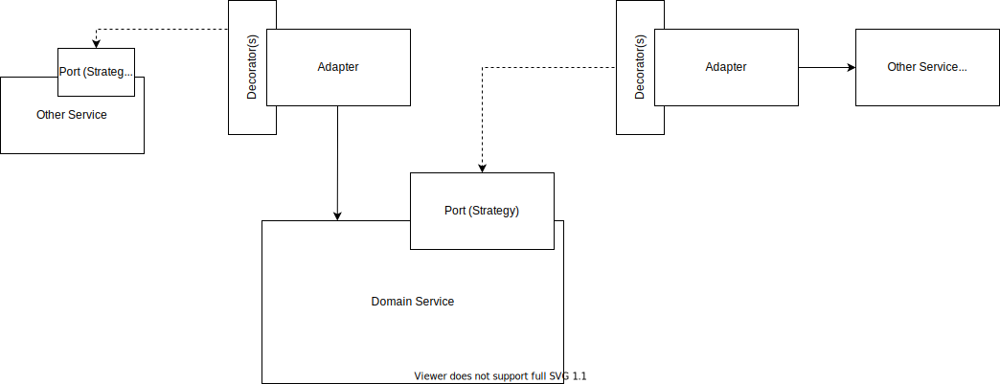
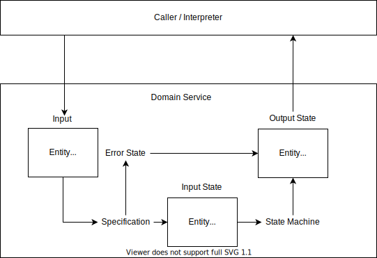

# My most used patterns in practice

Patterns are named solutions to common problems in software. They level up developers by reducing complexity, and compactly communicating intent.

Patterns are generally taught in isolation (separation of concerns), but application of patterns is often highly interconnected. Here I'll show how my most used patterns come together as a design system.
<!--more-->

The overall structure is ruled by **dependency inversion**. A service uses ports, which are often **strategies** or **observers** to create an abstract set of dependencies. The service ports are then implemented by connecting to other services with **adapters**. Sometimes a **decorator** will wrap an adapter to add cross-cutting concerns like logging, authorization, failure/retry policies, or indirect communication protocols.

Each service defines it's input and output data as **entities**, **value-types**, or primitives. Input is validated using a **specification** and usually becomes the input to some business flow represented as a **state machine**. The state machine produces a new state which is returned to the caller. The output states are fed to an **interpreter** which aligns the global persistent state with the changes.

Services might instead focus on a complex computation or transformation of the data, in which **strategies** might be used to compose or swap different transforms.

In review
- **Dependency Inversion**, most often through constructor injection, keeps the overall structure flexible by turning service dependencies into pluggable abstractions
  - **Strategies** are a common port for swapping out different computations or operations. Can also be used internally by a service for modularizing complex computations.
  - **Observers** are a common port for notifying other services of internal events
  - **Adapters** map ports to existing implementations in other services or 3rd party libraries while keeping port definitions independent
  - **Decorators** can compose tangential concerns like authorization into ports instead of baking those decision into the service or each adapter.
- Most data falls into two categories
  - **Entities** represent any data that has a identity beyond it's current values. Generally distinguished by an Id property.
  - **Value-types** represent any data that is defined by it's current values (no Id)
- **State Machines** effectively encode flows that have decisions or multiple possible states (which is most of them). State machines can be drawn and understood by all stakeholders and often reveal missing requirements through unhandled possible states. Useful fact, any program can be written as repeated calls to a state machine.
- **Specifications** define what data should look like. They are useful for validation, but also for generating test data.
- **Interpreter** encodes operations as data structures. Different interpreters can decide how to act based on the data at a later time. Interpreting state changes improves transactional consistency of the domain and can also replace most observers.

## Conclusion

Patterns, even in isolation, raise our level of discourse and deliver robust solutions to common problems. However, patterns often interact in non-additive ways.

Here I've shown how the pattern I use most mesh together to create a whole-system structure.

<!-- What is my motivation
- patterns get discussed a lot, but usually in pretty isolated scenarios
- I was thinking about patterns I use and realized that many of them compliment each other and interact in non-additive ways -->

<!-- idea: flow could be describing the system flow, or or I could roughly order the patterns in the same order they'll be encountered in a typical flow
  either way, pattern names should be bolded
 -->