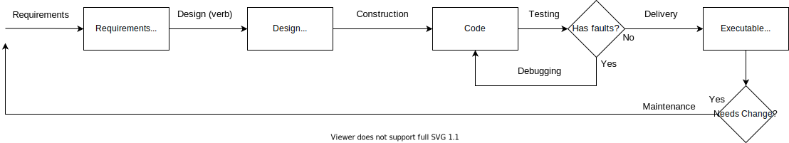

# Software Engineering as Problem Translation

The Software Engineering Body of Knowledge (SWEBOK) states the goal of software engineering is transforming problems stated in natural language to problems stated in electrical current. This view emphasizes the continuity of the design process and intermediate artifacts.

> Abstractly speaking, problem solving using a computer can be considered as a process of problem transformation - in other words, the step-by-step transformation of a problem statement into a problem solution. To the discipline of software engineering, the ultimate objective of problem solving is to transform a problem expressed in natural language into electrons running around a circuit. - SWEBOK 13.1.5

The major steps of this process are
- Figure out what to tell the computer to do
- Convert the problem statement into algorithms
- Convert the algorithms into machine instructions

## Compilers Make Machine Code
I don't know about you, but I never find myself hand assembling code into machine instructions. That's what compilers are for, and they're good at their job.
The entirety of a typical software process lives in those two first steps, defining the problem and translating it into rigorous code. 

In fact, Jack Reeves has a famous article about this very topic called [What is Software Design?](https://www.developerdotstar.com/mag/articles/reeves_design.html).

## Everything else is design

Software is great at automation. That includes our own processes. Any mechanical steps, like compilation, get automated away.

This means no part of the development process is a prescriptive, mechanical construction process. Every stage is related to further defining and expressing the problem being solved. The original problem must be understood all the way through or translations end up like [repeated google translations](https://www.youtube.com/watch?v=LMkJuDVJdTw&).

Messy real-world processes can't always be mapped into precise processes, or the mapping may not be economic. These challenges may not be apparent until detailed design or even until the code is written. Developers at all phases have to work with stakeholders to evaluate trade-offs and approximations.

SWEBOK Section 13.3.1 elaborates on the breakdown of SWEBOK itself related to this transformation view. It frames typical development phases (and book chapters) as transformations creating a problem statement one step closer to machine code.

## Relation to common process

How small and frequent one loops between these stages depends on the type of process. 
- Kanban maintains a constant loop based on tasks
- Scrum partitions cycles into short fixed-time increments (~1-2 weeks) 
- Phased delivery methods break work into larger deliverables (on the scale of months)
- Waterfall attempts to address each transform only once for the whole project 

The documents generated are thematically the same, but at varying levels of formality.

Tighter loops are better for most cases, thus the popularity of agile methods.
The methods are also not completely exclusive. It is common to plan rigorously at the scale of weeks, and less specifically over the course of a quarter, and thematically over several years.

## Conclusion

There are many views of software process that capture different truths. I think the SWEBOK transform view captures the nature of software as a problem-clarification process. Every step must understand the original problem and handle messy design trade-offs. The intermediate representations provide checkpoints for feedback and documentation.

<!-- 
(may be nice to have a simple graphic that shows natural language on one side and machine instructions on the other)

- a flat view for showing segments of the transform pipeline
- a circular view to emphasize the iterative nature

I realize that maintenance can have significantly different management, cost, and process characteristics. However, from an intellectual/learning standpoint it is just the same process with more constraints than before.
- I suppose this is why the intro lumps maintenance into the "management" portion of the book

Further Reading: 
- Design of Design
- What is Software Design?

Uncategorized: chaos testing, stress testing, penetration testing, 

Control and management is generally a factor of data and checkpoints from quality and configuration management practices
- SCM gives natural checkpoints
 -->

<!-- 

IDEA: I could make cross-sectional cheatsheets of swebok
- i.e. a sheet that outlines investigational skills across all chapters

What is my blog post lineup?

- Focused concept map 
  - limited to layout and few key ideas. Focused on application view (routine process view)
- Chapter cheat sheets
  - Enumerating key concepts for inclusion in concept map. No need to do for chapters with mostly obvious outlines (most foundations)
  - Requirements
  - Design
  - Construction
  - Testing
  - Quality
  - Config management?
- "Good Enough" target
  - maybe this should be key concepts I've forgotten I had to learn (also include design for verification)
- Concept map -->
