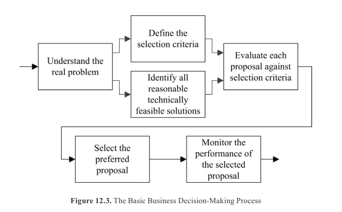
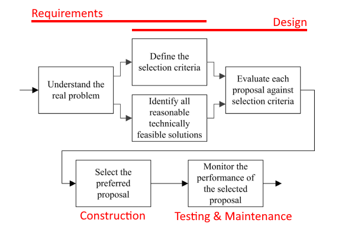
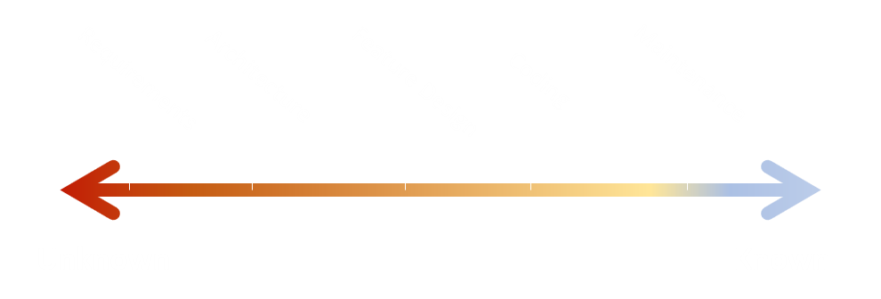

# Software Engineering as Problem Translation

Pinning down a concrete view of software design can be difficult. All the way from requirements to code are just different phases of one design. SWEBOK formalizes this idea in several different ways that may shed some light on the deeper understanding.

## Transformation View

SWEBOK states the goal of software engineering is to transform problems stated in natural language to problems stated in electrical current.

> Abstractly speaking, problem solving using a computer can be considered as a process of problem transformation - in other words, the step-by-step transformation of a problem statement into a problem solution. To the discipline of software engineering, the ultimate objective of problem solving is to transform a problem expressed in natural language into electrons running around a circuit. - SWEBOK 13.1.5

The major steps of this process are
- Figure out what to tell the computer to do
- Convert the problem statement into algorithms
- Convert the algorithms into machine instructions

I don't know about you, but I never find myself hand assembling code into machine instructions. That's what compilers are for, and they're good at their job.
The entirety of a typical software process lives in those two first steps, defining the problem and translating it into rigorous code. 

In fact, Jack Reeves has a famous article about this very topic called [What is Software Design?](https://www.developerdotstar.com/mag/articles/reeves_design.html).

No part of the development process is a prescriptive, mechanical construction process. Every stage is related to further defining and expressing the problem being solved.

SWEBOK Section 13.3.1 elaborates on the breakdown of SWEBOK itself related to this transformation view. It frames typical development phases as transformations creating a problem statement one step closer to machine code.

How small and frequent one loops between these stages depends on the type of process. In general, smaller tighter loops are better, thus the popularity of methods like agile.

## Decision Process View

Checkout this diagram generalized business decision making.

This may seem a bit familiar, it maps pretty closely to the transform view.

<!-- TODO: I'm doubting this visual now. The analog is less than I thought

What views would I consider...
- stage view is much like transform view
- decision view is kind of a simplified design tree view with this loop in each stage and the stage determining which base assumptions we deal with.

what really differentiates different views
- who performs a task
- what tasks are performed
- what value is generated
- pre & post conditions to get out of a stage

So
- Resource/Implementation view (requirements, Db schema, UI, business logic)
- Money view? Upfront vs continuing costs. Also sprints and milestones

 -->

This makes sense because software engineering is "the step-by-step transformation of a problem statement into a problem solution". In other words, a design process. Design is all about understanding the problem, and making decisions based on that understanding. The transforms are specific expression of a decision making process.

> "It's useful to think of the architectural design process from a decision-making perspective rather than from an activity perspective" - SWEBOK 2.3.4
<!-- 
This is a bit of a lie though, since this decision making process happens repeatedly in each stage of the process as well. -->

## Design Tree View

The decision and transform views dovetail nicely into my favorite model of the software process.

I see the overall process as a spectrum from unknown to known. Each of the transforms is a checkpoint in how much known information we've uncovered.

Known information can be of all kinds
- User expectations
- Expected tradeoffs between conflicting expectations
- How to map messy expectations into precise process
- Key segments of a process
- How the processes and expectations are stated with code
- Economical decisions (build vs buy, can expectations be loosened to shorten timelines)
- Measuring how well the solution actually meets expectations

Each of these choices can be modeled into a *Design tree*. The design tree represents all possible decisions that can be made. A solution is some leaf, or furthest node, in any particular path of the tree.

Progress along the spectrum is measured in how many decisions we've made toward a single leaf (full solution) that meets all of the requirements. This kind of progress is hard to track quantitatively, but it does illuminate some significant consequences for how we make decisions.

Humans naturally gravitate toward two approaches that don't work in practice
- Depth-first approach: Trying to jump straight to full-solutions is likely to throw away lots of work
- Breadth-first approach: There are nearly infinite possibilities. We can't evaluate them all

The optimal process is a repeated loop of limited-choice comparisons.
- Identify some key decision 
- Enumerate a few likely alternatives
- Evaluate alternatives in enough depth to make a decision
- Lock in a choice
- Identify the next key decision on that path

Decisions naturally get more fine grained as the loop locks in more decisions. Some decisions will inevitably be wrong, but we throw away minimal work because we can back up to the closest key decision that still works.

## Conclusion

There are many different views of software process that capture different truths. Each view colors concepts of progress and artifacts. However, they all share an emphasis on understanding the underlying problem, increments of progress, and executable machine code as the final output.

Ultimately, writing software is a design process that transforms messy real-world processes into precise automated processes.

<!-- 
(may be nice to have a simple graphic that shows natural language on one side and machine instructions on the other)

- a flat view for showing segments of the transform pipeline
- a circular view to emphasize the iterative nature

I realize that maintenance can have significantly different management, cost, and process characteristics. However, from an intellectual/learning standpoint it is just the same process with more constraints than before.
- I suppose this is why the intro lumps maintenance into the "management" portion of the book

Further Reading: 
- Design of Design
- What is Software Design?

Uncategorized: chaos testing, stress testing, penetration testing, 

Control and management is generally a factor of data and checkpoints from quality and configuration management practices
- SCM gives natural checkpoints
 -->

<!-- 

IDEA: I could make cross-sectional cheatsheets of swebok
- i.e. a sheet that outlines investigational skills across all chapters

What is my blog post lineup?

- SWEBOK Summative review
- Swebok topic hierarchy
- SWEBOK transform view
- SWEBOK cross-cutting activity table
- Focused concept map 
  - limited to layout and few key ideas. Focused on application view (routine process view)
- Chapter cheat sheets
  - Enumerating key concepts for inclusion in concept map. No need to do for chapters with mostly obvious outlines (most foundations)
  - Requirements
  - Design
  - Construction
  - Testing
  - Quality
  - Config management?
- "Good Enough" target
- Concept map -->
