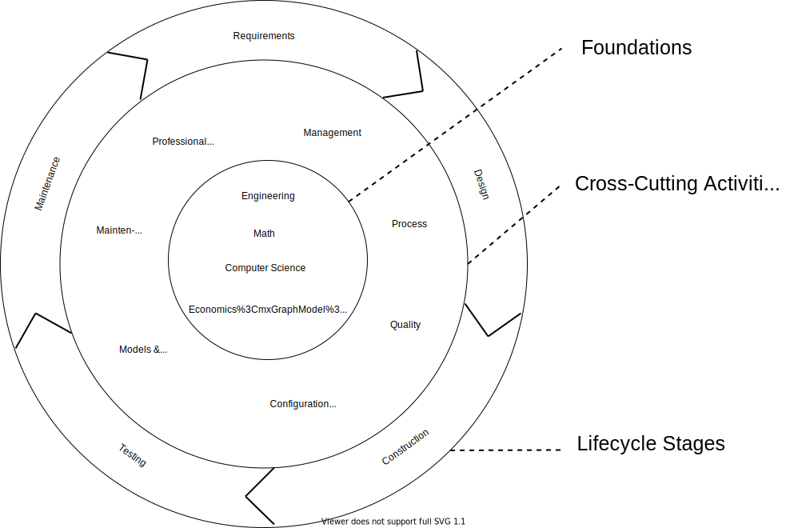

# SWEBOK: Hierarchy of chapters 

The Software Engineering Body of Knowledge (SWEBOK) defines the major categories of software knowledge. It even talks about relationships between topics a bit. However, the overall picture is never very clearly explored. I hope to remedy that.

<!-- I think I should release this post before the transform artifact post -->

The tiers are layered based on how fundamental the topics are
- *Foundations* are precursor topics to Software Engineering. Topics in this level may be repackaged 
- *Cross-cutting activities* happen at every stage of the software lifecycle. They shape the lifecycle and inform decisions at every level.
- *Lifecycle stages* represent major checkpoints in how much we know about the final solution. The stages commonly overlap, but are typically used to categorize software activities and progress.

Tiers based on how fundamental each is 
- mid tier built on concepts and measures of bottom tier
- outer tier integrates the middle tier at every stage
- outer tier is the general form of the software process loop. That loop may be very short and on smaller decisions in some methodologies
- true center tier is problem solving (13.1.1 everything is problem solving and specialized techniques separate out into disciplines), but problem solving isn't a Knowledge Area

Econ is actually in management and not in foundations, but economics is the differentiation between engineering and science
Maintenance is in management section, not sure if I should include it in the middle or outer tier...
- everything is maintained, and maintenance is more of a perspective, but it sorta has a position in the process flow

<!-- I like how Construx separates out cross-cutting *activities* and cross-cutting *concerns*
- their visual makes more sense to me now -->

- should probably indicate that i'm not sold on where maintenance lives
- moved economics to foundations because it factors into most decision processes.  