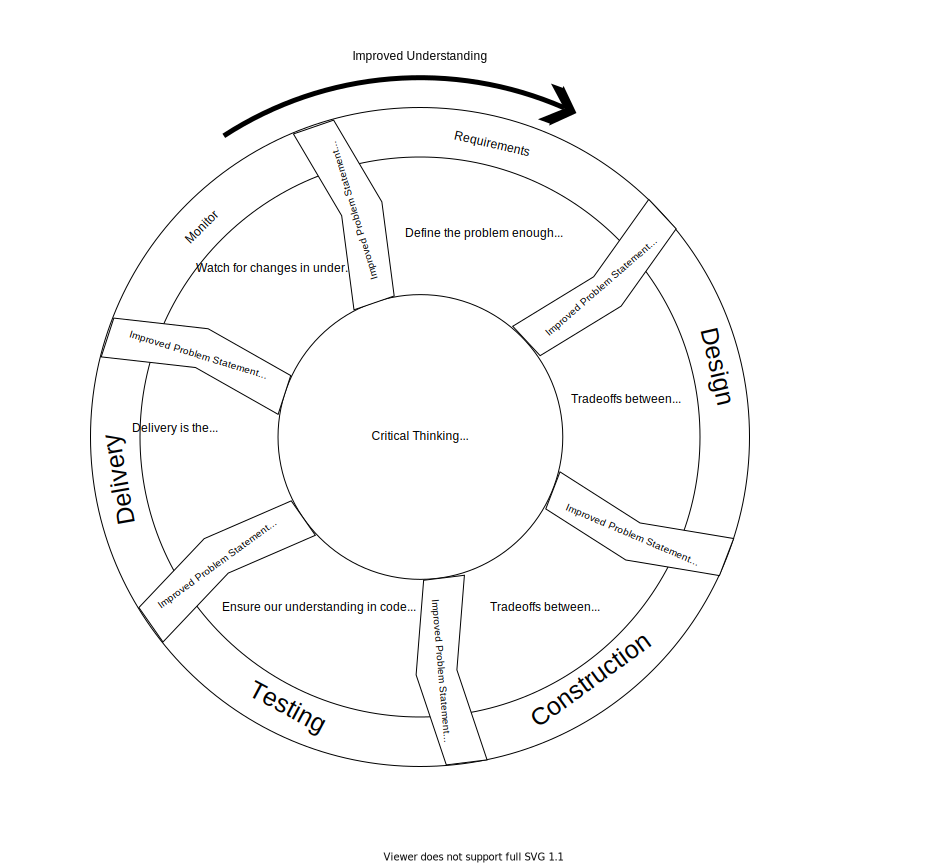

# Programming is Problem Modeling

Code is often considered the goal of programming. This abjectly false. Programming is about understanding and representing problems. While this belief is expressed by many experts, the repercussions are many and nuanced. This is my latest attempt to communicate the idea clearly.

## Past Attempts

I've written numerous previous posts covering different views on this underlying idea.
- [SWEBOK: Software Engineering As Problem Translation](../_posts/2021-08-13-Swebok-transform-view.md)
- [Going Fast is Going Well](../_posts/2021-01-29-Going-Fast-is-Going-Well.md)
- [What's your duck?](../_posts/2020-10-02-Whats-Your-Duck.md)
- [Requirements](../_posts/DevEssentials/2018-11-25-Requirements.md)
- [Quantified Communication (from customer to code)](../_posts/2021-03-19-Quantified-Communication-Customer-to-Code.md)

My previous visual was the software lifecycle as a spectrum. We start with much unknown and iterate until there is enough known to deliver a solution.

I hope to evolve this idea and cover more detail.

## Goals

Problem modeling permeates all aspects of software development. I can't hope to communicate a full picture in single visual.

The primary ideas I want to communicate are
- Problem understanding evolves through the whole software lifecycle
  - Problem understanding can't be confined to requirements 
- Lifecycle / process artifacts are restatements of the same problem
- Problem understanding is fundamentally progressive
  - The problem changes over time
  - Understanding is naturally incomplete
- Lifecycle stages are not strictly sequential
- The problem is defined by user need
  - Success is defined by satisfaction of user need
- Common ways lifecycle stages help refine the problem
- Lifecycle stages as an accumulation of problem clarity

Secondary ideas I'd like to communicate 

- Software/developer needs constrain solutions to the problem, but are secondary
  <!-- - Examples: 
    - Developer time impacts schedule, but not individual functional expectations
    - Qual
    - maintainability impacts velocity and developer happiness -->
- There is no perfect design

## Sources

> "The besetting mistake of expert designers is not designing the thing wrong, but designing the wrong thing" - Design of Design p. 167

I don't expect you to take these statements of software truth on my word. Here are many of the key points taken directly from the [Software Engineering Body of Knowledge](../_posts/2021-07-30-SWEBOK-review.md).

Customer need defines "correct" software (heart of design process)
- Ch 11.1.9 Tradeoff analysis - software engineer must evaluate tradeoffs with stakeholders
- Ch 7.4.1 Customer satisfaction is principle goal of engineering management
- Ch 1.3.2 "The software engineer, first of all, must determine the real purpose of the software"

Software Engineering is Problem Modeling
- Ch 1.2.1 Requirements are refined through all lifecycle phases
- Ch 13.1.5 Software Engineering is a set of translations from plain language to executable code. The lifecycle phases refine the problem statement
- Ch 1.3.2 "The software engineer, first of all, must determine the real purpose of the software"

Problem understanding is fundamentally progressive
- Ch 1.7.1 Iteration is Fundamental
- Ch 1.7.1 Requirements *will* change
- Ch 1.7.1 No perfect requirement specification
- Ch 2.3.4 Design less of an activity more of a decision process
- Ch 12.5.1 "Good Enough" principle and RACE Reduce Accidents and Control Essence

I also strongly recommend learning [Domain Driven Design (DDD)](https://www.amazon.com/Domain-Driven-Design-Tackling-Complexity-Software/dp/0321125215). DDD is a popular design philosophy all about clearly coupling our designs to domain (problem) understanding.
It explores the discovery and application process in much more detail than I can here. 

<!-- Testing isn't optional
- Ch 4.intro "Software testing is, or should be, pervasive throughout the entire development and maintenance lifecycle" -->

## Lifecycle Visual

This first visual focuses on the relationship of lifecycle stages to problem modeling. 

The core is Refining the problem, which is defined by customer need and achieved through critical thinking. Each phase outputs some artifact, and all artifacts are a restatement of the problem with additional details we've uncovered. In the middle I state how [each phase refines the problem](../_posts/2021-08-13-Swebok-transform-view.md). 
- Requirements define the problem enough that we are well informed to consider solutions (SWEBOK chapter 1 intro or 1.7.1)
- Design refines the problem by considering tradeoffs between different solutions (SWEBOK 2.3.4). Tradeoffs should be weighed with stakeholders (SWEBOK 11.1.9)
- Construction states the problem in code (precise processes). Construction further refines the problem by weighing tradeoffs between potential solutions
- Testing measures how well our code matches our mental model for behavior and other expectation measures (SWEBOK 4.intro)
- Delivery make our solution available for application by end users. Application to the real problem is the most important measure of success.
- Monitoring watches for changes in the problem or improvements in understanding that must be addressed in our solution.

## Underlying Scientific Method

Notice how the lifecycle repeatedly refines understanding through 
- identify a need
- identify a solution
- test the solution to make sure it fits the need
- Deliver the solution
- Repeat

This is the scientific process.

These question/hypothesis/test loops underlie not only the lifecycle, but each individual activity as well.

## Good Enough

Each hypothesis/test cycle tells us something about the problem and solutions. These increments of progress interpolate us to a final solution.
However, there is no single perfect solution. Instead, there is a target of "good enough". Any solution that meets all known requirements falls in "good enough".
Conversely, this shows that satisfying requirements is our stop condition to consider work complete.

Requirements need not only be functional requirements (behavior expectations). They should also include quality measurements like maintainability and defect rates. Quantifying and benchmarking these requirements is a whole topic of it's own.

- idea: lines on design tree indicating phase transfers (maybe phase through phase artifacts)

Note that lifecycle stages can be seen as benchmarks in understanding. Each stage is about underst
- swebok quote on refining requirements enough to perform design
- design is a decision process, often tied to construction
- testing is a review to check what we did
- delivery is the ultimate test where our understanding is put into practice 
- monitor is waiting for new understanding

Remember that the programming lifecycle refines the problem understanding. It is likely that new requirements will be added to the "definition of done" as developers work.
Undoubtedly, more requirements will also appear after work is delivered. This shifts target of "good enough" and we iterate to reach the new target just like before. 

testing

Requirements
- interviews, prototypes, shadowing, acceptance tests, ....

Design / Construction
- Specificity reveals hidden assumptions
- weigh tradeoffs with customer
- Areas of flexibility reveal nature of business (volatility vs change)

Testing
- echoes developer understanding of requirements
- The right techniques let customers review test suites
- acceptance tests probs belong here in this view?

Maintenance 
- adjust to changes in need
- adjust to changes in understanding 

DDD: A design reflecting domain will likely lead to deeper insights and changes in the design. Design is, in a way, becoming an expert in the field you are representing.

Maybe explicitly connect hypothesis/test cycles from problem solving as even more fundamental version of this

"The quality of your questions determines the quality of your decisions"

Q: Should it be a spiral toward "good enough"?
- maybe it's two visuals?
- !!! spiral is the design tree with some failed paths, gradually incrementing to "good enough"
  - in this vein, one visual is responsible for communicating connection to problem understanding, the other to progression of the understanding over time

Where does problem understanding come from: most often the customers.

This is to address carlos' reaction to the transformation view. It also helps emphasize a very critical belief that the problem we're solving is king and present in every stage

This should be specific practices, not just the general increase in detail.
