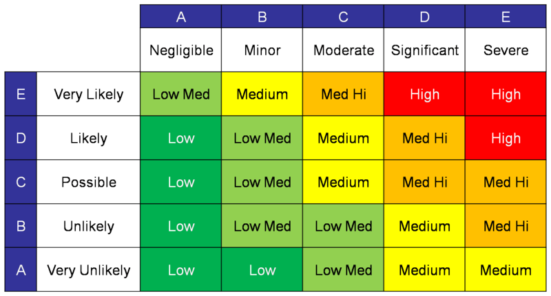

# Governance is a mine of Quality techniques

I recently put together that multiple verification (the quality technique) is effectively the same and as [governance](https://en.wikipedia.org/wiki/Corporate_governance) techniques. It's about managing the level of trust and risk we're comfortable with in our process.

Aiming for "low-trust" may sound bad, but good governance doesn't mean we don't trust, it means we don't *have to*.

Consider the company source control. No single developer should be able to simply delete company source control. Such capability could sink the company. It's a huge risk to the company and a liability for the developer who needs to control their credentials. Instead, deleting a repository could require approval from multiple people. This reduces risk for everybody.

For a less personal take, consider measurements. Any individual measurement might be flawed. Equipment might be bad, conditions might be bad. All kinds of errors could happen. Scientists and engineers can mitigate this error with multiple measurements and measurements through multiple means. If the measurements agree, then we trust the result. In terms of development, the measures are usually tests.

The same applies to process. Process and people can go awry. The way we mitigate contributor error or malice is having multiple people involved.

This happens at all kinds of levels from loose to formal: pair programming, peer reviews, audits, pull request policies, etc.

These kinds of practices are older and much more general than programming. They are known as [governance](https://en.wikipedia.org/wiki/Corporate_governance).

Governance is, of course, a trade-off. Governance naturally tends to slow process down, but reduces severity and frequency of errors. Fewer controls allow contributors to move independently, which usually means faster. But few controls also mean more opportunity for error.

A spectrum of governance techniques have evolved for many levels of speed vs trust. To name a few 
- Requiring multiple approvals
- Committee
- Voting systems 
  - Quorum
  - Veto
  - Veto override
  - 2/3rds majority

The more people required, the more conservative the process is. The bias is toward stopping failure. This can be slower, but it's safer. Tradeoff between speed and safety is really a decision of about risk. 

Deciding how much governance is needed for a given process is tricky, but a threat matrix is your best friend.

Side note, Two-factor authentication is also an application of governance. I wasn't sure how to incorporate it in the flow, so I put it awkwardly here at the end.

## Conclusion

I've unknowingly been using governance techniques for years. Such process is common in programming whether we call it such or not. Making the explicit connection to governance opens up a well-developed trove of techniques for managing software and software process effectively!