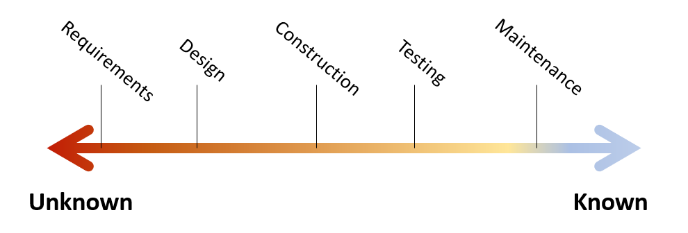
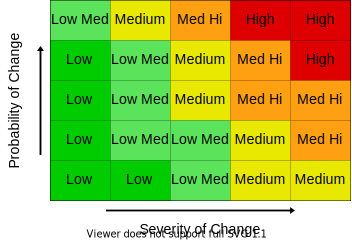
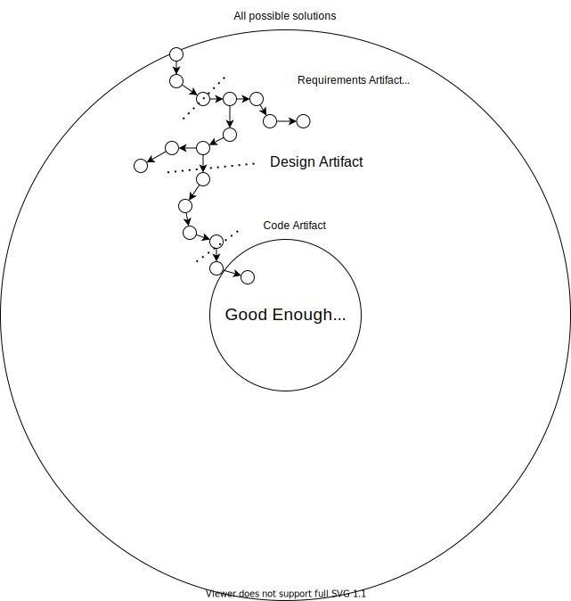

# What's your Duck (Presentation Version)

This post is about design process and organizing our thoughts for effective development. The main goal is to establish a healthy mental model and intuition for effective design process. The duck bit will be explained later.

<!-- 
TODO: clarify self-similarity
TODO: consider putting a warning in What's your duck pointing to this post as the presentation companion -->
<!-- TODO: make a forwarding link for embedding in the presentation
- https://github.com/jekyll/jekyll-redirect-from
 -->

<!-- 
IDEA: make this post a series to make it more approachable / smaller increments
TODO: Do I need to group section by what I think belongs in one post? Clearly delineate chunks that need to be taken as a whole
I think at least the stage-specific techniques might be good as a separate post. Most everything up to there flows pretty well

TODO: Revisit consistency of questions and artifacts in the stage-specific sections
-->

<!-- Meta thoughts
This feels so much different from writing my other posts. I can see all the effort I put into connecting back 

Thinking about this as a potential series causes me to write each section intro like a blog intro and forge stronger context clarity
 -->

## Motivating Questions

First, here are a few motivational questions.
- What is programming? Software Engineering?
- How do we effectively break down problems?
- Can software be perfect?
- What makes software good?

I'd encourage you to take a few minutes and organize your own thoughts on these questions before moving ahead. You don't have to have an answer, ideas and questions are good too. Connecting and theorizing [aid the learning process](../_posts/2022-03-07-Small-Teaching-Review.md#predicting).

## The Nature of Software 

Let's tackle the first motivational question: "What is programming?".

I'm a firm believer that [programming is problem modeling](../_posts/2022-02-18-Programming-is-Problem-Modeling.md). I love the quote from Fred Brooks

> The programmer, like the poet, works only slightly removed from pure thought-stuff. He builds his castles in the air, from air, creating by exertion of the imagination.  
> \- Fred Brooks, Mythical Man-month

As programmers, we take problems of all kinds and we translate them into the exact language of software. We can encode almost anything our imagination can grapple.

Real world problems are often messy and partially self-conflicting. Unwinding the many facets of such problems into automated processes is a difficult, non-deterministic, and beautiful [act of design](https://www.developerdotstar.com/mag/articles/reeves_design.html).

Software Engineering is then the repeatable process for encoding ideas in software both economically and reliably. 

## Better Wrong Than Vague

> Better wrong than vague  
> \- Fred Brooks, Design of Design

This quote is the single most important idea you can take from this post. If you remember nothing else, remember it's better to be wrong than vague.

Software is a complex design activity. We deal with messy problems and problems that often change. It's inevitable that we will get some elements wrong. What matters is [when and how we discover errors](https://stevemcconnell.com/articles/an-ounce-of-prevention/).

Vague ideas can still be wrong, it's just less likely that anyone will notice. Vague problems get swept down the line and pile up until they're nearly insurmountable. Software has coined the derogatory term "legacy" for such software, and it's often a place projects go to die.

Favoring clarity means identifying and communicating our assumptions. It means encoding what we think we know about the problem we're solving and how we're solving it. It's about ordering our thoughts well.

Clearly communicated ideas, unlike vague ideas, enable collaboration, comparison, reviews, and future reference.

Everything that follows is builds a framework to order thoughts well.

## Spectrum of Clarity

The high-level of software process is often known as the software development life cycle. The Software Engineering Body of Knowledge (SWEBOK) [imagines this process as a set of translations](../_posts/2021-08-13-Swebok-transform-view.md). I tend to view the software life cycle as a spectrum of clarity.

The spectrum starts with much unknown and ends with most elements known. At the beginning, we know relatively little about the problem we're solving. Each development stage (i.e. requirements, design, construction, ...) is a [checkpoint in how well we've defined the problem](../_posts/2022-02-18-Programming-is-Problem-Modeling.md#increment-to-good-enough). 

I don't mean to profess a strict linear flow like waterfall. Remember that programming is a design activity and design is messy. It's common to uncover questions in a later phase that force us to reconsider decisions we made in an earlier phase. This is natural and part of understanding the problem. What we want to avoid is cycling back frequently or back multiple stages. Cycling back, especially multiple stages, undermines previous work and is expensive. 

This spectrum from unknown to known plays out both at the work item level and system level. A work item is clarified through this spectrum until it can be released. A system is clarified as completed work enables feedback and new user abilities. Agile emphasizes small complete units of work for this reason. Better wrong than vague, and try to discover "wrong" early.

## Design Tree and Effective Work Increments

A spectrum describes the general lifecycle progression, but leaves the fine-grained progress unclear. Design trees can help us zoom in and understand the second motivational question "How do we effectively break down problems?".

The design tree is an idea that we can represent all possible design routes as a [graph](https://en.wikipedia.org/wiki/Graph_(discrete_mathematics)).
- Each graph node is is a possible decision we could make
- Edges show how later decisions depend on earlier ones
- The furthest nodes in the graph (or leaves) represent complete solutions.

Every path to a leaf represents a series of decisions we can make to arrive at a final solution.

Humans have a natural tendency toward depth-first approaches. We try to find complete solutions all at once.

The problem is that depth-first tends to lead to a lot of wasted work. We generally don't have all the information we need at first. Our solution probably wont quite match our need, and a lot of work is undermined.

Breadth-first search, where every next option is considered before making a choice, is not feasible. There are often effectively infinite options for any given decision in a design. 

A healthy design process uses an incremental approach. 
- First identify the next key decision
- Identify a few (3+) *likely* solutions to the decision
- Explore each route in enough depth to lock in an answer
- Lock in the answer and repeat until there are no more key decisions, at which point you have a complete solution.

Such a process nearly guarantees we'll reach a solution that meets our current understanding of the problem with as little rework as possible. It also meshes well with how our brains work. We break off smaller problems that are easier to solve. Each decision reduces the solution space, making downstream decisions easier with less to consider. 

## Self-Similar Process

<!-- TODO: This transition isn't good enough to start a post. Consider more connecting context, or maybe they'd be in the same post as the design tree -->
Fortunately, each iteration (or each sub-problem) along the design tree has about the same core process. In each increment we consider

- **Must haves (Requirements)**: Any qualites that *must* be satisfied to consider the problem solved
- **Nice to haves (Secondary goals)**: Qualities we'd like have, but are not essential to call the problem solved
- **Constraints**: Qualities that aren't essential to the problem in all cases, but must be met in our case. Common examples include budgets, timelines, available personnel, and hardware limitations
- **Solution Fit**: How we compare solutions against the enumerated goals and constraints.

First enumerate any known requirements, goals, and constraints. The list will probably evolve as we explore solutions, but it should serve as a strong initial filter for possible solutions.

Second, enumerate likely solutions. Consider how each solution category matches up to the goals and constraints. Possibly add new solutions based on your findings, and stop when you have a solution that meets all known needs.

## Thread Matrix: How much effort

Enumerating requirements, goals, and constraints for evaluating solutions may sound like a lot of work, but it doesn't have to be. This process can fall anywhere from a few options weighed in your head, to sticky notes, to design documents, to expansive interviews and studies. A threat matrix helps us evaluate how important each decision is and how much effort we put into it.

On one axis we have impact should our decision be wrong, and on the other we have likelihood the decision is wrong. Decisions that are low-impact or unlikely to change don't need much consideration. Just pick something and move on. The higher impact or likelihood of change, the more time is worth investing to make sure the descision is right.

## Iterate to Good Enough

This brings us to our third and fourth motivating questions "Can software be perfect?" and "What makes software good?"

Think of how we iterate along the design tree. At each step we break off a problem, identify criteria we need to solve the problem, and stop when we have a solution that meets all criteria.

This is true for the overall process too. There is no one perfect solution. There are only solutions that meet our need as we understand it.

The increments help us refine our understanding of the problem, and step us closer to satisfactory solution. Our enumerated understanding of need creates a "definition of done". This definition of done is our benchmark for "good" work. Any solution that meets those critera is "good". Work below the line is not a complete solution. Any work beyond this definition is speculative "gold plating", which often translates into wasted work.

## What's your duck?

Now let's explain the ducks.

There's an old programming joke that if you're stuck on a problem, you should explain it to a rubber duck and the duck will help you solve your problem.

Rubber ducking is a bit silly, but actually a very useful technique. The reason is that it encourages us to be wrong rather than vague. Explaining our problem to the duck pushes us to organize our thoughts enough to explain. Organizing our thoughts exposes holes in our mental model and thus gets us unstuck.

This process doesn't have to be done with a rubber duck. It can be a coworker, a design document, a drawing, or anything that causes you to organize and communicate your thoughts. Thus the question: "What's your duck?"

## Duck Docs

I use a process that I call [duck docing](../_posts/2021-05-21-Duck-Structure.md) where I pair program with a text document. It started because I was working as a solo developer and felt the gap left by pair programming.

The structure is fairly loose, but the general structure is

**Motivation**: I always start by explaining the motivation of my current work in plain language

**Requirements and Constraints**: As described in [Self-Similar Process](#self-similar-process), next I enumerate known qualities of a solution. This forms a baseline definition of done. This may also be provided by an up-stream requirements process.

**Knowns & Unknowns**: With core requirements in place I start exploring the problem by listing 
- Knowns: what I already know about the problem and think will be helpful
- Unknowns: anything I think I need to know about the problem but don't know. These often come in the form of questions.

Knowns and unknowns lead into questions and sub-problems, which lead to hypotheses, experiments to prove or disprove my hypotheses, and finally knowledge to fold back into the overarching goal.

The process has evolved a [flexible structure](../_posts/2021-05-21-Duck-Structure.md) that doesn't inhibit my flow of thought, but promotes easy reference to later extract key information. I've even [built tools](https://github.com/farlee2121/Notedown) to leverage this structure since it effectively [turns notes into data](../_posts/2021-03-05-Reference-Ready-Notes.md).

> The quality of your questions determine the quality of your answers

Asking good questions that lead us to the heart of a problem is a valuable skill in itself. The next sections talk about questions and ducks techniques for specific software life cycle phases. You can also check out an [example duck](../_posts/2021-05-21-Duck-Structure.md#sample).

### Questions For Requirements

<!-- TODO: consider normalizing how I talk about questions to ask and ways of communicating thoughts to gain clarity -->

I like to approach requirements with the 5ish interrogatives
- Who (am I solving a problem for)
- Why (is it important to them)
- What (do they see as necessary qualities of a solution)
- When (do they need it)
- How much (are they willing to invest in a solution)

The trio of what, when, and how much inform if a solution is even worth pursuing.

Most requirement techniques are different angles at these questions that try to achieve enough granularity for development. It's also critical to align understanding between customers and developers. Again, it's better to be wrong than vague. Producing artifacts (sketches, descriptions, diagrams, etc) that both implementers and the customer understand helps surface differences in understanding early and saves pain for everyone later.

Common communication tools
- [Wire Frames](https://en.wikipedia.org/wiki/Website_wireframe)
- [Mockups](https://en.wikipedia.org/wiki/Mockup#Software_engineering)
- [User Stories](https://en.wikipedia.org/wiki/User_story)
- Semi-formal language like [Gherkin](https://specflow.org/learn/gherkin/)
- [Prototypes](https://en.wikipedia.org/wiki/Software_prototyping)

Approaches
- Event Storming ([original overview](http://ziobrando.blogspot.com/2013/11/introducing-event-storming.html)) ([official resources](https://www.eventstorming.com/resources/))
- [Behavior-Driven Development and Acceptance tests](https://en.wikipedia.org/wiki/Behavior-driven_development)
- [Story Maps](https://en.wikipedia.org/wiki/User_story#Story_map) and [User Journey Maps](https://en.wikipedia.org/wiki/User_story#User_journey_map)
- Interviews
- Shadowing

## Questions for Architecture and High-level Design

I make a point to ask people about their views on architecture. Often, I get responses about X framework or Y technology stack. These are not architecture.

I like how Robert Martin broadly describes architecture as [making the important decisions that allow you to put off the unimportant decisions](https://blog.cleancoder.com/uncle-bob/2016/01/04/ALittleArchitecture.html). Unimportant decisions being things that shouldn't control the overall structure of your program.

Unimportant 
- Data Schema
- Language
- Frameworks & Storage
- Implementation details

Important
- Domain / Non-Domain properties
- Details to defer (or hide at architecture level)
- Likely design changes
- Project scale

Seen another way, architecture is understanding the problem domain. [Domain Driven Design](https://en.wikipedia.org/wiki/Domain-driven_design) is one of the most popular design methodologies. It prescribes that software should reflect the problem it solves and provides various techniques. For example, sub-domains (or separable responsibilities of the problem domain) can often be discovered by considering business departments.

My main lines of thought include
- [Essence vs accident](http://worrydream.com/refs/Brooks-NoSilverBullet.pdf): What is a fundamental part of the problem, versus what could change by circumstance
  - Could we be a (company type) if we didn't (activity)?
- [Volatility Analysis](../_posts/2022-02-18-Programming-is-Problem-Modeling.md#adaptability-volatility-analysis-as-essence-discovery): Using likelihood of change to understand how fundamental concepts are to a problem
  - Note: frameworks, data stores, data schemas, communication protocols, UI organization, and similar are almost never essential to a problem and likely to change. They are poor foundations for organizing a system
- [Information Hiding](https://en.wikipedia.org/wiki/Information_hiding): How can I minimize the scope a programmer needs to consider to understand a given piece of the system 
- [SOLID](https://en.wikipedia.org/wiki/SOLID): A set of design principles that guide ways to avoid key design problems.

Common design communication tools include
- Service Diagrams: Enumerate the major system components and how they interact ([some simple examples](https://spencerfarley.com/2020/08/14/notification-design/), more generally see [component diagrams](https://en.wikipedia.org/wiki/Component_diagram))
- Component signatures:
  - the methods on a service
  - the inputs and outputs of each method
  - data contracts (any complex data types used as input or output to a service)
  - expected side-effects of an action (i.e. exceptions, events)
- [Activity diagrams](https://en.wikipedia.org/wiki/Activity_diagram): lay out the steps of a process, if a process is sufficiently complex to design before construction. I rarely use these

Design approaches
- [Domain Driven Design](https://en.wikipedia.org/wiki/Domain-driven_design) ([book](https://www.amazon.com/Domain-Driven-Design-Tackling-Complexity-Software/dp/0321125215))
  - I highly recommend [Domain Modeling Made Functional](https://fsharpforfunandprofit.com/books/#domain-modeling-made-functional). It covers a modeling process from end to end in digestable increments.
- [Ports and Adapters, Clean Architecture, Hexagonal Architecture](https://blog.ploeh.dk/2013/12/03/layers-onions-ports-adapters-its-all-the-same/)
- [IDesign](../_posts/2020-07-03-iDesign-Visual-Summary.md)

I describe much of my design process in these posts
- [Programming is Problem Modeling](../_posts/2022-02-18-Programming-is-Problem-Modeling.md)
- [Stable, Incremental, Additive](../_posts/2022-02-25-Stable-Incremental-Additive.md)
- [Patterns in practice](../_posts/2021-07-09-Patterns-in-Practice.md)

## Questions for Construction

Many architecture and high-level design questions trickle down to construction, just at a smaller scale with more detail.

The main questions I ask myself while coding are
- **Testing**: How can I write automated tests for this code?
- **Understandability**: How can I communicate my intent clearly in code so future contributors can correctly modify the system?
- **Coupling and Cohesion**: Another view of volatility analysis and information hiding. How can I separate activities so each chunk is independently understandable and future change has minimal impact? How can I minimize and clarify expections between components?
- **Design Patterns**: what established [patterns](https://en.wikipedia.org/wiki/Software_design_pattern) can I use to maximize understandability.

The primary communication tool for construction is code and tests. Diagram sketches, signatures, or duck docs can still be helpful for getting thoughts out. However, anything others should understand about the system should be made evident in the system itself. 

Construction Approaches
- [Test-Driven Development](https://en.wikipedia.org/wiki/Test-driven_development)
- Pseudo-code Programming Process (Code Complete 2nd ed chapter 9)
  - Use pseudo-code to progressively understand a process. Aids consistent abstraction / code that reads like a sentence and conceptually well-factored code 
- [Pair Programming](https://en.wikipedia.org/wiki/Pair_programming)
- Preparatory Refactoring ([Refactoring](https://refactoring.com/) Ch 2): 
  - How do I change my system so it's easy to add the feature I want? 

## Conclusion

The main goal of this post was to build a mental model for healthy software design process.

To do this we explored
- What is programming? Software Engineering?
- How do we effectively break down problems?
- Can software be perfect?
- What makes software good?

Software is fundamentally a design activity trying to model problems as automated processes.
Banishing vague notions is a primary responsibility for programmers, who incrementally break of
unknowns from the problem to zero in on clear and satisfactory solutions. 
There is no perfect solution, only solutions that meet our known needs.

Communicating ideas clearly is central to effective process at all stages. Duck docs are but one
flexible technique for getting ideas out of our heads, making them clear, and balancing solutions against our problem's goals and constraints.