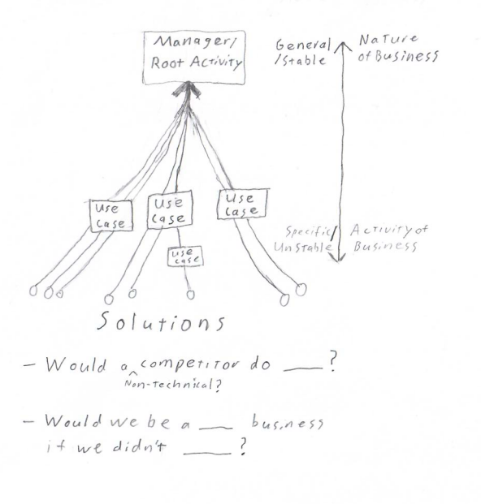

# Righting Software Visual Summary

Thus far this only includes the System Design portion of the book.

## Separating Nature from Solutions (Domain Discovery)

## Layer Guidelines

## Sub-system Guidelines

 - Systems are kept small to be intellectually managable. They are split on a cohesive vertical callchain, which is based around a manager and thus generally a sub-domain
 - "2% activities" are the activities that aren't the nature of you're business and so you spend little time on them. Thus, you'll never be an expert at them and you should keep them separated so that you can utilize pre-packaged solutions if needed (even if you custom implement at first). 
   - i.e. templated emails, message bus, role management, logging, task scheduling
   - This orthogonalization of concerns makes very re-usable and composible components rather than patching ancillary concerns into domain flows
   - Jives with Open-Closed Principal, More Generic -> Fewer opportunities for error, Single Responsibility Principal, Information Hiding, Unit of reuse is unit of release

## Other things
 - The one of the most stable systems decompositions is by the *nature of the business*
   - Despite the shade he throws at domain decomposition, DDD and iDesign have significant overlap. The business activities drive discovery of your services and methods. System language is also aligned with business language.
 - He also throws shade at Unit Testing, saying broader scale integration or regression testing is necessary and more practical. Seems like he never read Robert Martin's content on the Fragile Test Problem ([Test Contravariance](https://blog.cleancoder.com/uncle-bob/2017/10/03/TestContravariance.html), [First-Class Tests](https://blog.cleancoder.com/uncle-bob/2017/05/05/TestDefinitions.html), and [TDD Harms Architecture](https://blog.cleancoder.com/uncle-bob/2017/03/03/TDD-Harms-Architecture.html) among others)
 - His treatment of Functional Decomposition feels like McCarthyism. It is apparently the catch-all evil opponent of ~~democracy~~ design.