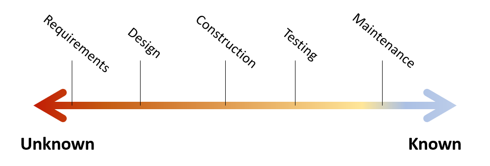

# What's your Duck: Fundamental Questions

This series is about design process and organizing our thoughts for effective development. The main goal is to establish a healthy mental model and intuition for effective design process. The duck bit will be explained later.

The general layout of the series is
- Fundamental questions: understanding the big picture of software and design motivations

<!-- 
TODO: consider putting a warning in What's your duck pointing to this post as the presentation companion -->

<!-- 
IDEA: make this post a series to make it more approachable / smaller increments
TODO: Do I need to group section by what I think belongs in one post? Clearly delineate chunks that need to be taken as a whole
I think at least the stage-specific techniques might be good as a separate post. Most everything up to there flows pretty well
-->

<!-- Meta thoughts
This feels so much different from writing my other posts. I can see all the effort I put into connecting back 

Thinking about this as a potential series causes me to write each section intro like a blog intro and forge stronger context clarity
 -->

## Motivating Questions

First, here are a few motivational questions.
- What is programming? Software Engineering?
- How do we effectively break down problems?
- Can software be perfect?
- What makes software good?

I'd encourage you to take a few minutes and organize your own thoughts on these questions before moving ahead. You don't have to have an answer, ideas and questions are good too. Connecting and theorizing [aid the learning process](../../_posts/2022-03-07-Small-Teaching-Review.md#predicting).

## The Nature of Software 

Let's tackle the first motivational question: "What is programming?".

I'm a firm believer that [programming is problem modeling](../../_posts/2022-02-18-Programming-is-Problem-Modeling.md). I love the quote from Fred Brooks

> The programmer, like the poet, works only slightly removed from pure thought-stuff. He builds his castles in the air, from air, creating by exertion of the imagination.  
> \- Fred Brooks, Mythical Man-month

As programmers, we take problems of all kinds and we translate them into the exact language of software. We can encode almost anything our imagination can grapple.

Real world problems are often messy and partially self-conflicting. Unwinding the many facets of such problems into automated processes is a difficult, non-deterministic, and beautiful [act of design](https://www.developerdotstar.com/mag/articles/reeves_design.html).

Software Engineering is then the repeatable process for encoding ideas in software both economically and reliably. 

## Better Wrong Than Vague

> Better wrong than vague  
> \- Fred Brooks, Design of Design

This quote is the single most important idea you can take from this post. If you remember nothing else, remember it's better to be wrong than vague.

Software is a complex design activity. We deal with messy problems and problems that often change. It's inevitable that we will get some elements wrong. What matters is [when and how we discover errors](https://stevemcconnell.com/articles/an-ounce-of-prevention/).

Vague ideas can still be wrong, it's just less likely that anyone will notice. Vague problems get swept down the line and pile up until they're nearly insurmountable. Software has coined the derogatory term "legacy" for such software, and it's often a place projects go to die.

Favoring clarity means identifying and communicating our assumptions. It means encoding what we think we know about the problem we're solving and how we're solving it. It's about ordering our thoughts well.

Clearly communicated ideas, unlike vague ideas, enable collaboration, comparison, reviews, and future reference.

Everything that follows is builds a framework to order thoughts well.

## Spectrum of Clarity

The high-level of software process is often known as the software development life cycle. The Software Engineering Body of Knowledge (SWEBOK) [imagines this process as a set of translations](../../_posts/2021-08-13-Swebok-transform-view.md). I tend to view the software life cycle as a spectrum of clarity.

The spectrum starts with much unknown and ends with most elements known. At the beginning, we know relatively little about the problem we're solving. Each development stage (i.e. requirements, design, construction, ...) is a [checkpoint in how well we've defined the problem](../../_posts/2022-02-18-Programming-is-Problem-Modeling.md#increment-to-good-enough). 

I don't mean to profess a strict linear flow like waterfall. Remember that programming is a design activity and design is messy. It's common to uncover questions in a later phase that force us to reconsider decisions we made in an earlier phase. This is natural and part of understanding the problem. What we want to avoid is cycling back frequently or back multiple stages. Cycling back, especially multiple stages, undermines previous work and is expensive. 

This spectrum from unknown to known plays out both at the work item level and system level. A work item is clarified through this spectrum until it can be released. A system is clarified as completed work enables feedback and new user abilities. Agile emphasizes small complete units of work for this reason. Better wrong than vague, and try to discover "wrong" early.

