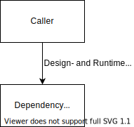
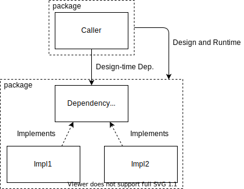
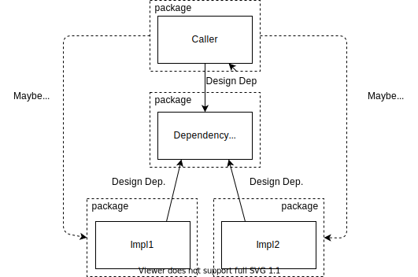
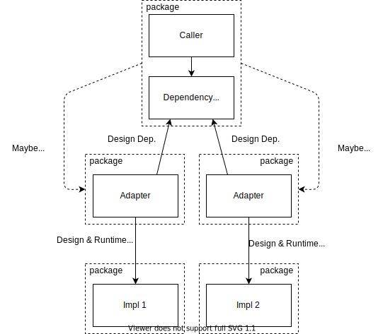

Dependency Inversion demands that abstractions belong to callers. 
This isn't an immediately intuitive choice. I'll break down the choices for where our abstractions can live and how each impacts kinds of dependency.
<!--more-->

<!-- TODO: reconsider title and file name -->

<!-- Should I split posts. One on differentiating run and design dep. One on DI? -->
Dependence often get's talked about as if there were only one kind. A component depends on another or it doesn't. But that's not true. There are many kinds of dependence (or coupling). 

<!-- The only way components have no dependence is if they have no relation at all, which means they cannot interact in any way. It's certainly useful thinking about what shouldn't interact, but much of design happens in finding just the right amount of dependence. -->

The main kinds of dependency I'll be considering here are 
- Design-time dependency: Dependent code won't compile if it doesn't have a reference to the dependency code
- Runtime-time dependency: Dependent will execute the dependency code at runtime. May or may not involve design-time dependence
- Semantic coupling: The dependent code uses knowledge of concepts the dependency defines. Could be modeled concepts, operating assumptions, or other knowledge.

I'll also often refer to packages for groups of code that get would get distributed together. In .NET land this could mean nuget packages or projects (which decide what gets compiles into one DLL). The same general ideas apply to code groupings across languages.

## Sample of Runtime without Design-time Dependence

It's not immediately intuitive that code can depend on other code at runtime, but not at design time. However, that's one of the main motivations for inheritance, and more broadly for dynamic polymorphism.

Consider this quick example. Which implementation of `IFoo` does `Baz` depend on?

```cs
interface IFoo{
    int Bar ();
}

class FooConst : IFoo {
    int Bar(){
        return 5; 
    }
}

class FooConfig : IFoo {
    int Bar(){
        return Config["foo"]; 
    }
}

class Baz{
    public Baz(IFoo foo)
    {

    }
}

```

It's a trick question. Baz doesn't know about any concrete `IFoo` implementations. It has no design-time dependence on specific IFoo implementations. Baz could be compiled with no IFoo implementations at all. However, a specific implementation of IFoo will need to passed into Baz in order for it to run, and is thus a runtime dependency. Which IFoo implementation Baz depends on at runtime can be decided at each instantiation of Baz.


## Where Abstractions Live

<!--
Maybe I don't make DI the framing, but instead instead overviewing kinds of coupling? or kinds of dependency?
- in particular, my original sketches cover a spectrum of abstraction choices
  - probably need a diagram showing adapter

TODO: I need a clearer term than "abstractions". 
- contracts for dependency operations, which we'll call ports
 -->


###  No Abstraction

The most straightforward dependency approach is dependency retention. That is, no abstraction. A concrete component directly references another concrete component.

For example, class B directly depends on class A.

```cs
class A {
    void DoThing(){
        //...
    }
}

class B{
    
    void DoMoreThings(){
        new A().DoThing();
        //...
    }
}
```



The caller is coupled to it's dependency at design-time and runtime. It also probably has a degree of semantic coupling since it is fully aware of the dependency's knowledge model. The caller must directly shape itself around mapping to the dependency's contract.

Changing what dependency we use requires changing the caller.

## Adding Abstraction

Desire to swap out dependency implementations generally leads to abstractions (e.g. [interfaces](https://learn.microsoft.com/en-us/dotnet/csharp/language-reference/keywords/interface)). Testing, for example, is much easier if class dependencies can be swapped for faster and more observable test implementations. When I say abstractions, I mean types that determine the contract a component accepts. These types could require specific methods on an implementation or set the shape for input data or output data.

All types in this code example could be called "abstractions" and part of the contract

```cs
class SearchParameters {
    Ingredient[] Ingredients;
    DietRestrictions[] Restrictions;
}

class RecipeSearchResult{
  Recipe[] MatchingRecipes;
  RecommendedContent Recommended;
}

interface IRecipeSearch{
    RecipeSearchResult Search(SearchParameters searchParams);
}
```

## Abstraction Lives with Implementation

Suppose we group these abstractions with their implementations. Seems intuitive.

.

Now we can technically swap implementations, but the reality tends to not be so nice.

For one, we haven't separated design-time and runtime dependency. Since the abstraction and implementation live together in one package, they are also always depended on together.

Alternative implementations have to live in the same package or reference the package that also includes the original implementation. The original implementation is usually explicitly not desired when you're creating an alternative implementation.

Implementation-oriented abstractions tends to violate [Interface Segregation](https://en.wikipedia.org/wiki/Interface_segregation_principle).The abstractions also don't know what they're being used for, so they have to try to be generic. The caller ends up depending on concepts they don't need. Further, the abstraction can't focus on a particular use-case so it accumulates too much responsibility and alternatives become too complex to practically create. The also abstraction usually becomes a "header interface" that just reflects the concrete implementation, resulting in very little conceptual decoupling.

## Shared Abstraction Reference

The coupling of design-time and runtime dependence can be broken by moving the abstractions into their own package.



A separate abstraction package does separate design-time and runtime dependency.
However, it doesn't resolve semantic tensions. The abstractions still need to orient their contracts to one need or the other. Here's the main options
  - *implementation-owned semantics* -> Forces the caller to still shape itself around the implementation's semantics. Suffers the disadvantages already discussed for Implementation-oriented abstractions. Also, offten results in the caller depending on sneaky assumptions of the implementation and undermining the decoupling
  - *caller and implementation semantics* -> Suffers all the disadvantages of Implementation-oriented abstractions, but also leaks semantic coupling between consumers of the dependency
  - *the abstractions own themselves* -> Abstractions on their own terms can be ok when they model system-wide common concepts. For example, you probably don't want every service defining a custom logging interface. I'd recommend avoiding these until you get a better handle on Dependency Inversion.
  - *caller-owned semantics* -> No need to separate the abstractions from the caller. Not immediately intuitive how to accomplish this, but we'll get there.


A major danger of a shared abstraction assembly is just having an "abstractions" package for most abstractions in system. This is (usually) about the same as making all your data global. It makes reference easy, but then everything knows about every abstraction and any change to those abstractions is pretty unsafe. Changing any abstraction requires considering the entire system. Yuck.

## Caller-owned Abstractions

Caller-owned abstractions resolve semantic tensions while maintaining design-time and runtime dependency separation.


Abstractions oriented to the caller know exactly how they're going to be used, so they can define only what the caller needs and in the exact terms the caller needs. There is no tension trying to balance design forces of multiple consumers. It is much easier to keep abstractions focused, small, and thus swap different implementations readily.

The confusing part is now your dependencies rely on the services that uses them. How can that work?

It works because the kinds of dependence are different. The caller has only a runtime dependence, while the implementation has a design-time dependence. 

This does mean that the dependencies are semantically dependent on the caller. They must work around mapping the caller's contracts into the dependency's concepts.

## Adapters

Adapters packages separate from the caller and the implementation. Their purpose it to isolate the mapping from caller contracts to implementation contracts. The adapter depends on both the caller and the dependency so that neither has to depend on the other. Adapters free both the caller and the dependency to define contracts on their own terms and pretend other components don't exist. Adapters cut design-time and semantic dependence and maintain deferred runtime dependence.



<!-- Now the adapter depends on the caller and on the called dependency. It is responsible for mapping one contract into the other. Now the caller and the implementation are semantically decoupled from each other and decoupled at design-time. Only the runtime-dependence remains. -->

Adapters are light-weight. The design freedom they provide usually more than makes up for the extra layer. The adapters also create a composable suite of caller-dependency relationships. The system can change achieve substantial behavior changes without changing any services (the callers or the implementations).

Here's a quick code example.

```cs
interface IMessageNotifier{
  void NotifyMessageSent(Message message);
}

class ChatMessageClient{
  private IMessageNotifier notifier;
  public ChatMessagingClient(IMessageNotifier notifier){

  }

  public SendMessage(){
    //...
    notifier.NotifyMessageSent(message);
    //...
  }
}
```

`IMessageNotifier` is the abstraction or "port" in this example. It could have adapters to all kinds of implementations.

Different mail providers
```cs
class SendgridMessageNotifier : IMessageNotifier {
  void NotifyMessageSent(Message message){
    //Email code from before
    sendgridClient.Send([map message to sendgrid]);
  }
}

class MailGunMessageNotifier : IMessageNotifier{
  //...
}
```

SMS messaging
```cs
class SMSMessageNotifier : IMessageNotifier{
  //...
}
```

Testing
```cs
class MockMessageNotifier : IMessageNotifier{
  List<Message> MessagesNotifications = new List<Message>();

  void NotifyMessageSent(Message message){
    MessagesNotifications.Add(message);
  }
}
```
Or even aggregates of other notifiers
```cs
class AggregateNotifier : IMessageNotifier{
  private IMessageNotifier[] notifierList;
  public AggregateNotifier(IMessageNotifier[] notifierList){
    this.notifierList = notifierList;
  } 
  void NotifyMessageSent(Message message){
    foreach(notifier in notifierList){
      notifier.NotifyMessageSent(message); 
    }
  }
}
```

Adapters are so powerful, they [form the backbone of many of the most established architecture patterns](https://blog.ploeh.dk/2013/12/03/layers-onions-ports-adapters-its-all-the-same/). For example, Ports and Adapters or Clean Architecture.

<!-- Don't adapter everything. Notice how adapters inherently use direct dependence -->
