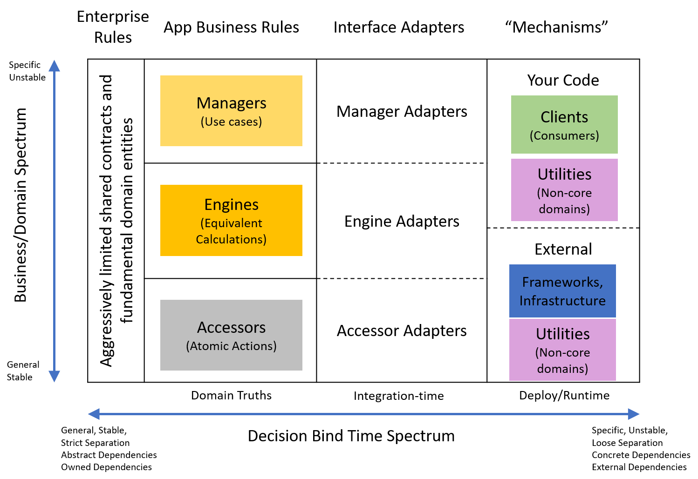

<!-- TODO: do a sweep for potentially confusing terms to link
- iDesign
- Clean ARch
- Dependency Inversion
- ports & adapters?
- domain -->
<!-- TODO: rename file according to final title -->
I generated a visual while trying to reconcile the iDesign and Clean Architecture architectural patterns. The visual helped cement some important ideas, but I never published it. Here I'll revisit the visual and review how my ideas have changed.
<!--more-->

## Original Visual



### iDesign Layers
iDesign organizes software systems into layers based based on responsibility cohesions within the problem domain. Specifically,
- Clients: Define interactions for external actors. External actors could be users or other systems
- Managers: Centralize orchestration and sequence. Managers tend to reflect usecase groups.
- Engines: Define interchangeable calculations
- Accessors: Hide external dependencies from the system, like data stores or 3rd-party APIs.
- Utilities: Centralize repeated non-domain concerns across other services, like pub-sub tooling or logging.

Most of these layers define abstractions that model the problem being solved.

For the most part the higher service types call the layer below. For example, clients call managers and managers call engines and accessors. Utilities tend to be cross-cutting and are used across the layers.

I've written [more on iDesign](../posts/2020-07-03-iDesign-Visual-Summary.md) if you want to explore deeper.

### Clean Architecture layers
Clean Architecture also organizes systems into layers, but bases the layers on the level of abstraction. Dependency Inversion is used to defer details that are not essential to the business rules or may vary.
- Enterprise Rules: An aggressively limited set of abstractions shared across the system that represent normalized fundamental domain concepts
- App Business Rules: model business rules free from incidental implementation concerns
- Interface Adapters: Thin mappers from a Business Rule's abstract dependency to a concrete implementation like a data store, 3rd-party tool, other domain service, etc.
- Mechanisms: Non-abstracted components. Could be implementations of business rule dependencies or consumers of the business rules like user interfaces.

Clean Architecture is effectively the same architecture pattern as Ports and Adapters, Hexagonal Architecture, and Onion Architecture.

A short example

```cs
interface IMessageNotifier{
  // This is an abstract dependency of MessageClient
  void NotifyMessageSent(Message message);
}

class MessageClient{
  // MessageClient is the core Business Rule defining messaging behavior
  private IMessageNotifier notifier;
  public MessagingClient(IMessageNotifier notifier){
    this.notifier = notifier;
  }

  public SendMessage(User to, string text){
    //...
    notifier.NotifyMessageSent(message);
    //...
  }
}

// Adapters
class SendgridMessageNotifierAdapter : IMessageNotifier {
  void NotifyMessageSent(Message message){
    // SendGrid is the mechanism here
    sendgridClient.Send([map message to sendgrid]);
  }
}

class MockMessageNotifierAdapter : IMessageNotifier{
  // here the mechanism an in-memory collection
  List<Message> MessagesNotifications = new List<Message>();

  void NotifyMessageSent(Message message){
    MessagesNotifications.Add(message);
  }
}

class SNSMessageNotifierAdapter : IMessageNotifier{
  //...
}
```

### Bringing Them Together

The core of this visual is realizing the two layering schemes are not at odds. 
iDesign defines layering within domain abstractions while Clean Architecture protects domain abstractions from unnecessary implementation concerns.

Placing iDesign service layer types within the clean architecture layers affords us both organization of domain responsibilities and deferred component composition.

Both layering schemes obey the Stable Abstractions Principle, where the more abstract a type is the more stable it should be.


## What's Changed

My perspective has shifted since I made this visual. 

One, I prefer the Ports and Adapters analogy instead of Clean Architecture's terms. Ports being the configurable abstactions domain services use to defer dependencies on their own terms (i.e. `IMessageNotifier`). Adapters being the same as in Clean Architecture. Ports are kinda like computer ports (i.e. usb) and other services "plug-in" to them using adapters. Ports and Adapters is still the same concept as Clean architecture, just different terms.

Most significantly, I've de-emphasized importance of the iDesign layers. The roles of engines and accessors tend to be satisfied by ports without need for a concrete downstream domain service. The adapter can map ports to a different domain service, data store, or to a third party service equally well. The core rule protected by the port is equally oblivious to external actors in any case. There isn't need for coordinating domain service abstractions or for implementing a concrete service for each domain layer. This also reduces pass-through calls just to satisfy layering rules. Overall, creating concrete services for each domain layer is de-emphasized in favor of adapters.
Services themselves are more about what parts of the problem are *both* isolatable and reused.

Another way of looking at it, iDesign layers tend not do deliver on their intended Stable Abstractions promise. Since services try to model domain-wide reusable concepts, their abstraction tends to just reflect the implementation (see [header interfaces](https://blog.ploeh.dk/2010/12/02/Interfacesarenotabstractions/#5003089a645f468bb76d44b61871bfdd)). There is no need for the domain service to be abstract when the calling service already defines a port to decouple from concrete implementations. In fact, there is no need for the lower domain service at all if there isn't a concrete need shared between higher services. Instead trying to use domain-wide service interfaces leads to conceptual coupling between services and causes changes to ripple through the application.

Conversely, Ports and Adapters limits the abstractions to the one service that calls it. Domain-wide reuse can still be collected into a service, but the reused service doesn't need to try being abstract or worry about specific caller usecases. Calling services can just use adapters to map their needs into the lower service's api. See, [Open-Closed Principle by Example](../posts/Open-Closed-by-Example/2023-03-02-0-Intro-to-OCP.md) for a more in-depth exploration of how this works.

## What's stayed the same

Clarifying how Dependency Inversion allows a progression of decision composition (or binding times) remains highly useful.

More explicitly
- Domain rules focus only on modeling the essence of the problem we're solving. This is where domain rules are "bound".
  - Ports allow the domain rules to define dependencies in terms of the domain, not the implementation. They allow dependencies to be bound later
- Adapters define a suite of alternatives we can swap in for different domain dependencies. This "binds" our suite of behavior options.
  - Many cross-cutting concerns like identity, logging, caching and similar can be also separated from the domain rules into [decorator adapters](../posts/Open-Closed-by-Example/2023-03-02-4-OCP-as-architecture.md#isolate-cross-cutting-concerns) to be composed later
- Clients or consumers of the rules decide which adapters to compose into the service ports. This determines, or "binds", the final run-time behavior and dependencies.

I also still believe there is a useful 2-axis gradient of stability and abstraction. However, I don't know how to update the table for the new domain spectrum. The new domain spectrum spans a composed suite of services that don't know about each other. Some services will probably be more fundamental than others. Especially since many services evolve from adapters expanding to meet the needs of other services. 
This domain gradient informs how services should be composed and thus manages complexity by reducing mutual service dependencies. 


