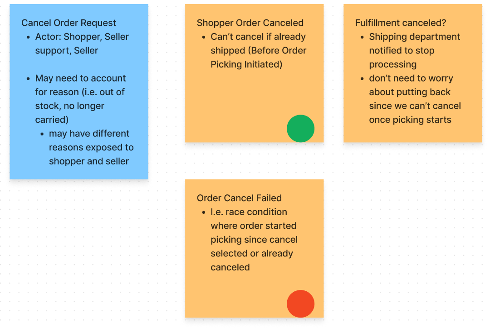

<!-- todo: probably rename the file or title so the url and title align -->
<!-- TODO: this should probably be split into two posts. One is data model, the other is the from data model to code design -->

Continuing the event storm explorations, I tested out several approaches for translating event storms into system designs.
<!--more-->

## Event Storming Review

For those who are unfamiliar, event storming is a technique for mapping out processes. It's often used to create a shared picture between people of many different roles. 

An event storm is primarily composed of events. Events represent something that happened in a process that other parts of the business might need to know about. Some examples from an ecommerce site might include `OrderCanceled`, `OrderPacked`, and `OrderShipped`.

Alberto published an [excellent and brief introduction](http://ziobrando.blogspot.com/2013/11/introducing-event-storming.html) to event storming. You can also
checkout [Awesome Event Storming](https://github.com/mariuszgil/awesome-eventstorming) for more materials and examples.

## Problem Context


I've been exploring event storming with some other developers, and now we want to translate the event storm into a high-level system design in order to understand the flow from discovery to code. 

I've experimented with event storms in the past, but always in a functional programming context. 
Functional design seemed like too much learning to pile on for others in the current experiment. So, I explored with a few other approaches for refining event storms into designs. 

## Example Workflow for Design 



The portion of the event storm I'll be translating to a high-level design is shown in the picture above.

This flow consists of one command and the events that follow it. Specifically, the command is Cancel Order Request.

If the command succeeds, then the Shopper Order Canceled event is raised and the Fulfillment Canceled event is also raised. Fulfillment Cancelled could, in the future, be subject to more sophisticated flows the follow from an order cancel. For simplicity, it fulfillment is assumed canceled if the order succeeds in canceling. 

If the Cancel Order Request fails, an Order Cancel Failed event is thrown with the reason for failure. 
There aren't multiple failure events in this case because different modes of failure wouldn't be handled differently by the business.


## Data Modeling

With this event storm model in place (the sticky notes), the next steps would be working with stakeholders to identify the data needed on each command and event. 

I first learned about event storms from Scott Wlaschin's [Domain Modeling Made Functional](https://fsharpforfunandprofit.com/books/#domain-modeling-made-functional), and this process largely follows his example.

Data exploration starts by choosing a high-level workflow, like the one we demonstrated [above](#example-workflow-for-design). We bootstrap our data model by encoding the workflow with the command as input and the events as output.

A simple syntax might stub the workflow like this
```
workflow CancelOrder =
  input: CancelOrderRequest
  output: 
    | Shopper Order Canceled
    | Order Cancel Failed
```

Then, start asking what data each of those inputs and outputs include. Stub out child types until you've reached the bottom or decided enough detail has been covered. 

All of this communicated in some semi-formal language to balance readability with enough clarity to expose gaps in understanding.

```
workflow CancelOrder =
  input: CancelOrderRequest
  output: 
    | ShopperOrderCanceled
    | OrderCancelFailed

data CancelOrderRequest = {
  OrderId: OrderId
  Reason: ShopperCancelReason 
}

data OrderId = 
  constraints: Should be unique. Doesn't need to be human readable.

data ShopperCancelReason = // TODO

data ShopperOrderCanceled = // TODO
data OrderCancelFailed = // TODO
```

This simple syntax is intuitive enough for non-developers to read and rigorous enough that there's little room for ambiguity and misaligned understanding. 

A few choices might need a bit of explanation.
- `|` means alternatives. Like `type Answers = | Yes | No` 
- Data inside brackets lives together `type Person = {Name: FullName; Address: PostalAddress}`

These data models aren't primarily for coding. They dig into dependencies between parts of the business process with greater detail. They're an effective way to find gaps in the higher-level sticky note model and avoid programmers unhappily rewriting code to fit what business people knew all along, but didn't know to share.

I was surprised [how much this data phase reveals about the business](../posts/2023/2023-07-13-Differentiating-events-and-commands.md), and how much it led to rework of the overall event storm.

This approach benefits from several types of incremental progress. Each workflow stands on its own (out of the larger event storm), and the data is also progressively clarified from the top-down. This means the team can work in complete chunks, prioritize the chucks most likely to effect the big picture, and stop whenever they feel confident that overall risk to the model is low enough.


## High-Level Design 

This stakeholder-focused data model is also a very good starting point for a software design. It specifies data, constraints on that data, and workflow inputs/outputs that can translate to action signatures.

In essence, this originally stakeholder-focused model has defined our high-level system endpoints.

But, we still need to know what dependencies those high-level endpoints will need, what concerns should be reused, how all of it should be organized into modules, etc.

This is where I hoped to side-step functional programming, but let's see the functional version for reference.

## Event-Driven Architecture

Event storms focus on events to model business processes. Well, there's also a software design paradigm based on events: Event-Driven Architecture. Specifically, I'll focus on a functional-core type design.

Before I get into the ideas behind the approach, I want to give a taste of it's power.

Let's use the workflows we've defined so far as a baseline. Assume that any events returned from our flow will be saved / turned into entity state. This frees the workflow from state management. 

Now we can consider dependencies of our workflow with an extension of our data model. In this case, I added a `dependencies` section.

```
workflow CancelOrder =
  input: CancelOrderRequest
  output: 
    | ShopperOrderCanceled
    | OrderCancelFailed

  dependencies:
    GetOrderById 
      // the command doesn't include the full order, 
      // so we need to be able to look it up
```

In this way we can build an 
<!-- TODO: PICKUP: -->

### Sneaky Code

The data model has thus far been focused on redability and collaboration.
It was largely a convenient translation of our event sticky notes into text that could be progressively clarified.

But this model is also a good starting place for code. 

Turns out, with the right software design, this model effectively *is* a high level code model.

Suppose we tweak this model syntax just a bit
- `->` indicates a transformation. For example, `CancelOrderRequest -> CancelOrderResult` means take a CancelOrderRequest and return a CancelOrderResult
- `*` indicates `AND` when a flow requires multiple pre-conditions
- We replace `workflow` and `data` with `type`

Now the model might look like this
```
type CancelOrder = 
  // non-domain dependencies first, if included at all
  GetOrderById 
  // domain input / output
  -> ((OrderId -> OrderExists?) * OrderFulfillmentStatus) * CancelOrderRequest 
  -> CancelOrderResult

type GetOrderById = OrderId -> Order

type OrderId = // must be unique, and easy for a customer to read to a support agent

type CancelOrderRequest = {
  OrderId: OrderId
  Reason: ShopperCancelReason
}

  type ShopperCancelReason = 
    // Q: What reasons might a shopper cancel their order for?
    | FoundBetterPrice


type CancelOrderResult = 
  | Success of
    | OrderCanceled
  | Error of
    // Q: What ways can an order fail that might change the message to consumers? 
    | OrderAlreadyInFulfillment
    | OrderNotFound

  type OrderCanceled = {
    // Q: what do we need to notify others?
    OrderId: OrderId
    Reason: CancelReason
  }

  type CancelReason = 
    // Q: What groups would have distinct reasons for cancelling?
    | ShopperCancelReason
    | SellerCancelReason
    | WarehouseCancelReason

```

Surprise! This is valid F# syntax (minus the order of type declarations, which I left alone to keep the comparison easy).

This approach for refining event storm sticky notes into a more detailed view is simple for developers and non-developers alike. While working with non-developers, the inputs and outputs are discussed in purely domain terms and recorded in the readable but consistent style. But, this semi-formal definition is already rigorous enough to define the foundational domain model in code.


### Functional Core

The code design approach here is called Functional Core or Event-Driven Architecture.

The idea is that the business rules are [pure functions](https://en.wikipedia.org/wiki/Pure_function), 
they don't cause any observable state change. Instead they return values, in this case the events, which represent state changes that can be enacted by simple mapping functions.

This approach is very intersting, but I won't go deeper here. [Domain Modeling Made Functional](https://fsharpforfunandprofit.com/books/#domain-modeling-made-functional) is excellent resource for futher exploration.
The book is a fantastic introduction to domain modeling, event storming, or just a thoughtful requirements-driven development process. 
The book is very approachable and I highly recommend it, but you can also check out his free [presentation](https://fsharpforfunandprofit.com/video/#domain-modeling-made-functional) or his related [Designing with Types series](https://fsharpforfunandprofit.com/series/designing-with-types/). His work is where I learned many of the ideas discussed in this post.
Mark Seemann also has good content on this approach ([book](https://www.amazon.com/Code-That-Fits-Your-Head/dp/0137464401), [blog](https://blog.ploeh.dk/2016/03/18/functional-architecture-is-ports-and-adapters/)).

The main thing to know for now is that this approach is my reference point for how well event storms can map to code.

## Translating to C#

I thought I might be able to use C# to formalize data and dependencies in a similar way. I could use interfaces to translate workflows into function signatures, and data-only classes to represent the inputs and outputs.
Perhaps a constructor listing dependencies would do for modeling side-effects or state that workflow might need. 

Also key, I wasn't going to use a functional core model, but a [Ports and Adapters-style model](https://spencerfarley.com/2023/03/02/4-ocp-as-architecture/) where the workflows might enact state instead of returning events (i.e. using [Dependency Inversion](https://spencerfarley.com/2023/03/02/3-interchangable-dependencies/)).

This devolved quickly for several reasons. First, C# anonymous functions are not intuitive to read, and interfaces require a name. This prematurely pressures toward
grouping command flows into modules or services. It also more clearly makes the model seem like code. The gap between the domain and code model is far enough that it feels weird and effortful.

```cs
Func<CancelOrderRequest, CancelResult> CancelOrder; //Wat?
// OR
interface ISomeAggregateResponsibility { // I don't want to name this yet
  CancelResult CancelOrder(CancelOrderRequest cancelOrderRequest);
}
```

Second, C# doesn't have a concise syntax for alternative data cases. We can model the command just fine, but the events would all have to inherit from a base class.
It clearly becomes code

```cs
record ShopperCancelReason{
  record FoundBetterPrice(RetailerWithBetterPrice retailer): ShopperCancelReason {};
  record OrderedByAccident(): ShopperCancelReason;
  //...
}
```

In C#, we have to use a constructor or currying if we don't want to pass dependencies on every function call. This starts pulling us into concrete types and draws more code-specific concerns into the picture.

Overall, C# doesn't work well as a semi-formal specification. There are too many concerns that force a compromise between C# syntax and avoiding code-specific concerns.
This is a deal breaker for working with non-developers, but also tempts developers to preemptively dive into code details.

   <!-- CROSS: [concise syntax matters](../posts/2023/2023-04-16-concise-notation-matters.md) -->


## Translating to F# with stateful dependencies

I thought perhaps a Ports and Adapters-style model would fair better in F# because F# has readable anonymous function types, readable alternative value types, and can partially apply functions to handle dependency management.

However, this style of modeling still didn't feel good in F# either. The translation from events to types is less direct. The functions have way more dependencies which decreases readability.

Most importantly, the concerns added to the process don't have any benefit for domain modeling, they are purely code design concerns. Non-developer don't care how or where state in enacted. The implicit expectation of state changes would render the domain model unintuitive and error-prone. The domain model is better served by expecting workflows to only change state through their output values. In other words, the domain models should follow a functional core / event-driven modeling approach. 

## Conclusion: Event-Driven Modeling  Wins

My conclusion is that event-driven modeling is still the winner for refining event storms into high level models.

The translation is clear and it can be done with non-technical stakeholders. The key concerns at the domain level and high-level design level can be clearly discussed with one model. T

he production code can be implemented in a different style if desired. Even so, an event-based model requires the fewest incidental implementation details or premature decisions and still coveres the essential high-level design decisions. Translating those decisions from the event model to other styles is a matter of implementation details.
