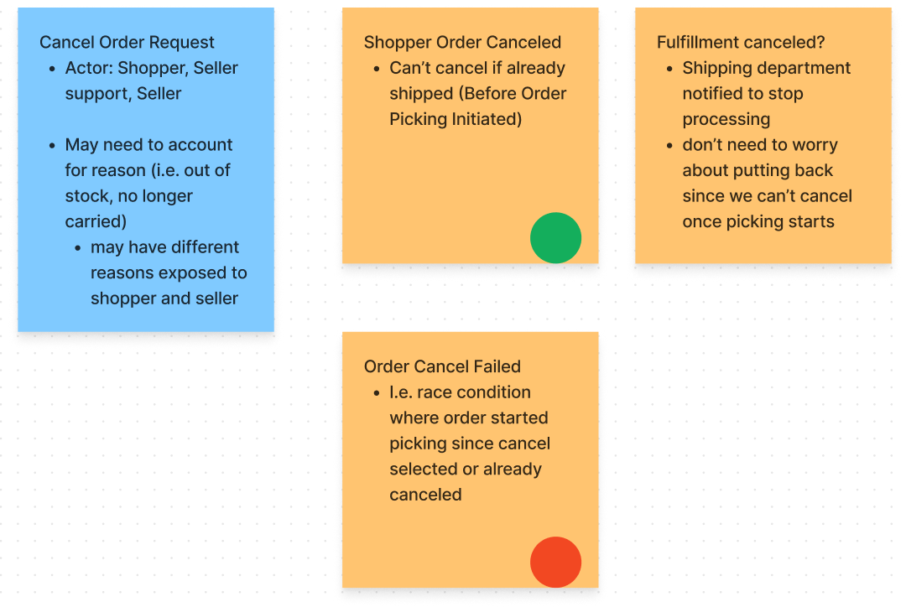

<!-- TODO: The experimentation with non-functional approaches in a relatively small part of the post. Should I change the framing in the problem context? -->

Continuing the event storm explorations, I tested out several approaches for translating event storms into system designs. 
<!--more-->

## Event Storming Review

For those who are unfamiliar, event storming is a technique for mapping out processes. It's often used to create a shared picture between people of many different roles. 

An event storm is primarily composed of events. Events represent something that happened that other parts of the business might need to know about. Some examples from an ecommerce site might include `OrderCanceled`, `OrderPacked`, and `OrderShipped`.

Alberto published an [excellent and brief introduction](http://ziobrando.blogspot.com/2013/11/introducing-event-storming.html) to event storming. You can also
checkout [Awesome Event Storming](https://github.com/mariuszgil/awesome-eventstorming) for more materials and examples.

## Problem Context

I've been exploring event storming with some other developers. We've previously completed the high-level event storm (process flow using sticky notes) and clarified the data models for key flows. Now we want to translate the event storm into a high-level system design. 

I've written systems based on event storms in the past, but always in a functional programming context. 
Functional design seemed like too much learning to pile on for others in the current experiment. Here I'll explore a few other approaches for refining event storms into high-level designs. 

## Example Workflow 

This post is heavily based on artifacts from previous explorations
I've replicated the basic artifacts here. For more details please read [Event Storming Interaction-heavy Flows](../posts/2023/2023-10-05-Storming-interaction-heavy-flows.md) and [Clarifying Event Storms with Data Modeling](./2023-05-08-clarifying-event-storms-with-data-models.md).

The event storm sticky notes for the Cancel Order flow.



The data model for the Cancel Order flow.
```
workflow CancelOrder =
  input: CancelOrderRequest
  output: 
    | ShopperOrderCanceled
    | OrderCancelFailed

data CancelOrderRequest = {
  OrderId: OrderId
  Reason: ShopperCancelReason 
}

data OrderId = 
  constraints: Should be unique. Doesn't need to be human readable.

data ShopperCancelReason = // TODO

data ShopperOrderCanceled = // TODO
data OrderCancelFailed = // TODO
```


## Start with the data model

The stakeholder-focused data model is a very good starting point for a software design. It specifies data, constraints on that data, and workflow inputs/outputs that can translate to action signatures.

In essence, this originally stakeholder-focused model has defined our high-level system endpoints.

But, we still need to know what dependencies those high-level endpoints will need, what concerns should be reused, how all of it should be organized into modules, etc.

This is where I hoped to side-step functional programming, but let's see the functional version for reference.

## Event-Driven Architecture

Event storms leverage events to model business processes. Well, there's also a software design paradigm based on events: Event-Driven Architecture. Specifically, I'll focus on a functional-core type design.
<!-- 
Before I get into the ideas behind the approach, I want to give a taste of it's power.

Let's use the workflows we've defined so far as a baseline. Assume that any events returned from our flow will be saved / turned into entity state. This frees the workflow from state management. 

Now we can consider dependencies of our workflow with an extension of our data model. In this case, I added a `dependencies` section.

```
workflow CancelOrder =
  input: CancelOrderRequest
  output: 
    | ShopperOrderCanceled
    | OrderCancelFailed

  dependencies:
    GetOrderById 
      // the command doesn't include the full order, 
      // so we need to be able to look it up
```

In this way we can build an 

TODO: need to talk about dependencies -->

### Sneaky Code

The data model has thus far been focused on redability and collaboration.
It was largely a convenient translation of our event sticky notes into text that could be progressively clarified alongside non-developers.

Turns out, with the right software design, this model effectively *is* a high level code model.

Here's the non-developer friendly model we defined previously

```
workflow CancelOrder =
  input: CancelOrderRequest
  output: 
    | ShopperOrderCanceled
    | OrderCancelFailed

data CancelOrderRequest = {
  OrderId: OrderId
  Reason: ShopperCancelReason 
}

data OrderId = 
  constraints: Should be unique. Doesn't need to be human readable.

data ShopperCancelReason = // TODO

data ShopperOrderCanceled = // TODO
data OrderCancelFailed = // TODO
```

Suppose we tweak this model syntax just a bit
- `->` indicates a transformation. For example, `CancelOrderRequest -> CancelOrderResult` means take a CancelOrderRequest and return a CancelOrderResult
- `*` indicates `AND` when a flow requires multiple pre-conditions
- We replace `workflow` and `data` with `type`

Now the model would look like this
```fsharp
type CancelOrder = 
  // domain input / output
  -> CancelOrderRequest 
  -> CancelOrderResult

type GetOrderById = OrderId -> Order

type OrderId = // must be unique, and easy for a customer to read to a support agent

type CancelOrderRequest = {
  OrderId: OrderId
  Reason: ShopperCancelReason
}

  type ShopperCancelReason = 
    // Q: What reasons might a shopper cancel their order for?
    | FoundBetterPrice


type CancelOrderResult = 
  | Success of
    | OrderCanceled
  | Error of
    // Q: What ways can an order fail that might change the message to consumers? 
    | OrderAlreadyInFulfillment
    | OrderNotFound

  type OrderCanceled = {
    // Q: what do we need to notify others?
    OrderId: OrderId
    Reason: CancelReason
  }

  type CancelReason = 
    // Q: What groups would have distinct reasons for cancelling?
    | ShopperCancelReason
    | SellerCancelReason
    | WarehouseCancelReason

```

Surprise! This is valid F# syntax (minus the order of type declarations, which I left alone to keep the comparison easy).


<!-- 
This approach for refining event storm sticky notes into a more detailed view is simple for developers and non-developers alike. While working with non-developers, the inputs and outputs are discussed in purely domain terms and recorded in the readable but consistent style. But, this semi-formal definition is already rigorous enough to define the foundational domain model in code. -->


### Functional Core

The code design approach here is called Functional Core or Event-Driven Architecture.

The idea is that the business rules are [pure functions](https://en.wikipedia.org/wiki/Pure_function), 
they don't cause any observable state change. Any changes must be reflected the functions return value. The return value in this case is the event data structures. The events represent state changes that can be persisted by simple mapping functions.

This approach is very intersting, but I won't go very deep here. [Domain Modeling Made Functional](https://fsharpforfunandprofit.com/books/#domain-modeling-made-functional) is excellent resource for futher exploration.
The book is a fantastic introduction to domain modeling, event storming, or just a thoughtful requirements-driven development process. 
The book is very approachable and I highly recommend it, but you can also check out his free [presentation](https://fsharpforfunandprofit.com/video/#domain-modeling-made-functional) or his related [Designing with Types series](https://fsharpforfunandprofit.com/series/designing-with-types/). His work is where I learned many of the ideas discussed in this post.
Mark Seemann also has good content on this approach ([book](https://www.amazon.com/Code-That-Fits-Your-Head/dp/0137464401), [blog](https://blog.ploeh.dk/2016/03/18/functional-architecture-is-ports-and-adapters/)).

The main thing to know for now is that this approach is my reference point for how well event storms can map to code.


### Dependencies

Contemplating dependencies is rather straightforward with a functional-core approach. 

Essentially, we just need to consider what information or sub-actions may be needed to translate a command into it's related events but isn't present in the input command. For example, the `CancelOrderRequest` includes only an OrderId, but we may need to analyze items in the order or the current status of the order to decide the outcome.

We can mostly ignore the mundane dependencies like state persistence. The domain rules themselves don't persist state. Any changes in state will be reflected in the returned events and are usually rather predictably translated into persisted state with little logic.

Dependencies can be discussed with semi-formal syntax as an extension of the data model.

```
workflow CancelOrder =
  input: CancelOrderRequest
  output: 
    | ShopperOrderCanceled
    | OrderCancelFailed

  dependencies:
    GetOrderById 
      // the command doesn't include the full order, 
      // so we need to be able to look it up
```

Or, dependencies could be reflected directly into the code translation of the model

```fsharp
type CancelOrder = 
  GetOrderById: (OrderId -> Order option) 
  // domain input / output
  -> CancelOrderRequest 
  -> CancelOrderResult
```

Note that F# has partial application (as do most functional languages). 
This allows us to pass part of the argument list and get back a function on the remaining arguments. This means functions can accept dependencies as arguments without passing them on every call.

```fsharp
let cancelOrder = SomeModule.cancelOrder getOrderById_FromSql

let cancelResult = cancelOrder cancelRequest
```

Re-examining `GetOrderById`, there's not much reason the business rule needs a function to get the order. Instead, directly accepting an order allows the flow to fix all its state up front, making observability and error reproduction much easier. 
This seems like a good place to diverge from the business model and assume we can get a full order ahead of time.

```
type CancelOrder = 
  Order option
  * CancelOrderRequest 
  -> CancelOrderResult
```

Note that `option` allows us to either find an existing order or not and let the CancelOrder flow decide what to do if no order exists.


### Modularization

Modularization is also simple with an event-driven / functional-core approach. 

The workflow signatures stand alone. They can communicate inputs, outputs, and even dependencies in a self-contained fashion. 

This means we don't have to make any decisions about where these functions live in order to explore dependencies.
Our modularization choices are not influenced by groupings made early on chunk off the top-level apis. Instead we can see what dependencies emerge, and inform our modularization at all levels *after* defining individual endpoints on their own terms.

The top-level modules will, however, likely be based on business division in the event storm. I.e. you could draw circles around groups of sticky notes based on who in the company is responsible for it. Still, analyzing common dependencies might inform hidden connections and who really owns certain workflows.


## Other Approaches

Now we've seen my baseline process for translating event storms
into functional designs. It's time to explore how other design approaches might work.

## Translating to C#

I thought I might be able to use C# to formalize data and dependencies in a similar way as I could with functional-core and F#. I could use interfaces to translate workflows into function signatures, and data-only classes to represent the inputs and outputs.
Perhaps a constructor listing dependencies would do for modeling side-effects or state that workflow might need. 

Also key, I wasn't going to use a functional core model, but a [Ports and Adapters-style model](https://spencerfarley.com/2023/03/02/4-ocp-as-architecture/) where the workflows might enact state instead of returning events (i.e. using [Dependency Inversion](https://spencerfarley.com/2023/03/02/3-interchangable-dependencies/)).

This devolved quickly for several reasons. First, C# anonymous functions are not intuitive to read, and interfaces require a name. This prematurely pressures toward
grouping command flows into modules or services. It also more clearly makes the model seem like code. The gap between the domain and code model is far enough that it feels weird and effortful.

```cs
Func<CancelOrderRequest, CancelResult> CancelOrder; //Wat?

// OR

// I don't want to name this interface yet...
interface ISomeAggregateResponsibility { 
  CancelResult CancelOrder(CancelOrderRequest cancelOrderRequest);
}
```

Second, C# doesn't have a concise syntax for alternative data cases. We can model the command just fine, but the events would all have to inherit from a base class.
It clearly becomes code

```cs
record ShopperCancelReason{
  record FoundBetterPrice(RetailerWithBetterPrice retailer): ShopperCancelReason {};
  record OrderedByAccident(): ShopperCancelReason;
  //...
}
```

In C#, we have to use a constructor or currying if we don't want to pass dependencies on every function call. This starts pulling us into concrete types and draws more code-specific concerns into the picture.

Overall, C# doesn't work well as a semi-formal specification. There are too many concerns that force a compromise between C# syntax and avoiding code-specific concerns.
This is a deal breaker for working with non-developers, but also tempts developers to preemptively dive into code details.

   <!-- CROSS: [concise syntax matters](../posts/2023/2023-04-16-concise-notation-matters.md) -->


## Translating to F# with stateful dependencies

I thought perhaps a Ports and Adapters-style model would fair better in F# because F# has readable anonymous function types, readable alternative value types, and can partially apply functions to handle dependency management.

However, this style of modeling still didn't feel good in F# either. The translation from events to types is less direct. The functions have way more dependencies which decreases readability.

Most importantly, the added concerns don't add any modeling benefit, they are purely code design concerns. 

State management is the most obvious complicating concern. Statefullness through the call stack distributes defensive programming, orchestration, and scaling concerns across many methods, and their relationship to each other must be kept in mind.

It's much easier to grapple with state decisions when they are concentrated in one layer. In effect, we almost back to a functional-core approach.

## Semi-formal Ports and Adapters syntax

A semi-formal Ports and Adapters syntax falls short for the same reasons an F# Ports and Adapters approach falls short. Statefulness complicates the dependencies and general design considerations. Attempts to simplify effectively lead back to what we had in our functional-core / event-driven model. 

## Conclusion: Event-Driven Modeling Wins

My conclusion is that event-driven modeling is still the winner for refining event storms into high level models.

The translation is clear and only a short step from the non-technical data model. The key concerns at the domain level and high-level design level can be clearly discussed with one model. 

An event-based model requires the fewest incidental implementation details or premature decisions while still covering the essential high-level design decisions. 

The production code can be implemented in a different style if desired. The event model captures the critical high-level details. Translating an event-driven model into other styles is a matter of implementation details.
