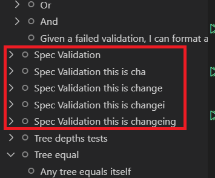
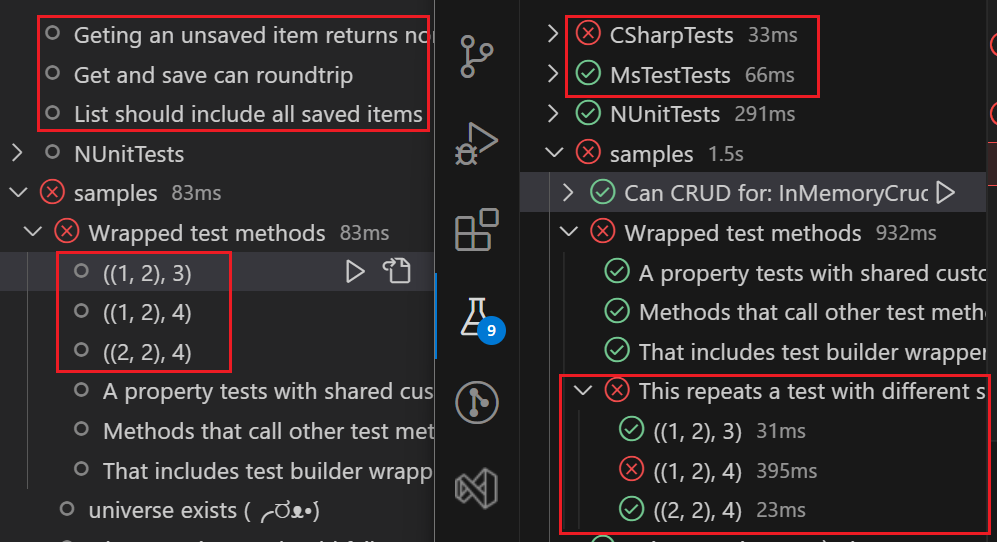
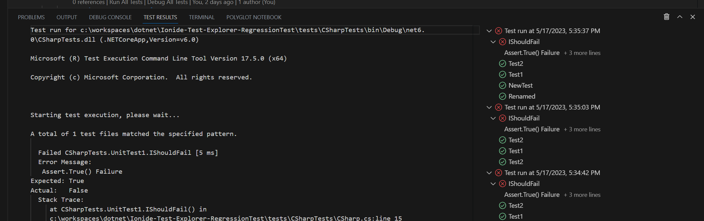
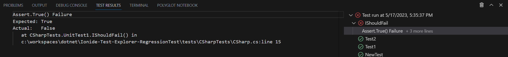

I contributed to the Ionide (F#) test explorer for VS Code. I'm proud of the work, so please pardon a bit of show and tell.
<!--more-->

The [full pull request](https://github.com/ionide/ionide-vscode-fsharp/pull/1874) is available with more details on challenges and their solutions.

## Motivation 

Yes, I know that Visual Studio has good F# support with a well functioning test explorer. But VS Code with it's strong extension ecosystem works better for some of my mixed workflows. Like if I want to iterate between an interactive notebook and coding, or between an exploratory markdown document and coding, or if I'm working in mixed languages. So, I regularly find myself working on F# in VS Code.

VS Code has a nice F# plugin: Ionide. But test explorers for .NET in VS Code have long been a bit lacking. This is especially true for for my F# experience since I use Expecto, which functions differently than the mainline attribute-based test frameworks. 

Testing is central to my development flow, so I want a fast test loop. At least I want my test explorer to
- Show tests in the expected hierarchy / test groupings
- reliably run all
- reliably run individual tests and groups of tests
- Go to test code from the test item in the explorer

I'd also like to
- See the test explorer update as code updates
- Run tests from an line lens / from a control in proximity to the test code
- Debug tests
- Test across .NET languages

None of the existing .NET explorers covered all the requirements.

## Previous Ionide Test Explorer

Someone contributed an MVP test explorer to Ionide. It covered many of these cases, but had some issues.

It updated with code changes, but had a tendency to accumulate test tree items mid-rename states.

It also based the test hierarchy fully on the code structure, and not the test group / test name structure. Sometimes these are the same, but they often aren't, especially in Expecto where tests can be composed.

This has several consequences.
- Sometimes tests show in the wrong place, and can't be run when that happens
- Tests using custom test methods, like this [theoryWithResult example](https://github.com/farlee2121/Ionide-Test-Explorer-RegressionTest/blob/7c968e045ce4bca562a814ded63ac99a1938eb1f/tests/ExpectoTests/Expecto.fs#L83) don't show in the explorer
- Other .NET langauges can't be supported
- A code analyzer must be written for every test framework the explorer wants to support

Relying fully on code analysis also made it difficult to refresh the test explorer when something goes wrong.

You can see an in-depth list of behaviors and issues in my [regression testing project](https://github.com/farlee2121/Ionide-Test-Explorer-RegressionTest).

## The solution

My core solution was to change the primary source of truth for test explorer. Instead of basing on the code, I'd base the explorer on the test results. Then I could merge locations from the code.

The result were pretty satisfying. The tests now consistently display in the hierarchy expected by their logical grouping. Other languages and test frameworks without code analysis are now supported.

Code analysis results are still used for "go to test" and live updates.
Live updates like rename, add, and remove from code updates are more stable

<video  controls>
  <source src="/post-media/Ionide-Test-Explorer/live-explorer-updates.mp4" type="video/mp4">
</video>

The test explorer can be refreshed if anything looks off.

I also added console output. This improves troubleshooting and failure message discoverability for any tests that can't show error messages next to the test code.

Though you can also see errors for any test in the results view by clicking on the message under the test

There's a number of other trouble shooting improvements I won't cover here, but they can be read about in the [full PR](https://github.com/ionide/ionide-vscode-fsharp/pull/1874).

## Outstanding work

Changing the source of truth enabled some significant feature enhancements. But this work also revealed the incredible depths of potential issues and edge cases in test explorers.

There are still cases, relatively uncommon ones, where mislocated tests can show up in the wrong place in the explorer. I decided to leave this error though because it's relatively uncommon and the near term fix would have killed live explorer updates (which are highly valuable). In the long term, I hope to fix this with more sophisticated matching for tests where the code-based and logical/name-based hierarchies don't match. 

Special characters like `.` and `+` in test names can also cause incorrect hierarchy splitting. This problem goes deep though. Even the test results file reports name splits incorrectly. 

Overall, I'm still really proud of this work and how much it improves the experience!