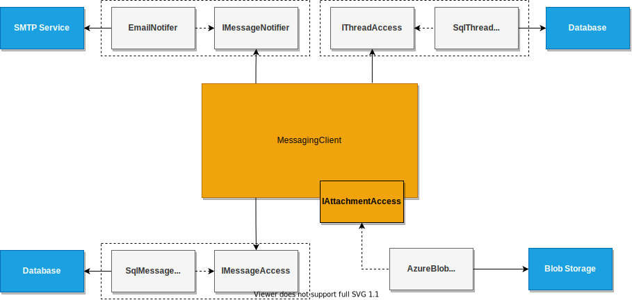

<!-- TODO: Consider this post in light of being my high-level design post
- a lot of it is about specific->Generic. Domain becomes reusable library for specific problem rather than a collector of specific accomodations/paths. Gain more options over time instead of rip and replace. Avoid carving path for every case
  - deeply testable, still accommodates system concerns like monitoring, independent deployment, etc

TODO: Consider addressing the tension between OCP's self-defined flexibility and DI's caller-owned abstractions. So which owns the abstractions? It depends. Between two major services the answer is both. Each defines their API and dependencies on their own terms then you write adapters between the two.

This is a good transition from the flexible behavior post into this architecture post. 
I need to make sure I've defined DI already. Maybe even pose it as "did you notice a contradiction in the previous post? Take moment to think about it" 

TODO: consider how I could add more examples to architecture. Maybe split benefits into a different post

Q: Mention that you often end up with fewer services because 3rd party services can be more directly integrated without polluting the domain. You can eliminate many conforming container-type services that exist just to centralize the pain of integrating a third party generic domain. I've seen so many custom user services and payment services. There's no need for that kind of wrapper service with Ports and Adapters. Neither do services need to always use the same payments and authorization, even within the same deployed application
 -->
<!-- TODO: This got really long. Consider tightening it up -->
This series clarifies the [Open-Closed Principle](https://en.wikipedia.org/wiki/Open%E2%80%93closed_principle) with examples. This post applies OCP to the system level with architecture patterns like ports and adapters.
<!--more-->

I recommend you read the [series intro post](./2022-09-16-0-Intro-to-OCP.md) if you haven't already. This post also learn heavily into ideas established in the previous [post on flexible behaviors](./2022-09-16-3-Flexible-Behavior.md)

As a reminder, the OCP illuminates how components can adapt to caller needs without changing internally. Dependency Inversion (DI) is key to OCP with dependencies. When a component defines it's own dependency abstractions it can compose different dependency implementations without changing itself. Different callers can reuse a flow without changing the flow itself.

## Ownership of Abstractions

Did you notice a conflict between DI and OCP? 

I'll give you a moment to think about it.

...

I've repeatedly described Open-closed principle as a component defining flexibility on it's own terms. Dependency Inversion specifies that *abstractions belong the callers*.
Who owns the abstractions? The component or it's caller?

The answer depends, but is often *each own their own abstractions*. A service protects its domain from incoming callers with flexible APIs like tags or callbacks. It protects its domain from dependency details with Dependency Inversion. In this way a component can be fully self-defined. These services do not interact directly because that would require the service to know about external ideas. Instead, something else needs to map between the abstractions of self-contained services.

<!-- Dependency Inversion is OCP because a flow defines flexibility on it's own terms. The flexibility just happens to be dependency implementations.   -->

## Ports and Adapters

This pattern of fully self-defined services with connectors in between is key to composable architecture. 

Many have rediscoved this idea. Consequentially, this pattern goes by many names: [Clean Architecture](https://blog.cleancoder.com/uncle-bob/2012/08/13/the-clean-architecture.html), [Hexagonal Architecture](https://en.wikipedia.org/wiki/Hexagonal_architecture_(software)), [Onion Architecture](2022-09-16-0-Intro-to-OCP.md), or Ports and Adapters.
These approaches are [all fundamentally the same](https://blog.ploeh.dk/2013/12/03/layers-onions-ports-adapters-its-all-the-same/).

I generally say Ports and Adapters. I think it provides the best analogy for how the pattern works.
<!-- TODO: either cite this or find a license-free image -->


At the core we have some service or component (yellow). It defines the ways external actors are allowed to interact and customize as ports (red). Then adapters (blue) are create to map other services into the ports.

Other services also selfishly define their own abstractions/ports and adapters bridge the gap. This separates the business rules from composition of those rules. The result is a highly flexible and reusable system. The services are more like domain-specific libraries than an inherently connected system. Changes tend to be far more isolated, involving a single service or a service and some adapters.

I'll discuss more benefits, but let's look at a more concrete example first.

## Example: Chat System
I've referenced a chat system for examples throughout this series. Now we'll look at the overall structure of the system.

Specifically we'll focus on MessagingClient and its dependencies. Messaging client is where the core domain logic happens. Messaging client has four main dependencies 
- IMessageNotifier: Notify when a message was sent. Covered in [flexible behavior post](./2022-09-16-3-Flexible-Behavior.md)
- IThreadAccess: Read or save thread information, not including messages in the thread
- IMessageAccess: Read or save messages
- IAttachmentAccess: Read or save attachment to messages

### Anti-Example: Externally owned abstractions

I must stress again that *callers own abstractions*. This also means dependency interfaces and data contracts. Ports and Adapters falls apart without this and the system loses flexibility.

Consider this diagram where the ports are defined externally.


This structure leads to one of two scenarios
1. *Abstractions gear toward implementations*: This leads to [header interfaces](https://blog.ploeh.dk/2010/12/02/Interfacesarenotabstractions/). The interface simply becomes a pass-through for an implementation and is no longer an abstraction. The domain workflow has to bend around the semantics of the dependency. These interfaces usually accumulate so many operations that alterative implementations are heavy and not maintained. The cohesion of the operations is low, making them difficult to decorate or to properly implement alternatives.
2. *Abstractions try to gear toward multiple callers*: This situation is even worse. The abstraction accumulates semantics from multiple callers, and causes every caller to be coupled to the semantics of every other caller. This semantic coupling is sneaky and fragile. Every caller has to be considered when changing the interface or implementation.

### Improvement: Service-owned Abstractions

Now consider if MessagingClient owns it's dependency abstactions (i.e. IMessageNotifier, IThreadAccess, IMessageAccess, IAttachmentAccess).


The dependency interfaces live in the same assembly as MessagingClient.
Adapters *outside* of the MessagingClient's assembly map the dependency interfaces & data contracts to concrete implementations.

We've already seen an example of this using IMessageNotifier in the [flexible behavior post](./2022-09-16-3-Flexible-Behavior.md). The same flexibility applies for each dependency.

Note that threads and messages are both being stored to relational databases. This could be the same database, or it could be separate. The service does not depend on the data store to manage relationships, it handles relationships in the logic layer. This was a hard step for me to take and I wrote [a thorough post about it](../../posts/2021-01-01-Accessors-Services-Not-Servants.md).

IAttachmentAccess could directly adapt to a 3rd-party storage service like S3, BlobStorage, or a CDN. Our application could also decide to centralize campaign documents and adapt message client into a custom CampaignDocumentService. We could even use the adapters to migrate between the two.

Each dependency of Messaging client can be swapped independently, per consumer of MessagingClient, and without changes the MessagingClient.

## General pattern

<!-- TODO: could this consolidate with the explanations prior to the example? -->
The chat library example extends to all kinds of services.


In general, you have some core workflow or logic that is self-contained using OCP and DI to define "ports". Other services are then mapped into these ports using adapters that live outside the assembly of the core workflow.

<!-- TODO: I never discuss what adapters can map into -->


In this way the core workflow or business logic becomes the lowest layer in the dependency chain. It only knows about abstractions (i.e. interfaces and data contracts) that it's created for itself. The core workflow comes with little baggage. It only knows about the domain problem it solves and everything else is composed later via ports. The core service is thus maximally reusable between different consumers. They could be other services in our own system or external users we've never thought of and may never know about.

## Architecture Benefits

All of these ports and adapters can feel like a lot of inderection. Is it worth it?

As always, the answer depends. Components with little change or short lifetimes probably don't need this approach. Benefits for evolving or frequently reused components stack up pretty fast.

For one, this approach is high testable. Already usually worth the effort.

The [last post](./2022-09-16-3-Flexible-Behavior.md) showed how this approach enabled the message client to adapt to testing, new kinds of notifications, or even dynamic notification types without changing the core messaging client. The specific mix of notifications also being decided per-consumer.

### Isolate Cross-cutting Concerns
This approach enables a similar but broader benfit: [separation of cross-cutting concerns into decorators](https://blog.ploeh.dk/2010/04/07/DependencyInjectionisLooseCoupling/).

Logging, authentication, retry policies, caching, and more can all be accomplished without changing any domain service. Instead they are accomplished with [decorators](https://en.wikipedia.org/wiki/Decorator_pattern).

Decorators sit between the caller and the called component. They add some functionality and then pass off to another implementation of the same interface. 

Consider this decorator that logs when another notifier fails
```cs
class ErrorLogMessageNotifier: IMessageNotifier{

    private IMessageNotifier decorated;
    private Logger logger;
    public NotificationLogger(IMessageNotifier decorated, Logger logger){
        this.decorated = decorated;
        this.logger = logger;
    }

    void NotifyMessageSent(Message message){
        try{
            decorated.NotifyMessageSent(message);
        }
        catch (Exception e){
            logger.Error(e);
        }
    }
}

// somewhere else
IMessageNotifier notifier = new ErrorLogMessageNotifier(new SendGridMessageNotifier(), new Logger());
```

These cross-cutting concerns tend to add noise to domain logic and cause sneaky coupling between components that could otherwise be generally reused.

### Trimability and Progressive Change

The composition is isolated in adapters. This allows for flexible and progressive system evolution.

Suppose we want to migrate data stores. A new adapter can be written for the new data store plus a migration decorator. The migration decorator can ensure that we read and write to the old data store while also writing to the new data store until we are sure all data is migrated. Then we repace the aggregate migration adapter with just the new data store adapter. We could even add another phase that reads and writes to the new store, but still writes to the old store until we're sure the migration worked. This can all be done without changing the core service. It could even be done dynamically using feature flags.

This same kind of progressive swap can be done with all kinds of behaviors, not just data storage. The composition of services lives external to the services themselves and their interaction is contained in swappable units. 

This results in service actions that can easily be trimmed over time, changed out, our built up into a suite of alternative. Consider [entity framework](https://www.nuget.org/packages/Microsoft.EntityFrameworkCore/) which has built up an [army of supported data stores and drop-in enhancements](https://www.nuget.org/packages?q=entity+framework).
This is opposed to direct service dependencies, which often require coordinated release and require overwriting the old dependency integration in order to add the new.

### Protocol Agnostic

This pattern is not limited to systems that run in-process. In fact, communication protocol also becomes flexible. Different adapters can be used to support different protocols. The services don't care if the adapter sources from dependencies that are in-process, background work, REST APIs, or something else. Deployment strategy becomes a configurable option using Ports and Adapters.


## Paradigm Disclaimer

This series has shown ports and adapter implementations from a common Object-Oriented perspective. This architecture style is not limited to OO, though it looks different in other programming paradigms. Check out Mark Seemann's adaptation to [functional programming](https://blog.ploeh.dk/2016/03/18/functional-architecture-is-ports-and-adapters/).

## Further reading
I'll admit this concept takes some experimentation to understand. Here are resources that helped me and some writtings about my own process learning this pattern
- [Layers, Onions, Ports, Adapters: it's all the same](https://blog.ploeh.dk/2013/12/03/layers-onions-ports-adapters-its-all-the-same/)
- [Notification Refactor Case Study](../../posts/2020-08-14-Notification-Design.md)
- [Async Refactor Case Study](../../posts/2020-09-11-Background-Task-Refactor.md)
- [Accessors: Services Not Servants](../../posts/2021-01-01-Accessors-Services-Not-Servants.md)
- [Clean Architecture+: Check-in and Benefits](../../posts/2020-09-17-Solid-Structure-Checkin.md)
- [Clean Architecture](https://blog.cleancoder.com/uncle-bob/2012/08/13/the-clean-architecture.html)
- [Incremental Accessors](../../posts/2020-12-25-Incremental-Accessors.md)
- [Ports and Adapters](../../posts/2020-12-19-Ports-and-Adapters.md)
- [DI-Friendly Framework](https://blog.ploeh.dk/2014/05/19/di-friendly-framework/)


## Conclusion

The Open-Closed Principle and Dependency Inversion applied at the system level define the Ports and Adapters architecture.
This approach requires our domain services to own their dependency abstractions (ports) and let external adapters map between services.

Ports and Adapters clears the way for flexible systems where
- domain services are reuseable libraries 
- cross-cutting concerns are isolated and composed 
- integrations can be accumulated and composed instead of torn out and replaced
- dependencies can be trimmed and progressively migrated
- deployment doesn't effect service implementations