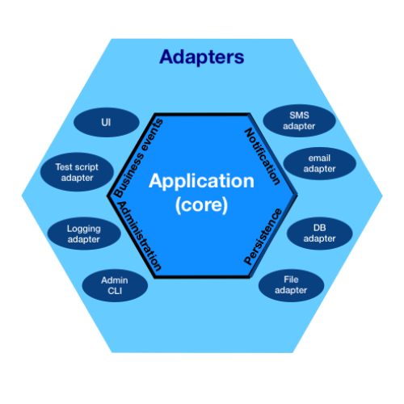

```yml
layout: post
tags: [PADL, Ports and Adapters, Architecture]
series: PADL
```
# Dependencies and Bind-times in Port-based Architectures

Clean Architecture, Onion Architecture, and Hexagonal Archicture talk about how dependencies can only point inward. This is ... true, but a bit confusing. Let's clear it up by elaborating on types of dependencies and how they affect when descisions are made.
<!--more-->

## Concrete vs Abstract Dependencies
For reference on what "in means" here are some diagrams of the previously mentioned architectures
<style>
.img-row{
    display: flex;
    flex-wrap: wrap; 
    /* flex-basis: 500px; */

}
.img-row img {
    height: 250px;
}
</style>
<div class="img-row">

[](https://blog.cleancoder.com/uncle-bob/2012/08/13/the-clean-architecture.html)

[](https://dzone.com/articles/onion-architecture-is-interesting) 

[](https://commons.wikimedia.org/w/index.php?curid=81276242)

</div>


The inner most layer is your core domain, outer layers are external resources (e.g databases, users, other systems), and middle layers are ways of mapping between the domain and outer layers.

*Concrete* dependencies only point in. The outer layers contain references to the assemblies, namespaces, types, and other constructs of the inner layers. 

I always found this a bit hard to understand, since my workflows appear to have the most dependencies. Managers (the high-level workflows) certainly inject the most dependencies of any component type. But there is a key word there, *inject*.

While *concrete* dependencies point in, *abstract* dependencies point out. The inner domain layers have lots of dependencies, but these inner services own the abstractions for those dependencies and rely on some concrete consumer to fulfil them.

## Bind-time flexibility

This strict opposing flow of abstract and concrete dependency has powerful consequences. It creates a predictable stratefication of when certain kinds of decisions are bound.
- Domain layer: 
  - binds the most stable and fundamental truths about the domain
  - never binds volatile concerns like frameworks, data schemas
- Adapter layers:
  - binds our *option set* for concrete implementations (e.g. each determines a framework, system, schema, or other details to implement the domain dependency)
- Outer layer
  - binds the concrete mix of implementations to be used in deployment

Seen another way
- Domain layer -> business decisions
- Adapter layers -> implementation option set
- Outer layer -> deployment decisions

## Summary

The dependency rules of the above architectures push systems that are very flexible under different deployment, resource, or service compositions. This plug-in style enables flexiblity independent of the software domain. 

However, we can't ignore domain organization. Domains are often complex and need to be broken into many pieces. The next post will tackle this domain decomposition.