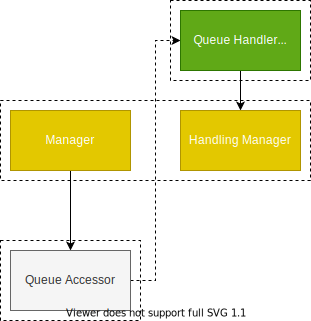
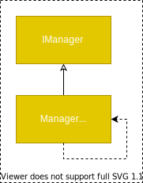
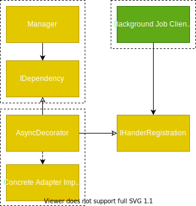

# Async Task Refactor Case Study

I've been unhappy with the async/background work model in my system for a while. The async logic always seems excessively complex, either entangled with business logic or creating opaque coupling between flows. However, my recent [breakthrough on code structure](../post/2020-07-10-Synthesizing-Structure.md) suggested a clear path to adding background work in an aspect-oriented style. Let's examine a refactor that helped me prove decorator-style async communication.

## The Refactor
The project centered around a search workflow. Searching required entities to be indexed with the search database (specifically Lucene). Many system events could trigger entities to be indexed. Most importantly, we were now letting users publish their own entities to the search index. This meant that we needed to add controls for when the search index was updated so that we could moderate published content and avoid search performance issues during peak hours.

To summarize the constraints
- Must control timing of search index updates
- Must control update requests from many sources 
  - Not every update source will be treated equally. For example, admins might need to trigger an immediate update
- Single update handler: Lucene requires exactly one index writer at any given time, all update requests must be fulfilled by one service instance

Goals include
- Automated and configurable index updates
- Separation of business logic from the async communication pattern
- Ability to swap async communication framework for later scaling
- Understandable and traceable async flow 
  - The async trigger and handler registration should be defined in one place so code readers can quickly comprehend and step through the expected code flow

## Previous Solutions

This code base originally managed async work through a QueueAccessor. Some manager would directly call a known event on the queue accessor with message data, then the queue accessor would publish to a queue, trigger a handler defined in a client, and run another manager method with the given message data.

This solution fails because
- It directly couples the notion of the communication method to business logic
  - The business flows cannot be used in other scenarios with a non-queued fulfillment without breaking semantic expectations
- A queue is never a natural part of a business flow. 
  - "Queueing" is not a business activity to be reused or evolved. At best this abstraction hides a library decision.
- The flow is opaque
  - The queue broadcast and event handler must be separated to prevent cyclical service dependencies. This causes a code trace "dead-end". Finding the handler requires searching for constants or prior knowledge. Constants like queue names must be exposed or duplicated.
- The division of events between callers is unclear. It is tempting to reuse events between callers in unexpected ways. Centralizing the "queueing" responsibility also encourages coupling between the many unrelated callers.

I had previously refactored a portion of the index updates. I opted to implement async calls as references back to the concrete manager rather than split up the async code and couple to the queue accessor. This did make the async work clearer, centralized, and prevent coupling to unrelated modules. However, it left my business logic coupled to async concerns and libraries.

## Design Shift

Making calls directly from service to service was trapping my design decisions. My only options were
- Bake the async knowledge into the calling service
- Bake the async knowledge into the called service, making it async for all consumers
- Implement a decorator on the large domain service
  -  May be difficult to still meet return value expectations
  -  Involves more methods than likely need to be async
  -  Likely involves methods that cannot readily be made async or fit more restrictive async patterns

Shifting to define dependencies contracts with only the calling service in mind produces contracts that are much smaller and more focused. This means that
- New implementations are smaller and easier to make
- Usage constraints for all contract operations are more likely to change together.
- We can wrap whole contracts in some decorator without disrupting intent.

In essence, we can leverage Aspect-Orientation to apply power-ups to our contracts without changing the original implementation.

<!-- making this diagram makes me realize that the IHandlerRegistration interface belongs to the handler client, but source dependencies are only supposed to point in... How are adapters supposed to consume libraries? It seems silly to abstract every framework from the adapters that are specifically there to bridge the frameworks into the use cases. Nevermind. The adapter is the library that is being extended. It provides the abstraction for the client to consume  -->

This diagram assumes a handler registration, like when using a message bus. However, the caller and concrete event handler don't change no matter what technology we use to implement the async decorator. 

> Aside: Functional users can accomplish decorators more generically with monads or composition. OO users have to make decorators per interface or employ some DI framework magic to dynamically proxy objects for completely central operations.

## Realized Benefits
Client-owned dependency contracts with decorators brought powerful improvements.

As expected,
- my business flows were much more focused and easier to understand. They had no concept of how events were fulfilled, so I could easily implement in-process or task based asynchronous behavior for testing and low-impact flows. Changing the adapters to a more robust async pattern later did not cause any changes to the core service.

- I was able to easily switch between async libraries. This really hit home when I started to doubt the message bus library I had chosen. I was able to create two async implementations with two libraries pretty quickly and swap the two in configuration to help decide which I would use going forward. I could even keep both for future use if I wanted to. 

- I could choose to apply decorators to the adapter or to the service managing search updates. This gives me the flexibility to manage scheduling differently per caller while also enforcing that calls to the update service are all made remotely.

- The adapters live just below the clients in the dependency hierarchy and are never directly referenced by core services. This made it easy to define event broadcasters and handlers together. The handlers can then be registered by any number of clients without any client coupling to a concrete list of handlers. In other words, the background work client is only concerned with background processing and is decoupled from specific application flows.

However, there were many unforeseen benefits too. 

- Testing became much easier because I did not have to consider async concerns in my business logic testing nor did I have to consider business concerns in my async adapter testing.

- I also ended up separating the scheduling decorator from the message bus decorator. I had planned to implement them together since the message bus had the ability to schedule. However, separating scheduling and applying two decorators allowed me to implement scheduling with a different library that was much simpler.

- It was pretty easy to abstract other events while refactoring services for index updates. This consequently improved the design of our import flows, signup flows, and other flows.

- Refactoring the various import flows caused them to all look pretty much the same, paving the way for consolidating into a singular import flow.

## Conclusion

Direct references between services was trapping me into sub-optimal async patterns. Switching paradigms to client-owned dependency contracts with adapters not only accomplished all of my goals for clear and separate concerns, but prodded me into improvements I had not yet imagined.