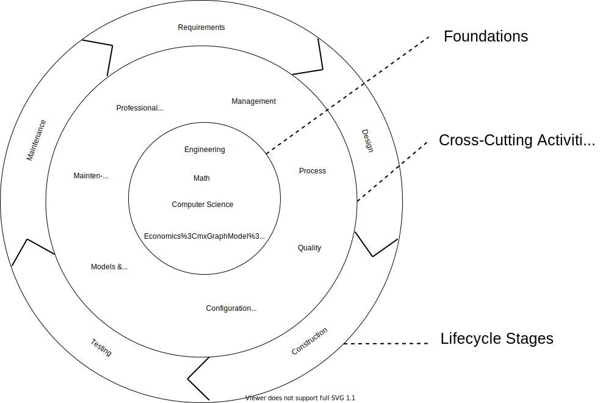

# SWEBOK: Hierarchy of chapters 

The Software Engineering Body of Knowledge (SWEBOK) defines the major categories of software knowledge. It even talks about relationships between topics here and there. However, the overall picture is never very clearly explored. I hope to remedy that.

> Update 2022-01-14: Here's [SWEBOK term definitions](../post/2022-01-14-SWEBOK-term-definitions.md) if needed

<!-- I think I should release this post before the transform artifact post -->

Note that these categorizations are not SWEBOK official. The lifecycle stages are discussed in SEBOK 13.3.1. Foundations of Math, Computer Science, and Engineering are explicitly called out. All other categorizations are my own attempt to organize the topics in the book.

The tiers are layered based on how fundamental the topics are
- *Foundations* are precursor topics to Software Engineering. They inform the root problems solving approaches and the theoretical toolkit. These topics often underpin software-specific practices rather actively shaping our mental model during application.
- *Cross-cutting activities* occur at every stage of the software lifecycle. They inform stage-specific practices, but are also considered across lifecycle stages to ensure healthy overall practices. 
- *Lifecycle stages* are major checkpoints in completed work and verified knowledge. Concrete practices are often categorized and applied by current stage. Stages commonly overlap and many practices range across several lifecycle stages.

The true center tier is problem solving (SWEBOK 13.1.1), but problem solving isn't a Knowledge Area. Thus it is not included in the diagram.

Also, also note that Maintenance shows up twice. 
- As a lifecycle stage, Maintenance mostly replays the lifecycle process with additional constraints and a different cost profile
- As a cross-cutting concern, maintenance is a kind of Quality focusing on ease of continued modification

<!-- I like how Construx separates out cross-cutting *activities* and cross-cutting *concerns*
- their visual makes more sense to me now -->
