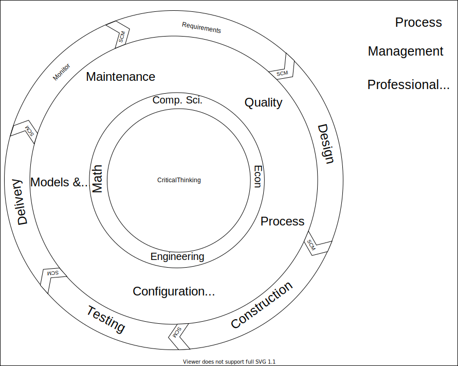

# SWEBOK: Modified software Concept Map

I've been wrestling with the Software Engineering Body of Knowledge (SWEBOK) to distill an intuitive mental image for software knowledge.
Here is my latest attempt incorporating insights from previous visuals.

> Update 2022-01-14: Here's [SWEBOK term definitions](../post/2022-01-14-SWEBOK-term-definitions.md) if needed

My goals with this diagram are to
- Stay rooted in accepted standards
- Impart practical understanding of how software topics relate
- Be approachable
- Create a base visual that can be modified to explain specific topics in the context of the larger mental map
- Reason about where specific topics belong and thus how it fits into our overall view of software

This diagram mostly builds on SWEBOK with a few inferred pieces 
- Critical thinking is the core. SWEBOK states this in ch 13.1.1 but does not account for it in the book structure
- Delivery has been added as a lifecycle phase. Delivery is not explicitly addressed by SWEBOK, but is implied and commonly understood as a step between testing and maintenance
- Monitor replaces maintenance as a lifecycle. This seemed appropriate because monitoring is the half of maintenance that measures the need for change. The lifecycle stars over once a needed change is identified. This also aligns with the general decision process in ch 12.1.5. Every decision is followed by monitoring for quality of the outcomes.
- Every lifecycle phase is separated by Software Configuration Management (SCM). This is taken from the [transform view](./2021-08-20-SWEBOK-transform-SCM.md) where every lifecycle stage creates a problem statement closer to machine code. This problem statement is the artifact that allows us to control changes and verify quality.
- Process, Management, and Professional Practice have been moved outside the cycle. This is meant to show that these activities generally consider our practices as a whole rather moment-to-moment activities.
  - Process is intentionally both a whole-system and cross-cutting topic. 
