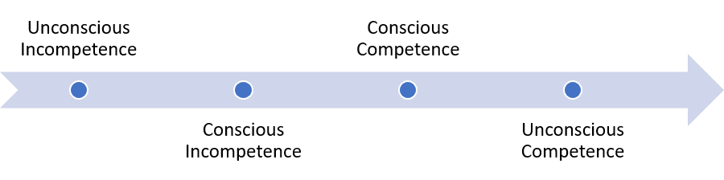
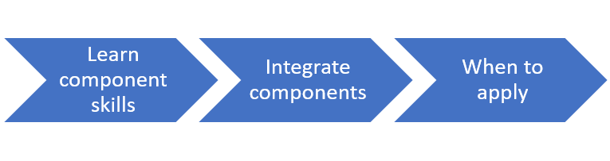

# Knowledge Types and Mastery

*Defn: Mastery - a high degree of competence in a particular area.*

Mastery is a goal of learning, but it can also be a barrier to teaching.

Consider, mastery is composed of four stages:

  - Unconscious Incompetence: Student doesn’t know what they don’t know
    and may think they’re great at it

  - Conscious Incompetence: Student knows they’re bad at the given skill

  - Conscious Competence: Student has meaningful use of the skill, but
    must perform it intentionally or with effort

  - Unconscious Competence: Student can now perform the skill without
    intentional effort

Further, the goal is ‘**far transfer**’, or the ability to connect and apply knowledge in diverse contexts.

Notice that both sides of this spectrum are ‘unconscious’. On one hand, this is necessary for building skills. Internalizing a skill to the point of habit frees up mental energy to focus on other aspects of a task.

On the other hand, this causes challenging disconnects between masters and novices known as **expert blind spot**. The novice does even know what they need to learn and cannot communicate why they are lost. The master can no longer recognize all the step they perform and connections they make. This complicates communication and frustrates both sides.

> Both novices and masters lack awareness. The novice does not know what they need to learn and cannot communicate why they are lost. The master can no longer recognizes all the steps they perform and connections they make.

## Knowledge Types

There are many ways to bridge the divide. It helps to understand the stages of learning and different types of knowledge a student must acquire.

**Declarative knowledge** is the ‘what’. Students with this knowledge can repeat facts but may not be able to apply them.

**Procedural knowledge** is the ‘how and when’. Students with this kind of knowledge can perform a task but can’t explain it or connect it to different situations.

As an example, declarative-only knowledge allows you to state what bechamel is and identify it in different recipes, but not to cook anything. Procedural-only knowledge lets you make mac & cheese.

These types of knowledge are distinct and do not necessarily lead to the other.

Further, mastering a skill or concept has distinct stages

1.  Learn component skills
2.  Integrate components
3.  Know when to apply

Isolating weak component skills can greatly improve the overall mastery of a skill. Singling out integration and application can also improve learning. It is like juggling, starting with too many balls leads to them all being dropped.

## Far Transfer

Students do not automatically recognize a concept in new contexts. Transfer must be taught for, if it is an expected result.

Students can learn to transfer knowledge through critical thinking processes. Questions like boundary conditions, structured comparisons, diverse applications, or distinctly highlighting which aspects are general principles and which are contextual examples all improve transfer. Even suggesting a relationship between concepts can be enough.

## Our part

The teacher plays a different role in each stage of student mastery. Building a Discipling Culture summarizes these roles in terms of the ‘square’.

S1: The process starts with modeling and is aimed at making the student aware of what they will learn.

S2: This stage is referred to as the ‘pit’. The student takes on responsibility but should be closely supported. The student does not have competence to perform independently and can lose hope in accomplishing the goal

S3: The student takes on greater responsibility, but still requires feedback to refine skills. It is important to specify less so the student can grapple with how they integrate knowledge to work independently.

S4: The student is now competent. The teacher should give the student space to work, but communicate that they are available to support and provide input.

## Signs of Failure

  - The teacher believes they communicate clearly, students may even affirm, but outcomes clearly miss expectations

  - Student feels lost or like they could never do what the teacher does

  - “Why is this so hard to understand?” or “Shouldn’t they know this by now?”

  - Students know isolated facts, but struggle to perform in integrated application

## Tools & Techniques

  - Concept Maps: Identify all the component concepts of a given topic and how they relate to each other. Systematically reduces blind spots in what needs to be learned.

  - Advance Organizer: Defines heuristics, processes, decision trees, or other prepared ways to help students organize new information

  - Teaching Assistants: TAs are halfway between an expert and novice perspective. They can help bridge the gap in understanding for both sides.

  - Structured Peer Review: Have peers think critically about each other’s work and provide feedback
    - Note: [Formal Inspections](https://en.wikipedia.org/wiki/Software_inspection) are a well researched means to overcome skill and opinion gaps without contest of egos. See [Peer Reviews in Software](https://www.amazon.com/Peer-Reviews-Software-Practical-Guide/dp/0201734850).

  - Why Questions: structured comparisons, explain pre-worked examples, boundary conditions, elaborative interrogation, hypothesis/test cycles

  - Scaffolding: Remove concerns so the student can focus on a smaller portion of a skill, then reduce support as the student gains competency
