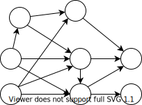
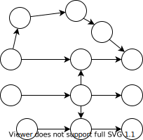

Part 2 of Righting software presents the most complete theory of project management I've seen: the [Critical Path Method](https://en.wikipedia.org/wiki/Critical_path_method). 
<!--more-->

It originated in the 1940's out of the Manhattan project and is based on understanding project dependencies as a graph or network. For example,

 While conceptually simple, we can now lean on all the power of [graph theory](https://en.wikipedia.org/wiki/Graph_theory) for understanding properties of our projects like: duration, cost, stability, and staffing. These insights take the guess work out of planning, allowing us to quantify the difference between plans and the impact of requested changes.

Lets start with how to build the graph, then dive into the data and decisions we can make from it.

----

## Building the graph
The most basic info to build the graph is
  - Activities 
    - Coding activities (depends on your design method, IDesign largely splits it by service)
    - Non-coding activities (UX design, migrations, negotiating design contracts with other departments, acceptance tests, etc)
  - Activity dependencies
    - discovered through architecture diagrams, call chains, activity diagrams, team input, organizational dependencies, etc
  - Estimates of all activities
    - could use PERT, historical analysis, Wideband Delphi

These components are then represented in the graph as

To interpret the graph you should also record 
  - Planning Assumptions
  - Constraints
    - limited resource access (i.e. no specialists, limited available developers, timeline, cost limits)

Here's the example for making chili.

Notice that the activities are the edges and dependencies are nodes. That's because the common scenario of many-to-many dependencies where a collection of tasks all need to finish in order for any task in the next set to begin.

----

## Making Decisions
### Schedule
The network represents a complete map of activity dependencies and estimates (as far as we understand them). This organization yields powerful insights on schedule. We can calculate when any work item could theoretically start and how long the project will take overall. We can also simulate staffing options and calculate the impact on schedule.

**Critical Path**  
The minimum project length for any staffing is determined by the network's diameter, or the *critical path*. Formally stated, this is the length of the slowest minimal dependency chain in the network.

This path assumes you can complete every dependency off the critical path before it delays a critical activity.
The project is *sub-critical* if you do not have enough staff to finish all dependencies before they delay the critical path. Being sub-critical effectively creates a new critical path by adding artificial (or resource-limitation) dependencies to any work that can't be done fast enough.

> *Sub-critical* $\approx$ understaffed

For example, with one developer, every activity is critical because only one activity can be done at a time.

 

Everything off the critical path must have *float*: the amount of time the activity (and dependencies) can be put off before it delays the critical path (thus delaying the project). 
The chili graph is simple enough that we can visually conclude 2 people would be enough to accomplish all non-critical activities in time for the critical path to keep moving. In fact, the second worker would really only be needed for about 16 minutes total.

**Compression**  
The project can be shortened by shortening the critical path through *compression*.

Types of compression
- Assign faster resources to critical path
- Break down an activity to separate chains (i.e. separate UI design from UI implementation)
- Forcefully split chains by designing to a contract and later integrating

> Compression should always be done on the critical path (or it won't shorten the project).

A common example would be splitting work around the UI. Consider this basic graph

We can increase parallel work and shorten the critical path by splitting out the UI design.

We can also completely parallelize UI and logic development by designing to a contract/simulator. Note that this incurs extra work to build a simulator and integrate the real logic later. It may not be worthwhile unless the business logic is very time consuming.

Splitting tasks allows more parallel work, but may require more developers and increases complexity of running the project.  

It's worth noting that some compression usually pays for itself by reducing the project duration and thus reducing indirect costs. However, projects can usually only be compressed about 30%.

**Decompression**  
*Decompression* is adding artificial float. Generally the float is added to critical path, else it wouldn't change the project schedule. This lengthens the project and decreases [risk](#risk). Think of it as a calculated safety buffer.

### Staffing
Suppose we didn't make any assumptions about available staff. The network with only natural activity dependencies can also be used to measure how much work could be done in parallel at any point in the project. This also means we know how much staff is expected at any point in the project. Plotting this staffing analysis as a bar chart reveals how realistic the project currently is, and what kind of changes might yield a project with realistic staff expectations.

Here are some example scenarios and what they say about the project

If your staff curve is not practical you might 
 - compress to provide more parallel work options
 - try assuming the staffing levels and see how it effects network
 - Introduce forced stages/milestones in the project

### Cost
The classic and surprisingly complex question, project cost. We've already seen how the network provides quantitative measures for time and staff. This gives us the information needed to calculate the components of cost

- *Direct Cost*: Cost incurred on activities in the network. More generally, cost for work that advances project completion. Think developer time.  
 Our network dependencies allow us to calculate how much work is available when. This can be compared against staffing options to calculate active working time and idle time for a given solution. Some projects count idle time as direct cost some as indirect.

- *Indirect Cost*: Costs like office space, supplies, utilities, tooling, PTO, managers. These costs tend to be constant with time, or cumulatively linear over time.

- *Total Cost*: Sum of direct and indirect costs 

Note that while project design affects staffing, thus direct cost, the project duration also affects indirect cost. Thus adding staff to shorten a project can pay for itself, to a point.

### Efficiency
In essence, efficiency is how much of your staff's time is idle versus actively contributing to project completion. The critical path method calculates *project efficiency* as the sum of all activity efforts without regard to workdays or idle time over the sum of actual effort accounting for idle time and workdays.

Target range is $15 \\% \le \text{efficiency} \le 25\\%$. Over 30% is likely too rigorous for any team to execute and high-risk. This number is much lower than expected, largely due to the difference between the work week and raw sum off effort without respect to work days.

### Earned Value
*Earned value* is essentially % project completion over time. More specifically, it is the sum of the effort on completed tasks.

The network allows us to plot the expected curve right away, which can reveal potential issues. For example

### Complexity
A project can be complicated to deliver for many reasons: politics, pandemics, changing markets, etc. 
Many of these factors can't be calculated and are also consistent across project plans. However, the difficulty based on work distribution and communication very much depends on the project design.

This is estimated from the network using *cyclomatic complexity*.

$$C = \text{Complexity} = (\text{\\# Dependencies}) - (\text{\\# Activities}) + (2 \*  \text{\\# Disconnected Subgraphs})$$ 

In practice, this should always be  
 $C = (\text{\\# Dependencies}) - (\text{\\# Activities}) + 2$

Target values are $10 \le C \le 12$ and 15 is too complex to execute.

Example: while both somewhat complex, I think it's clear which of these graphs has less entangled activity dependencies.

### Risk
Schedule, cost, and staff are all measures that could be estimated from past experience (though with much less flexible decision power). However, reliably quantifying risk was previously unattainable. Now risk can be mechanically calculated using two main formulas: criticality risk and activity risk. 

Risk as a decision tool is best understood when piecing everything together. We'll revisit risk in the [All Together](#all-together) section, but the general rule is that risk should be $0.4 \le \text{risk} \le 0.75$

Keep in mind that risk is not a probability, but an index. It only shows relative likelihood of failure.  

**Criticality risk**  
*Criticality risk* is based on grouping the activity floats into G groups and assigning a weight to each group. Typically $G = 4$ and the groups are critical=4, high=3, medium=3, and low=1.

$$Risk = \frac{\sum\limits_{i=1}^G{W_i\*\text{Count}_i}}{W_c\*(\text{Total Activities})}$$

Effectively, the sum of activity risk weights over the sum if every activity were critical.  
This method works well with even float distributions and has low sensitivity to outliers

**Activity risk**  
*Activity risk* is the sum of all activity floats over the sum if every activity had the maximum float.

$$Risk = 1-\frac{\sum\limits_{i=1}^N{Float_i}}{(\text{Max Float})\*(\text{Total Activities})}$$ 

This method is more sensitive to individual activities. It will generally be close to criticality risk unless there is an uneven distribution of risk that should be investigated.

---

## All together
First off, this is all project **design**. It cannot automatically produce a successful project. Rather, it is a toolbox of quantitative insights for how different arrangements fit you're project's needs.

That said. The book's examples seems to follow a typical flow.

### Establish the *Normal* Solution
The network created from the natural activity dependencies may not be a realistic project. The staffing distribution may not be achievable, schedule could be prone to delay, or it may violate project constraints like practical access to developers and specialists.

Your first goal is to establish the *normal solution*, or the solution that
 - has least direct cost
 - does not impede the critical path
 - is possible (doesn't violate any project constraints like unrealistic staffing)
 - has risk under 0.7

Some common tweaks to make a project possible are
- Try splitting the project into stages to level staff curve (eg.g developing high reuse components up front)
- Try settings realistic limits on max staff
- Try limiting specialized resources 
- Split out sub-projects
- Decompress as necessary

### Compress
With normal established, start trying to compress the graph. Realize that each iteration of compression may change the critical path, thus changing likely compression candidates. Compressing may also change the desired staff distribution.

Graph the cost vs duration for each compressed solution. Repeat until you start hitting a limit. This could be
- ~25-30% project duration reduction from normal
- it's too hard to find compression candidates,
- you see compression reaching an asymptote (cost way up with little time reduction)
- complexity is too high
- costs exceed project limits

### Decompress
Decompress the normal solution and/or compressed solutions with favorable risk values. Try adding different amounts of float to see how each amount changes cost and risk. Plot risk and total cost versus duration for all solutions.

Stop conditions
 - hit bottom of target risk range ($.4 \le risk \le .75$)
 - passed likely project duration limits
 - risk starts decreasing slowly (much past point of minimum decompression)

### Pick 3(ish)  
Pick the solutions that give management the best value trade-offs between duration, cost, and risk from the Cost & Risk vs Project Duration plot assembled in previous steps.

It's also wise to use a regression tool to find a best-fit curve of the solution Total Cost over Project Duration points.

This serves as a guide for accepting project conditions. Any projects with cost and duration above the line are possible. Any under the line are impossible and should be killed immediately.

---

# Summary & Reservations
The Critical Path Method offers quantitative insights far above any project planning method I've seen. It allows planners to not just create one good plan, but to understand the impact of different forces on their project and create a spectrum of options.

However, its context in Righting Software is always long-ish standalone projects. It is unclear to me how effectively this method could be applied at smaller companies. I would at least expect staffing constraints to greatly limit the possible solutions.

The bigger issue is the size of technical initiatives. Many startups or small companies don't have technical initiatives longer than a few weeks. Understanding and business plans also change much more rapidly than at big companies. It's normal for startups to completely change the nature of their business. For those pioneering new spaces, many things just might not be clear until a product or feature is already out there. 

Maybe those are too extreme of scenarios to expect stable insights. Maybe Kanban or Scrum are better suited to such sensitive environments. Still, I can't help but want the powerful metrics of Critical Path. 
  
# Asides for Math Nerds
I focused on discrete math in my undergrad, so here are my mathy musings. 

This is just me speculating, but graphs with a low minimum cut size are likely to be risky because they will have a few dependency choke points.
On the other hand, very large cut sizes likely mean high execution complexity. What could we learn from a distribution of cut sizes?

I'd also be interested to see 
 - an analysis of in-degree and out-degree related to risk
 - an analysis of connectivity for identifying useful sub-graphs (i.e. feature verticals or sub-systems)
 - are there properties we can leverage because projects should always be directed acyclic graphs?
 - what do we know about sub-graph patterns (like directed diamonds) that could be useful?
   - Could we identify complete bigraphs as a measure of risk or complexity?
 - does reachability tell us anything different than float?
 - is the number of leaves (sources in this case) a meaningful measure of complexity or risk?
 - are ears useful for compressing a graph? Splitting projects?

Observations that are probably minimally helpful
- the only sink should be the end of the project. 
  - I suppose this could be multiple tasks if you don't have a final milestone node
- Any cycles signify self-dependent activities and are impossible to schedule

Other math notes from the book
 - The point of minimum decompression is the inflection point of the risk curve. In other words, it is the point where decrease in risk for time added has zero acceleration. Any point before that will have increasing returns for added time and any point after will have decreasing returns.
 - Risk-Cost Crossover: The derivatives of risk and direct cost should cross over at two points (because risk is cubic and cost is quadratic). These are where the risk limits of .3 and .75 are estimated from. 