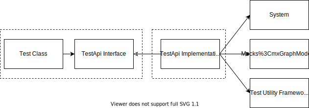

A friend of mine, Paul Spoon, wrote a [delightful article](https://codewithspoon.com/2019/12/stop-corrupting-yourself-test-against-abstractions/) about using the Anti-Corruption Layer pattern as a tool for more stable tests. I tried the pattern with skepticism, and will now never go back.

Let's take a brief look at the pattern then dive into the benefits I've experienced.
<!--more-->

## The Idea

Tests are valuable over time because they tell us that our system meets all of the same expectations as it did before. We expect tests to fail if our system changes in a way that changes behavior.

This means tests fail to provide value if
 - they are flaky
 - they are too specific and can't fail
 - They must change whenever the code changes (can't trust that the test expectation is the same)

Paul solves this problem by placing an anti-corruption layer between the tests and the code. The tests own the abstraction for this layer in accordance with the Dependency Inversion principle. The abstraction is then satisfied by the system and any desired mocks.

If something is to be tested, it must be exposed through the test api. There is no cheating knowledge of code internals.

## Expected Benefits
Paul expected various benefits from this pattern.

**Tests are blind to the system**: The tests don't know a system exists. This means
 - tests more purely represent the expected behavior
 - tests are more reliable because they don't change with the system
 - clean tests can be written even for a horrible system

> "...it's basically like applying TDD after the fact. You're not writing tests first, but you are writing them blindly, which is where the real test value comes in. Doing it first just achieves the same result with a stronger guarantee of not being biased by existing code." -Paul Spoon

**Test any system**: The state of the system doesn't matter for writing good tests. A horrible system will just mean a horrible adapter layer. The tests have given you a fresh shot at design. The test adapter serves as a refactor guide and refactoring will make your test api simpler over time. Meanwhile, the tests remain the same. As Paul said, "Testing legacy code without indirection basically ensures the tests can't survive the refactoring".

**Breaks the Fragile Test Problem**: 
The short version, the test api reduces the connections points between our tests and our system, reducing the number of changes to keep the two in sync.

The formal version. Suppose there are $N$ tests and $M$ code components. If the tests know directly about the system then any one of the $M$ components could break any number of the $N$ tests. There are $N\*M$ potential points of change. That's a complexity of $O(N\*M)$.  
Suppose we add test apis/adapters. Now changes in the tests do not affect the system, just an adapter. Similarly, changes in the system do not affect the tests, just the test adapter. Only one layer is subject to change so the potential number of changed components is just the number of test apis. In other words, we have a complexity of $O(N)$.

## Early skepticism
I was trained on a way of unit testing that created a test class for every code component. The test class was very mock heavy in order to test that code in isolation. The idea here was to provide thorough coverage and keep component tests independent of each other.

I later learned that Robert Martin has been refuting this way of testing for many years ([example](https://blog.cleancoder.com/uncle-bob/2017/10/03/TestContravariance.html), [example](https://blog.cleancoder.com/uncle-bob/2016/03/19/GivingUpOnTDD.html), [example](https://blog.cleancoder.com/uncle-bob/2014/05/10/WhenToMock.html)). The problem is that the tests become very coupled to the code. It almost guarantees a test has to change when the system changes.

Still, my gut feeling at the time was that adding a layer between our tests and system was too heavy handed. 
 - I felt like it would produce a lot of duplicate code
 - I was also unsure if I would really be able to test my system thoroughly without having direct access to it
 - I wasn't certain if I would be effectively testing my system, or just testing some api layer sudo-system.

The answer to these concerns requires a paradigm shift. Picture your tests as an embodiment of the system requirements and not as a fine grained method checker. Like in BDD, you then hook your system into these behaviors and ensure it can satisfy them.

## Experienced Benefits

My experience is that the test api layer pays for itself very quickly.

**Fast, focused test writing**: I'm not concerned with the state of the system when I write my tests. This means I have fewer forces to juggle and less jumping back and forth in code. The result is that test are much easier to write and thus faster and more pleasant to write.

**Short, clear tests**: The methods and language of my test api are specifically geared to the test class. This means that I can centralize test operations like data generation behind well named methods. This produces tests that are short and readable. My average test is about 5 lines of code and is about the same flow as I'd expect for testing out the code in a REPL. 

Note that the test api can pass through system details and hide details, but it can also add behaviors needed for the tests that don't belong in the rest of the system. Like when I test a component for searching and filtering a type, but the save and update belong to to a separate component that the system consumes separately.

Added behaviors can also be the result of spies, and other test patterns. This often happens when want to know if some operation was performed, but that operation doesn't normally produce a retrievable value (i.e. notifications, events).

**Design Check**: Your tests are the first consumer of your system and the embodiment of the requirements. Writing them without consideration for the system gives you a second opinion on how the consumers will actually use the design.

I once thought I had a clever idea on how to structure the code, but my test api ended up pushing me to a different design. I brushed it off, thinking it was a difference between test and real system usage. I later found that the rest of my system was working around my clever design decision to work exactly like the test api. I've learned to trust the test api's opinion.

**Change buffer**: As expected, the test api reduces how often the tests change. Refactorings usually stop at the test api. This also lowers hesitation to write more tests, since more tests doesn't result in more changes when refactoring.

**Test library flexibility**: Each test class has it's own test api. This means that it can choose to mock or use test tools as it pleases. Classes can individually decide to opt in or out of shared testing infrastructure. I find it often makes sense to use the system to fill dependencies as often as possible and only mock out the resource layer. This reduces duplicate work without coupling your tests to many components.

**Reusable tests**: Mocking, component mix, data generators, all that is decided by the test adapter. The test just encodes an expected behavior based on exposed operations. This means that you can use the same tests with different test api implementations in order to run unit tests, integration tests, integration tests under different system configurations, or even tests different components that have shared behavior expectations.
   

## Summary

Adopting Paul's test api pattern has shifted my view on testing and resolved long standing complexities. It makes it easier to design tests as a first class concept, results in a more enjoyable testing process, and produces more stable tests. 