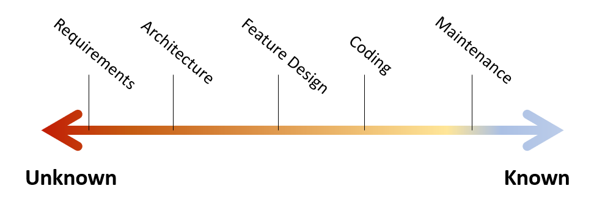

I want to directly address the idea that moving quickly means bad code. Heavy design process is also not the opposite of either speed or sloppy code. To go fast is to go well, and that means fast incremental design.

## Design Stamina
It's generally accepted that bad code slows you down, eventually. The [design stamina hypothesis](https://www.martinfowler.com/bliki/DesignStaminaHypothesis.html) represents the general relationship well. 

<figure class="image">
  
  <figcaption>Source: https://www.martinfowler.com/bliki/images/designStaminaGraph.gif</figcaption>
</figure>
 

I believe the trade-off happens very fast. The first time you have to rip out code, you're both throwing away the previous work, adding work to remove it, and doing the new work. The more thrown-together code you have the more frequent and complex these challenges become.

## Increments of Progress
I think the issue stems from a false belief that progress is only made in terms of code.

Production software is the most expensive, slowest, and hardest to change deliverable you can produce to get feedback from the customer.

I see it this way
- Progress is about building something of value to your customer
- Building something of value requires understanding what your customer needs
- Understanding needs requires feedback from your customer

Thus, the speed limiter is how tight of a feedback loop you have with your customer, and progress is measured in understanding of the problem.

The fastest scenario is that you *are* your customer and you are constantly feeding backing into the development process. Still fast is that you can contact your customer whenever questions come up and work through a decision with them.

These increments should also be focused. We want to push off decisions until we need them to make other decisions. Narrowing our view at each step limits decisions, resulting in fast iterations which all together reach a solution faster. 

Code is a slow. Jumping straight to full stack development is throwing out incremental progress and saying the next step the customer can give feedback to is a working feature.

Less intensive products like mocks, UI-prototypes, BDD-requirements, and domain models refine the problem understanding but are much faster than code. 

> "A few weeks of programming can save you hours of planning" -Scott Wlaschin

Even when coding starts, incremental development is driven by good practices. Methods like [ports and adapters](https://en.wikipedia.org/wiki/Hexagonal_architecture_(software)), [Clean Architecture](https://blog.cleancoder.com/uncle-bob/2012/08/13/the-clean-architecture.html), and [DDD](https://www.dddcommunity.org/learning-ddd/what_is_ddd/) keep structures flexible by starting with the underlying problem model and pushing details like storage and data schema down the line.

## Summary
If you want to go fast, invest in your customer reps and incremental design. Cutting corners on code will only slow you down.