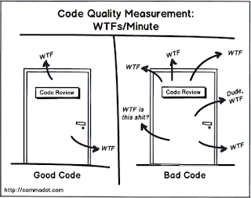

You know what they say about sharp-dressed code. Every dev's crazy about it...

More seriously, developers often fail to notice well-written code, but easily recognize and curse poorly written code.

Still, some of the greatest minds in our field have a great passion for well-written code (quotes below). Code clarity directly contributes to understandability, maintenance, quality, and more.  Here I'll discuss practical ways to write clean and maintainable code.
<!--more-->

## A few quotes

>"Style is the dress of thought, and a well-dressed thought, like a well-dressed man, appears to great advantage" - [Lord Chesterfield quoted by Fred Brooks](https://www.amazon.com/Design-Essays-Computer-Scientist/dp/0201362988)

>   “There are two ways of constructing a software design: One way is to make it
>   so simple that there are obviously no deficiencies and the other way is to
>   make it so complicated that there are no obvious deficiencies.” – C.A.R. Hoare

> "The competent programmer is fully aware of the strictly limited
    size of his own skull; therefore he approaches the programming task
    in full humility, and among other things he avoids clever tricks
    like the plague." - [Edsger Dijkstra](https://www.cs.utexas.edu/~EWD/transcriptions/EWD03xx/EWD340.html)

Steve McConnell wrote [Code Complete](https://www.amazon.com/Code-Complete-Practical-Handbook-Construction/dp/0735619670), a whole ~900 page book about writing clear code and the evidence behind it.

## Why the fuss?

Even the ugliest code can compile, and it's all the same to the computer. However, that line of thought falsely assumes the computer is the primary audience for our code.

The primary audience of code is maintainers (probably ourselves). A piece of code is only written once then read, maintained, and updated for the rest of time. Understandability is the primary driver of maintainability and thus long term quality and agility.

<!-- call out construction and connect construction to design? (swebok quote on their overlap) -->

## Techniques

Here are my favorite practical techniques for writing clear code. Most of them can be found in the [Software Engineering Body of Knowledge Chapter 3](https://www.computer.org/education/bodies-of-knowledge/software-engineering/v3) or with great detail in [Code Complete](https://www.amazon.com/Code-Complete-Practical-Handbook-Construction/dp/0735619670).

**Naming**: Naming is one of the most important aspects of clear code. I've written [a full post about naming](../posts/DevEssentials/2018-10-01-Semantic-Naming.md)
- Abbreviations are usually bad
- don't be afraid of long names
- name for semantic purpose, not type or implementation
- Related operations should have related names (e.g. Add/remove, Create/Delete, Read/Write)
- Use conventions to differentiate levels of constructs. Commonly classes/packages, functions, constants, and variables will have different capitalization conventions.

**Sentence-like code blocks**: Blocks of code should be comfortably read like a sentence. This encourages consistent level of abstraction and refactoring details into their own reusable components. Pseudo-code Programming Process (PPP) is a more rigorous technique in this vein.

**Intentional spacing and indentation**: 
- Indentation: Intuitively indicates code hierarchy at a glance. E.g. membership in a class, function, control statement or continuation from a previous value assignment 
- Spacing: add space between semantic groups of code within a code block. E.g. Between multiple steps of loading then using data, or between collecting data from many sources then operating on the arranged data. 

**Minimize variable lifespan**: Fewer lines of code between when a variable is defined and its last use reduces the simultaneous facts a programmer needs to remember and reduces errors. It creates more cohesive groups of code.

**Table-driven methods**: Use a dictionary/table to lookup data instead of using conditionals. Easy to understand, easy to load from an external source, and generally performant.

**Expressions**: Every section of code should have a single clear output value.
Avoid mutating data (e.g. conditionals that modify variables) or wrap the mutation in a dedicated function.

**Patterns**: Patterns are named solutions to common problems. They communicate the type of problem and type of solution very compactly. Use them and their naming conventions if you encounter a relevant problem.
- [An accessible catalog of common patterns](https://refactoring.guru/design-patterns/catalog)
- [Microsoft's list of more specific patterns](https://docs.microsoft.com/en-us/azure/architecture/patterns/)
- My most common are state machines, strategies, observers (think pub/sub), entity/value type, and decorators 
<!-- - TODO: link to practical patterns post -->

**Error cases and totality**: Communicate how your code can go wrong in function signatures. E.g. no value, failed, invalid input

**THINK!** Unclear thoughts make unclear code. Think before you write.

**TEST!** Testing is one of the best techniques to clarify thought and think from the perspective of code consumers. Especially [tests that aren't tangled with implementations](../posts/2020-08-21-Test-Api-InPractice.md)

## Conclusion

Writing clean code is not just a matter of preference, it is a direct contributor to the quality and longevity of a system. The primary audience of our code is other coders, and their understanding is the primary measure of good code. Fortunately, research has enumerated practices that maximize code understandability.

<!-- todo: need to balance message here with lead-in messaging -->