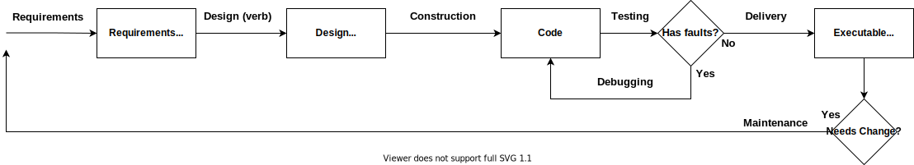

The Software Engineering Body of Knowledge (SWEBOK) portrays the software lifecycle as a [set of transforms](../posts/2021-08-13-Swebok-transform-view.md). I realized that each transform creates an artifact, and these artifacts are key to connecting cross-cutting concerns into the lifecycle phases.
<!--more-->

> Update 2022-01-14: Here's [SWEBOK term definitions](../posts/2022-01-14-SWEBOK-term-definitions.md) if needed

## Life-cycle Artifacts

A quick review on the transformation lifecycle. The input is plain-language requirements, and the output is machine instructions. Each transform translates the problem one step closer to machine code, resolving ambiguities and disconnects as needed.

The key here is that each step is a transform, and must have an output that represents the problem being solved.

This is a perfect fit for Configuration Management and Quality processes.
- Configuration Management (change control) sets up rules for controlling updates to artifacts
- Quality process can evaluate artifacts to verify expected outcomes

## Concerns of interest

SWEBOK's list numerous cross-cutting concerns 
- Management
- Configuration Management (Change Control)
- Models and Methods
- Process
- Quality
- Maintenance

However, most of these concerns can be expressed in terms of Quality and Configuration Management.
- **Management**: evaluates measurements from from software process to project outcomes and make changes as needed. Any measurement worth steering the project is an indicator of Quality. Configuration Management (change control) provides the checkpoints for evaluating quality and changing course.
- **Process**: process is more of a meta structure that determines frequency and rigor of Quality and Change Control activities.
- **Maintenance**: maintenance can be a lifecycle state or a cross cutting concern depending on the viewer's interests. As a lifecycle stage, Maintenance mostly replays the lifecycle process with additional constraints and a different cost profile. As a cross-cutting concern, maintenance is a kind of Quality focusing on ease of continued modification.

The outlier is **Models and Methods** which guide the artifacts we use to represent each lifecycle stage.

## Life-cycle Cross-over

Pulling these ideas together creates a fairly comprehensive framework for reasoning about where standard practices live in the software lifecycle and what each is trying to accomplish. This helps identify alternative practices for a given stage and find the right mix for our current process. It also provides structure for teaching and learning most software techniques.

Below is a first attempt at that mental framework. I list every life cycle phase with it's cross-cutting concerns and standard practices for each concern. This is not exhaustive, my hope is to prime a mental framework for organizing practices. 

Note that I have extrapolated some general SWEBOK examples to specific practice for understandability and concrete application. Many Models and Methods are my own opinion because SWEBOK lists relatively few per knowledge area.

<!-- TODO: Another post formatting this into a table would probably be nice -->
<!--  -->

**Requirements** (Ch 1.5.3, 1.6, 1.7)

SCM: 
  - Inspection (& other reviews)
  - Bug trackers and Work trackers
  - Change control boards or work-item triage
  - Estimation/priority ownership separation

Quality: 
  - Inspections
  - Prototyping
  - Formal models
  - Language analysis (e.g. find ambiguity indicators see SWEBOK)
  - Acceptance testing

Models and Methods:
  - Formal modeling
  - User Stories
  - Activity decompositions and graphs
  - Goal statements
  - Process flow charts
  - Mocks, prototypes
  - Throughput, reliability, responsiveness, and other non-functional requirement goals
  - Estimates, category tagging, and other requirement measures
  - Definition of done document

**Design** (Ch 2.5)

SCM: 
  - Inspections (& other reviews)
  - Source controlled design docs or other versioning systems (e.g. wikis, versioned file system, specialized software)

Quality: 
  - Inspections (& other reviews)
  - Translation to tests
  - Prototyping
  - Model analysis (e.g. Fan-in & Fan-out for component stability, cycle detection)

Models and Methods:
  - Prototypes
  - Tradeoff analysis records
  - Component diagrams
  - Activity Diagrams
  - Schemas / Data relationship diagrams
  - Public component contracts and expectations
  - Design decision records 
    - Request for Creation (RFC)
    - Architure Design Records
  - Architectural models (e.g. layer models, pipe and filters, IDesign, Ports and Adapters, design analogies)
  - [Duck docs](../posts/2020-10-02-Whats-Your-Duck.md)

**Construction** (Mostly Ch 3.1, 3.2, 3.3.7)

SCM: 
  - Source Control
  - Inspections (& other reviews)
  - Pull requests

Quality:
  - Inspections (& other reviews)
  - Compiler
  - Static Analyzers
  - Auto formatting (i.e. editorconfig)
  - Style guides
  - Automated testing
  - Fault handling
  - Cyclomatic complexity
  - Defect density (requires review and/or bug tracking)
  - Fan-in & Fan-out (component stability)
  - Variable lifetime (lines between declaration and final usage)
  - Variable scope (How much code can access a given non-constant data field. E.g. Global, class, function, block,...)
  - Code Churn
  - Cyclical reference detection
  - Code block size

Models and Methods:
  - Source Code
  - Component and system documentation
  - Outputs of Quality measurements
  - Statistical analysis of Quality measurements
  - Component diagrams

**Testing** (ch 4.4, 4.5)

SCM: 
  - Source control
  - Inspections (& other reviews)

Quality:
  - Inspections/review
  - Acceptance testing
  - Mutation testing
  - Test counting methods (state machine, branch, boundary cases,...)
  - Quality assurance process (multiple verification, standard process, measurement standards, reporting, sign-off)
  - Time between failures

Models and Methods:
  - Automated test code
  - Test plans
  - Test result outputs
  - Statistical analysis of test outputs
  - Fault analysis, branch analysis, or other models determining completeness of tests

**Delivery** (not well covered in SWEBOK)

SCM: 
  - Source control (version history and control deployment definition changes)
  - Gated releases
  - Feature flags
  - Deployments as code (Azure Devops yaml, etc)
  - Infrastructure as code (docker, ARM, cloud formation,...)

Quality:
  - Logging
  - Uptime monitors
  - Canary testing
  - Backups
  - Redundancy
  - Staged release

Models and Methods:
  - Deployment as code (scripts, yaml, containerization, etc)
  - Infrastructure as code
  - Process checklists

It's worth noting that the overall software process can also be managed with Configuration Management and Quality measures.

**Process-improvement** 
  - SCM:
    - Process improvement boards (& other review processes)
    - Controlled hypothesis testing (e.g. compare quality measures before and after a process change)
  - Quality:
    -  Retrospectives,
    -  Process improvement board/role
    -  Self-improving processes (i.e. Inspections)
    -  Audits 
  - Models and Methods:
    - CMMI / process maturity models
    - Process standard documents 
    - Scientific method

## Conclusion

The transform view of the software lifecycle highlights the overlap between cross-cutting concerns and the lifecycle stages. Each transform produces an artifact guided by Models and Methods. Quality and Configuration Management act on the artifacts of each transform to enable Management and high-level Process.

All together, this transform/artifact lifecycle forms a comprehensive framework for reasoning about practices and their role in the software process 