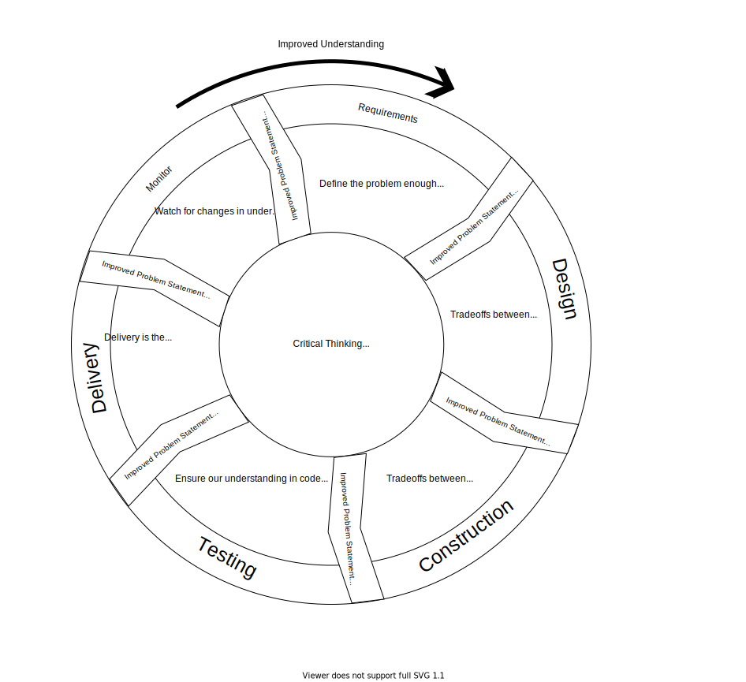
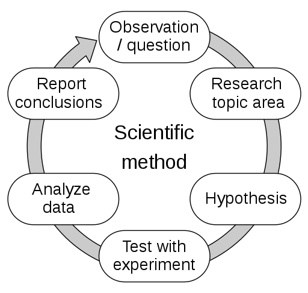
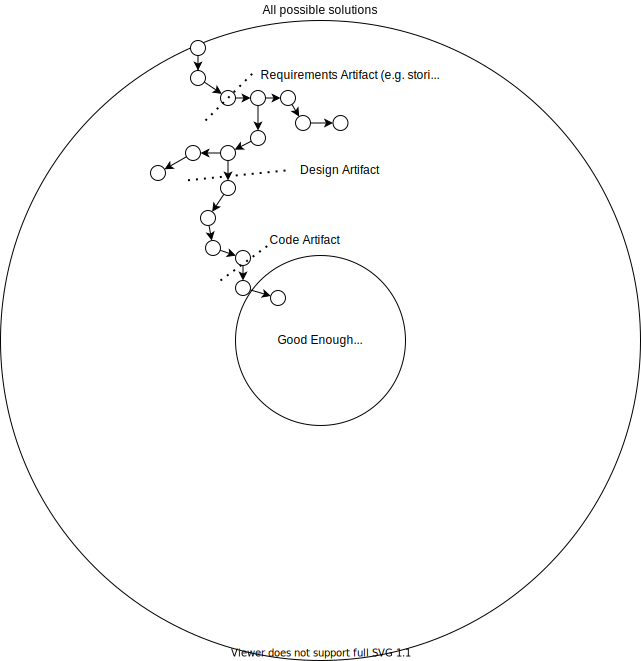
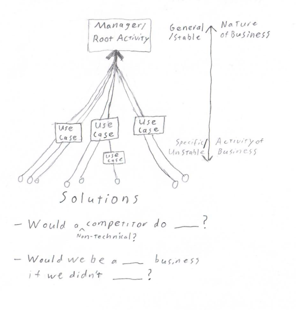

Code is not the goal of programming. Programming is about understanding and representing problems. While this belief is expressed by many experts, the repercussions are many and nuanced. This is my latest attempt to communicate the idea clearly.
<!--more-->

We'll examine how problem modeling relates to development life cycle stages, informs how we iterate on work, defines when work is done, and clarifies the long-term adaptability of our systems.

## Software Life Cycle of Problem Understanding

The software development life cycle stages can be seen as a cycle of actions to better understand our problem, where [each life cycle stage outputs a refined statement of the problem](../posts/2021-08-13-Swebok-transform-view.md).

- Requirements formalize the problem enough to effectively consider solutions (SWEBOK chapter 1 intro or 1.7.1)
- Design refines the problem by considering tradeoffs between different high-level solutions (SWEBOK 2.3.4). Tradeoffs should be weighed with stakeholders (SWEBOK 11.1.9)
- Construction states the problem in code (precise processes). Construction further refines the problem by weighing tradeoffs between potential solutions and forcing resolution of ambiguity 
- Testing measures how well our code matches our mental model of expected behavior and other expectation measures (SWEBOK 4.intro)
- Delivery makes our solution available for end users. Application to the real problem is the most important measure of success.
- Monitoring watches for changes in the problem or improvements in understanding that must be addressed in our solution

The core is understanding the problem, which is defined by customer need and achieved through critical thinking. All progress is made by better understanding what our customer needs and how we can satisfy that need through our product or processes.

## Underlying Scientific Method

Notice how the life cycle repeatedly refines understanding.
- identify a need
- identify a solution
- test the solution to make sure it fits the need
- Deliver the solution
- Repeat

The software life cycle is the scientific process.

These question/hypothesis/test loops underlie not only the life cycle, but each individual activity as well. Each prototype, shadowing, user story, tradeoff analysis, unit test, and so on is a hypothesis about the problem. Testing each hypothesis compares our understanding against reality and refines what we know. These small tests add up and push us to a solution one increment at a time.

## Increment to Good Enough

Each hypothesis/test cycle tells us something about the problem and our solutions. These increments progressively interpolate to a final solution.

We can consider life cycle stages as benchmarks in these accumulated increments of understanding. Certain amounts of understanding may trigger review, change in process, or transfer of work that we see as life cycle stages.

Note that there is no perfect solution. Instead, there is a target of "good enough". Any solution that meets all known requirements falls in "good enough".
Conversely, satisfying requirements is our stop condition to consider work complete ("definition of done"). 

> A designer knows he has achieved perfection not when there is nothing left to add, but when there is nothing left to take away. - Antoine de Saint-Exupery

Good requirements are essential. Bad requirements cause us to narrow in on the wrong solutions and consider work finished before it meets the actual customer need. The further off our requirements, the worse our solutions.

> "The besetting mistake of expert designers is not designing the thing wrong, but designing the wrong thing" - Fred Brooks, Design of Design p. 167

Fortunately, requirements mostly limit explorations to the right area. [As shown in the first section](#software-life-cycle-of-problem-understanding), life cycle stages progressively refine the problem as we work on it. Our "good enough" target gets better as we go, so long as we pay attention to trade-offs and feedback.

Undoubtedly, more requirements will also appear after work is delivered. This is the "monitor" stage of the life cycle. This shifts the target of "good enough" and we iterate to reach the new target just like before. 

It's important to note, requirements in our "definition of done" are not just behavior expectations ("functional requirements"). They should also include quality measurements like maintainability and defect rates. The customer may not realize how these non-functional requirements effect their outcomes, but they likely do want the results. Results like maintained productivity, low failure rates, and secure software. Quantifying and benchmarking these requirements is a whole topic of it's own. 

## Adaptability: Volatility Analysis as Essence Discovery
 

So far we've mostly explored how problem modeling applies to incremental story-level work. However, problem modeling is even more important for managing the big picture of inevitable change.

Needs naturally change over time. New technologies are invented, regulations are enacted, businesses expand, etc. Businesses and software solutions must change to stay relevant. 

How well the software adapts to the changes is key. How well our software adapts is largely dependent on how well we separate the true nature of our business from temporary coincidences. The traditional design terms are essence (true nature) and accident (coincidental qualities).

The true nature of the problem is often referred to as the "core domain" of our system. It represents the fundamental business rules, and should be stable. The coincidental qualities should be contained in as little of our system design as possible. 

Put another way, understanding what is least likely to change in our system is an act of understanding the true nature of the problem we are solving. Aligning our code with that nature maximizes long term adaptability.

A good example is notifications. It is often fundamental to a process that people must be alerted of a software event. However, whether that notification is by email, text, mail (legal notice?), or triggers a company representative to make contact is very likely to change. Notifying is fundamental, the delivery mechanism is "accident".

[Domain Driven Design](https://en.wikipedia.org/wiki/Domain-driven_design) and [Clean/hexagonal Architecture](https://blog.ploeh.dk/2013/12/03/layers-onions-ports-adapters-its-all-the-same/) are two popular techniques that try to bring structure to this process.

## Recap 
Problem definition cannot be confined to requirements. Rather, every life cycle stage polishes a refined statement of the original problem.
  
Questions, tradeoffs between implementations, and other myriad decisions during the life cycle are hypotheses we test against the real problem to refine our understanding. 

There is no perfect solution. Rather, these answered hypotheses incrementally push us toward a "good enough" solution where "done" is defined by meeting user need as we understand them. Life cycle stages are checkpoints in this understanding that often trigger review, handoffs, and different techniques.
Understanding naturally changes and shifts our definition of done.

Long term durability of software often depends on how well the design matches the nature of the problem being solved, centralizing the core nature of the business while keeping temporary details flexible.

## Conclusion

Programming is a discipline understanding and modeling problems. This view satisfactorily explains key problems in software, and why many key techniques solve those problems effectively. I believe this view provides a unified mental model to reason about software techniques and make effective process decisions.

## Further Reading
- [No Silver Bullets](https://www.cs.unc.edu/techreports/86-020.pdf) (article)
- [What is Software Design](https://www.developerdotstar.com/mag/articles/reeves_design.html) (article)
- [Design of Design](https://www.amazon.com/Design-Essays-Computer-Scientist/dp/0201362988) (book)
- [Domain Driven Design](https://www.amazon.com/Domain-Driven-Design-Tackling-Complexity-Software/dp/0321125215) (book)
- [Domain Modeling Made Functional](https://fsharpforfunandprofit.com/books/#domain-modeling-made-functional) (book)
- [The Clean Architecture](https://blog.cleancoder.com/uncle-bob/2012/08/13/the-clean-architecture.html) (article)

## Similar Past Posts (from me) 

I've written a variety of previous posts covering different views on this underlying idea.
- [SWEBOK: Software Engineering As Problem Translation](../posts/2021-08-13-Swebok-transform-view.md)
- [Going Fast is Going Well](../posts/2021-01-29-Going-Fast-is-Going-Well.md)
- [What's your duck?](../posts/2020-10-02-Whats-Your-Duck.md)
- [Requirements](../posts/DevEssentials/2018-11-25-Requirements.md)
- [Quantified Communication (from customer to code)](../posts/2021-03-19-Quantified-Communication-Customer-to-Code.md)

## SWEBOK Citations

I don't expect you to take these statements of software truth on my word. Here are many of the key points taken directly from the [Software Engineering Body of Knowledge](../posts/2021-07-30-SWEBOK-review.md).

Customer need defines "correct" software (heart of design process)
- Ch 11.1.9 Tradeoff analysis - software engineer must evaluate tradeoffs with stakeholders
- Ch 7.4.1 Customer satisfaction is principle goal of engineering management
- Ch 1.3.2 "The software engineer, first of all, must determine the real purpose of the software"

Software Engineering is Problem Modeling
- Ch 1.2.1 Requirements are refined through all lifecycle phases
- Ch 13.1.5 Software Engineering is a set of translations from plain language to executable code. The lifecycle phases refine the problem statement
- Ch 1.3.2 "The software engineer, first of all, must determine the real purpose of the software"

Problem understanding is fundamentally progressive
- Ch 1.7.1 Iteration is Fundamental
- Ch 1.7.1 Requirements *will* change
- Ch 1.7.1 No perfect requirement specification
- Ch 2.3.4 Design less of an activity more of a decision process
- Ch 12.5.1 "Good Enough" principle and RACE Reduce Accidents and Control Essence

<!-- I also strongly recommend learning [Domain Driven Design (DDD)](https://www.amazon.com/Domain-Driven-Design-Tackling-Complexity-Software/dp/0321125215). DDD is a popular design philosophy all about explicitly coupling our designs to domain (problem) understanding. DDD explores the discovery and application process in much more detail than I can here.  -->

<!-- Testing isn't optional
- Ch 4.intro "Software testing is, or should be, pervasive throughout the entire development and maintenance lifecycle" -->

<!-- "The quality of your questions determines the quality of your decisions"

  - in this vein, one visual is responsible for communicating connection to problem understanding, the other to progression of the understanding over time -->
