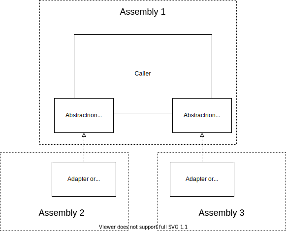

The [TestApi](../../posts/2020/2020-08-21-Test-Api-InPractice.md) pattern helps decouple tests from our system and enables more stable and reusable tests.
I've shown how I [use the pattern in F#](../../posts/2021/2021-10-08-TestApi-in-FSharp-revised.md). Now here's a similar example in C#.
<!--more-->


## Motivating Context
Suppose you're following [SOLID](https://en.wikipedia.org/wiki/SOLID) at the architectural level. This means each service pushes it's dependencies behind abstractions that it owns and some later caller injects the concrete implementations. 



The calling service likely expects all dependency implementations to behave consistently from the perspective of the service. This includes queries and any side-effects the service would be effected by.

TestApi allows us to write those shared behavior expectations once and verify them across many implementations or configurations.

## Example: Testing an abstract dependency

Suppose we have a service
```cs
class ChatClient{
    IThreadAccess threadAccess;
    IUserAccess userAccess;
    IAttachmentAccess attachmentAccess;
    IChatNotifier notifier;

    public ChatClient(IThreadAccess threadAccess, IUserAccess userAccess, IAttachmentAccess attachmentAccess, IChatNotifier notifier){
        //...
    }

    public void Send(Message message){
        //...
    }

    public Thread[] GetThreads(UserId userId){
        //...
    }
}
```

One can imagine how some of the service dependencies could vary. For example, we might have a stand-alone user store or we might want to leverage a shared user store with the hosting application. We might want to store attachments in blob storage, or publishes them to a CDN for fast delivery, or use a shared media service used across the application. These are valid use cases, but not the concern of our ChatClient. Our ChatClient only cares that it can orchestrate the sending and browsing of messages effectively. We can guarantee consistent behavior of ChatClient's dependencies and of the client itself by testing with TestApi.

Consider this example against `IUserAccess`
```cs
// Service Assembly
public interface IUserAccess{
    Profile GetUserProfile(UserId userId);
}


// Test Assembly

public abstract class UserAccessTests{

    public abstract ITestApi SutFactory();

    [Fact]
    public void SavedUserProfilesCanFetched(){
        ITestApi testApi = SutFactory();

        Profile expectedProfile = //...
        testApi.SaveUserProfile(profile);
        Profile actualProfile = testApi.GetUserProfile(profile.UserId);

        Assert.Equal(expectedProfile, actualProfile)
    }

    public interface ITestApi{
        Profile GetUserProfile(UserId userId);
        void SaveUserProfile(Profile userProfile);
    }
}
```

A few things to notice. 
- `TestApi != system interface`: Having the test suite define it's own api allows our test to define expectations differently than the system. In this case, it allows us to create users even if the system interface doesn't have a mechanism to do so.
- `Abstract test class + SutFactory`: The test suite is defined as abstract and requires any derivatives to implement the SutFactory. This allows us to control all lifetimes of test api instances within the test suite while allowing derivative test suites to vary how the test subject is constructed.


Here's a few example test api implementations
```cs
public class InMemoryUserAccessTests : UserAccessTests{
    public override ITestApi SutFactory(){
        return InMemoryUserAccessTestApi();
    }

    public class InMemoryUserAccessTestApi : UserAccessTests.ITestApi{
        InMemoryUserAccess inMemoryUserStore = new InMemoryUserAccess();
        IUserAccess userAccess = inMemoryUserStore;

        public Profile GetUserProfile(UserId userId){
            return userAccess.GetUserProfile(userId);
        }
        public void SaveUserProfile(Profile userProfile){
            inMemoryUserStore.SaveUserProfile(userProfile);
        }
    }
}

public class SharedIdentityUserAccessTests : UserAccessTests{
    public override ITestApi SutFactory(){
        return SharedIdentityUserAccessTestApi();
    }

    public class SharedIdentityUserAccessTestApi : UserAccessTests.ITestApi{
        SharedIdentityService identityService;
        IUserAccess userAccess;
        public InMemoryUserAccessTestApi(SharedIdentityService identityService){
            this.identityService = identityService;
            userAccess = new SharedIdentityUserAccess(identityService);
        }

        public Profile GetUserProfile(UserId userId){
            return userAccess.GetUserProfile(userId);
        }
        public void SaveUserProfile(Profile userProfile){
            identityService.SaveUser(UserFromProfile(userProfile));
        }
    }
}
```

This may seem like a lot of added code compared to directly testing a component. However, we get to share the core test suite across all implementations, resulting in overall less code!

## Example: Testing a service with multiple configurations
The same approach we used to test an abstract dependency applies for testing the main service. We have an abstract test class with thin derivatives that implement the test api.

The main difference is that the service usually won't have separate implementations. Instead, we want to test the service with different dependency configurations.

This is even easier. We only need to write one test api implementation that accepts an injected instance of the service. We can then derive test suites for any dependency configuration simply.

```cs

public class ChatClientTestApi: ChatClientTests.ITestApi{
    // A test API
    ChatClient chatClient;
    public ChatClientTestApi(ChatClient chatClient){
        this.chatClient = chatClient;
    }

    // implemented api methods go here

}


public class UnitChatClientTests : ChatClientTests{
    public override ChatClientTests.ITestApi SutFactory(){
        // TODO: create an instance of ChatClient with test double dependency implementations
        ChatClient client = new ChatClient(new InMemoryThreadAccess(), new InMemoryUserAccess(), new InMemoryAttachmentAccess(), new SpyChatNotifier());
        return ChatClientTestApi(client);
    }
}

public class IntegrationChatClientTests : ChatClientTests{
    public override ChatClientTests.ITestApi SutFactory(){
        // TODO: create an instance of ChatClient with fully-fledged dependencies
        ChatClient client = new ChatClient(new SqlThreadAccess(), new ActiveDirectoryUserAccess(), new FileSystemAttachmentAccess(), new EmailChatNotifier());
        return ChatClientTestApi(client);
    }
}
```

## Conclusion

C# users of TestApi can still benefit from test reuse. The use of inheritance makes the reuse less straightforward compared to F#, but the overhead is still fairly low and the pattern is fairly easy to trace. I've certainly found it worth the reduction in duplicated tests.