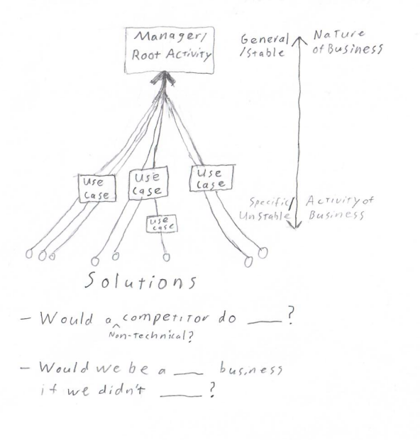

There are many ways to modularize a system. I initially learned Volatility-based Decomposition. I now speak in more Domain-Driven Design terms. However, I consider this a change in framing more than a change in strategy.
<!--more-->

First, let's overview the techniques to get on the same page.

## Volatility-Based Decomposition

Volatility-based Decomposition is all about discovering what is likely to change in a system, then isolating those elements of change.

The nature of the problem is the underlying force that determines volatility. The problem essence can be refined from user activities with questions like
- Would a non-technical competitor do _____?
- Would we be a ______ business if we didn't do ____?
- If this business process was done on paper, would we do ___?

I've previously used this visual to show use cases converging into underlying needs.

This doesn't mean we avoid change-prone business activities. It means we try to understand what parts of the business are more or less stable so our design can avoid strong coupling to unstable concepts. The goal is to improve long-term agility by reducing rework from predictable changes.

Volatility-based Decomposition is very similar to both the Single Responsibility Principle and Information Hiding.
The Single Responsibility Principle states that each unit of code should have one reason for change (one key design force). Information Hiding dictates that code should be decomposed to hide how work is accomplished, thus minimizing conceptual scope, rather than decomposing based on steps, resource types, or other factors.

Notifications are a prime example. A system may start by notifying users via email. Since email is the only approach, it's tempting to bake email notifications directly into flows around the code. However, this spreads email-specific knowledge all over the codebase. It makes it very difficult to add other kinds of notifications like SMS or push notifications, or even to modify how email notifications work. 

If we recognize notifications are likely to change often, we can instead take a more general approach. For example, sending notifications in response to business events raised by different parts of the system. The business flows then know nothing about specific notifications and don't change if an email format or the delivery medium change. I've demonstrated similar notifications scenarios with code examples in [Open-Closed Principle by Example: Interchangable Implementations](../../posts/Open-Closed-by-Example/2023-03-02-3-Interchangable-Dependencies.md) and 
[Notification Refactor Case Study](../../posts/2020/2020-08-14-Notification-Design.md).

<!-- Similar to changing notifications, a business may want to transition from some paper-based or manual step into more automated solutions, but needs to maintain the manual processes during the transition. Isolating that manual flow under a consistent abstraction allows the two flows to be swapped or even run side-by-side without other parts of the system changing.
 -->

## Domain-Driven Design

[Domain-Driven Design](https://en.wikipedia.org/wiki/Domain-driven_design) (DDD) urges programmers to reflect the business in their code. That includes type names, method names, code organization, and the decomposition of sub-systems and components. 

For example, an e-commerce business will likely divide its workers into distinct roles like: purchasing, packing, delivery, and more. A domain-driven software system for this company would have sub-systems, or sub-domains, serving each of these roles in the company. The programming teams and codebases may even be divided on those lines.

I recently wrote how [Domain-driven sub-domains satisfy the Single Responsibility Principle](../../posts/2023/2023-06-12-Sub-domains-and-SRP.md).

DDD also encourages programmers and business experts to use the same terms and concepts as much as possible. This improves communication and increases likelihood that programmers will unlock new understanding of the business's nature, and thus create a more stable (and useful) system.

## DDD and Volatility Decomposition are Fundamentally Related

Both DDD and Volatility-based Decomposition are tools for understanding the essence of a problem and thus creating a more stable system with the right kinds of flexibility.

Volatility-based decomposition uncovers the business domain through trying to isolate likely changes. DDD isolates likely causes of change by modeling the software after the business. 

In other words, both tools dig at the same design forces, just from different angles.
As such, they compliment each other and work well together.

Overall, I think DDD is the more direct and attainable approach. Programmers are unlikely to find better separation of responsibilities than most industries have developed over time through much experience. Therefore, modeling the business starting with how the business understands itself shortcuts discovery of key separable design forces.

 