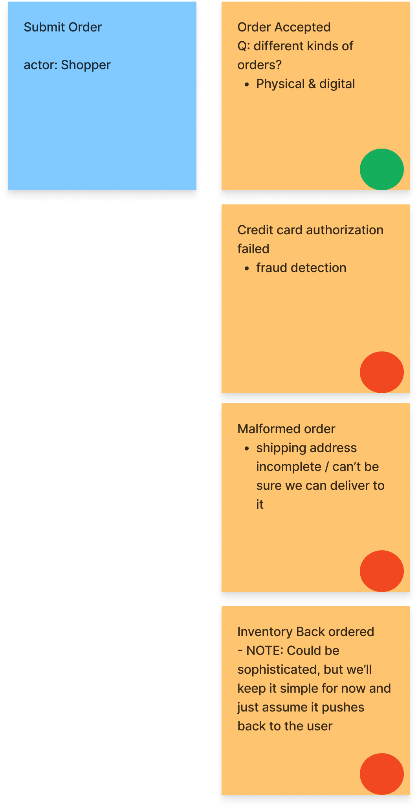

[Event storming](http://ziobrando.blogspot.com/2013/11/introducing-event-storming.html) for UI-focused flows was a bit confusing at first,
but the right questions can lead to great insights.
<!--more-->

## Event Storming Review

Event storming is a modeling technique. The variant I'm exploring focuses on modeling process flows across a business.
Stakeholders from many parts of the business work together to create a shared high-level understanding of the overall business process. 

For a brief introduction [read Zio Brandolini's post](http://ziobrando.blogspot.com/2013/11/introducing-event-storming.html). For more exploration, including examples,
checkout [Awesome Event Storming](https://github.com/mariuszgil/awesome-eventstorming).

Some of the key words are 
- **Events**: Events are facts. They represent something that *definitely happened* in a process *that other parts of the process may need to know about*. Example, `OrderCanceled`
- **Commands**: Commands are intents. They represent some actor's intent to change the state of the system, but that change could fail. Example, `CancelOrderRequest`
- **Flow**: Not a true event storming word, but I'll use it to describe a series of commands and events that form a larger experience. For example, the `CancelOrderRequest` might result in a `OrderCanceled` event, or in another event like `OrderCancelFailed (Reason: Item Already Shipped)`

Sticky notes are usually used to represent commands and events. Here's a simple example flow. The command is blue and the events are orange-ish.

## The Exercise 

I've been working through an event stormming exercise on an e-commerce system.

The event storm started with fulfillment flows. Finding events for these internal flows was fairly intuitive. You can see a sample of it in [Event Modeling and Business Differentiation](../../posts/2023/2023-09-10-Event-Modeling-and-business-differentiation.md)

The shopping experience proved more challenging. 

We were trying to tackle user flows like searching for products and adding them to the shopping cart.
We could think of commands, but there didn't seem to be any sensible events in many cases. 

### Trying Read Models

First, we turned to read models. After all, read models exist for cases where what the users sees is more important than what they do. However, this quickly felt like it was devolving into UI mocking. 

It shifted our focus to a lot of localized details, and away from the larger picture of the business. 

I researched and didn't find any event storm examples that used read models heavily. 
Many didn't use them at all, and those that did introduced them later.

### Clarifying Event Storm Priorities

For some segments of software, particularly the UI, it's hard to look past the interactions. But consider the goal of an event storm. It's not about designing UIs. It's not even necessarily about designing software. Event storming (at least the variation I'm practicing) is about modeling the business process flow across the business. 

We don't need to know about localized interactions or detailed flows. In fact, these details can quickly bog down the storming session and the model. That doesn't mean the detailed interactions are unimportant, it's just that there are other tools for discovering UI flows and interactions. If a user flow can happen many different ways without breaking expectations of other parts of the business, then it probably doesn't need to be in the event storm. Those localized interactions can usually be clarified with a smaller subset of stakeholders, not the full spectrum of stakeholder present in an event storm.

### Focusing on Process Dependencies

Applying this mindset to the shopping experience encouraged us to step back to a broader view. We asked, in general, "what can the user do that we need to know about?". This question pretty quickly led to a fairly small set of events, but those event were sufficient to describe what other parts of the system might need to know.

This result was exciting. It produced a clear picture of the user interactions, from a business process point of view. A very different kind of picture than we would expect from a mocking or journey mapping point of view.

Even better, this approach generalizes pretty easily. For any segment of the process we can ask "What can happen in ____ department that other roles need to know about?". 
It focuses the storm back on events and commands, reducing the number of concepts the team needs to learn to storm effectively.

These questions also reduce potential clutter or unnecessary detail. The event storm doesn't need to record every stateful operation or action. Our goal is to map out the process across the whole business, so we only need to identify what can happen that others need to know about or that captures a key change in the business process. Identifying these events help us understand interactions across the business, build a manageable shared mental model of that process, and iron out transfers in responsibility.

## Conclusion

In summary, interaction-centric processes can tempt us into excessive detail. Probably in part because we can picture the UI and a good UI is important.

However, event storms aren't meant to capture localized detailed interactions (UI or otherwise). They're meant to capture the flow of process between parts of the business.

Asking questions like "What can ___ do that other roles need to know about?" returns the focus to the overarching business process and 
facilitates focused modeling without getting mired in details that segments of the company can decide for themselves.
 