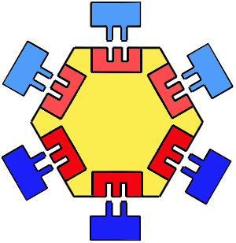

<!-- 
TODO: I never discuss what adapters can map into
TODO: I like calling out that services become the lowest layer in the call chain. Where does that fit now?
 -->
<!-- TODO: This got really long. Consider tightening it up -->
This series clarifies the [Open-Closed Principle (OCP)](https://en.wikipedia.org/wiki/Open%E2%80%93closed_principle) with examples. This post applies the OCP to the system level with architecture patterns like ports and adapters.
<!--more-->

I recommend you read the [series intro post](./2023-03-02-0-Intro-to-OCP.md) if you haven't already. This post also leans heavily into ideas established in the previous [post on flexible behaviors](./2023-03-02-3-Interchangable-Dependencies.md).

As a reminder, the Open-Closed Principle illuminates how components can adapt to caller needs without changing internally. Dependency Inversion (DI) is key to OCP with dependencies. When a component defines it's own dependency abstractions it can compose different dependency implementations without changing itself. Different callers can reuse that component's flow without changing the flow itself.

## Ownership of Abstractions

Did you notice a conflict between Dependency Inversion and the Open-Closed Principle? 

I'll give you a moment to think about it.

...

I've repeatedly described Open-closed principle as a component defining flexibility on it's own terms. Dependency Inversion specifies that *abstractions belong to the callers*.
So, who owns the abstractions? The component or it's caller?

The answer depends, but is often *each own their own abstractions*. A service protects its domain from incoming callers with flexible APIs like tags or callbacks. It also protects its domain from dependency details with Dependency Inversion. In this way a component or service can be fully self-defined with no external dependencies. Such services do not interact with each other directly because that would require a service to dependend on external ideas. Instead, something else needs to map between the abstractions of these self-contained services.

<!-- Dependency Inversion is OCP because a flow defines flexibility on it's own terms. The flexibility just happens to be dependency implementations.   -->

## Ports and Adapters

This pattern of fully self-defined services with connectors in-between is key to a composable architecture. 

Many have rediscoved this idea. Consequentially, this pattern goes by many names: [Clean Architecture](https://blog.cleancoder.com/uncle-bob/2012/08/13/the-clean-architecture.html), [Hexagonal Architecture](https://en.wikipedia.org/wiki/Hexagonal_architecture_(software)), [Onion Architecture](2023-03-02-0-Intro-to-OCP.md), or Ports and Adapters.
These approaches are [all fundamentally the same](https://blog.ploeh.dk/2013/12/03/layers-onions-ports-adapters-its-all-the-same/).

I generally say Ports and Adapters. I think it provides the best analogy for how the pattern works.
<!-- TODO: either cite this or find a license-free image -->


At the core we have some service or component (yellow). It defines the ways external actors are allowed to customize the service as ports (red). Then adapters (blue) are created to map other services into the ports.


Other services also selfishly define their own abstractions/ports. Adapters bridge the gap. This separates the business rules from composition of those rules. The result is a highly flexible and reusable system. The services are more like domain-specific libraries than an inherently connected system. Changes tend to be far more isolated, involving a single service or a service and some adapters.


I'll discuss more benefits, but let's look at a more concrete example first.

## Example: Chat System
I've referenced a chat system for examples throughout this series. Now we'll look at the overall structure of the system.

Specifically we'll focus on MessagingClient and its dependencies. MessagingClient is where the core domain logic happens. MessagingClient has four main dependencies 
- IMessageNotifier: Notify when a message was sent. Covered in the [flexible behavior post](./2023-03-02-3-Interchangable-Dependencies.md)
- IThreadAccess: Read or save thread information, not including messages in the thread
- IMessageAccess: Read or save messages
- IAttachmentAccess: Read or save attachments to messages

### Anti-Example: Externally owned abstractions

I must stress again that *callers own abstractions*. This also means dependency interfaces and data contracts. Ports and Adapters falls apart without this and the system loses flexibility.

Consider this diagram where the ports are defined externally.


This structure leads to one of two scenarios
1. *Abstractions gear toward implementations*: This leads to [header interfaces](https://blog.ploeh.dk/2010/12/02/Interfacesarenotabstractions/). The interface simply becomes a pass-through for an implementation and is no longer an abstraction. The domain workflow has to bend around the semantics of the dependency. These interfaces usually accumulate so many operations that alterative implementations are heavy and not maintained. The cohesion of the operations is low, making them difficult to decorate or to properly implement alternatives.
2. *Abstractions try to gear toward multiple callers*: This situation is even worse. The abstraction accumulates semantics from multiple callers, and causes every caller to be coupled to the semantics of every other caller. This semantic coupling is sneaky and fragile. Every caller has to be considered when changing the interface or implementation.

### Improvement: Service-owned Abstractions

Now consider if MessagingClient owns its dependency abstactions (i.e. IMessageNotifier, IThreadAccess, IMessageAccess, IAttachmentAccess).


The dependency interfaces live in the same package as MessagingClient.
Adapters *outside* of the MessagingClient's package map the dependency interfaces & data contracts to concrete implementations.

We've [already seen](./2023-03-02-3-Interchangable-Dependencies.md) an example of this using IMessageNotifier. The same flexibility applies for each dependency.

Consider IAttachmentAccess. It could directly adapt to a 3rd-party storage service like S3, BlobStorage, or a CDN. Our application could also decide to centralize campaign documents and adapt IAttachmentAccess into a custom CampaignDocumentService. We could even use the different adapters to migrate between storage options.

Note how threads and messages are both being stored to relational databases. This could be the same database, or it could be separate. The service does not depend on the data store to manage relationships. It handles relationships in the logic layer. This removes implicit data assumptions between dependencies and keeps port implementations interchangeable. This was a hard step for me to take and I wrote [a thorough post about it](../../posts/2021/2021-01-01-Accessors-Services-Not-Servants.md). 

All together, each dependency of MessagingClient can be swapped independently without changes the MessagingClient.

## Architecture Benefits

All of these ports and adapters can feel like a lot of inderection. Is it worth it?

As always, the answer depends. Components with little change or short lifetimes probably don't need this approach. Frequently changed or reused components will save effort with this approach pretty quickly.

### Testability
Domain rules are usually the focus of system behavior. Ports and Adapters isolates domain rules with swappable dependencies. This approach is highly testable. Testability alone is usually worth the effort of the extra indirection.


### Reusable Domain Rules & Diminishing Complexity

The [last post](./2023-03-02-3-Interchangable-Dependencies.md) demonstrated how a single port enabled the MessagingClient to adapt to testing, new kinds of notifications, or even dynamic notification types without changing the core messaging client. The specific mix of notifications was also configurable per consumer of MessagingClient.

This benefit extends to all kinds of services.

Services that use externally defined dependency abstactions must change internally to support new compositions of their dependencies. They also effectively only support one composition at a time. This results in "rip-and-replace" updates. In contrast, Ports and Adapter services accumulate compositions as swappable adapters, creating an ever greater palette of options for reusing a service.

OCP also pushes sub-domains and domain rules to [become more flexible to accommodate new caller needs](https://blog.cleancoder.com/uncle-bob/2017/03/03/TDD-Harms-Architecture.html) rather than carving new specific paths through the system. Thus, the system becomes more flexible and reusable over time instead of more complex and entangled.

These quickly result in less code for the same outcomes.

### Isolate Cross-cutting Concerns
Composing services with adapters enables a similar but broader benfit: [separation of cross-cutting concerns into decorators](https://blog.ploeh.dk/2010/04/07/DependencyInjectionisLooseCoupling/).

Logging, authentication, retry policies, caching, and more can all be accomplished without changing any domain service. Instead they are accomplished with [decorators](https://en.wikipedia.org/wiki/Decorator_pattern).

Decorators sit between the caller and the called component. They add some functionality and then pass off to another implementation of the same interface. 


Consider this decorator that logs when another notifier fails
```cs
class ErrorLogMessageNotifier: IMessageNotifier{

    private IMessageNotifier decorated;
    private Logger logger;
    public NotificationLogger(IMessageNotifier decorated, Logger logger){
        this.decorated = decorated;
        this.logger = logger;
    }

    void NotifyMessageSent(Message message){
        try{
            decorated.NotifyMessageSent(message);
        }
        catch (Exception e){
            logger.Error(e);
        }
    }
}

// somewhere else
IMessageNotifier notifier = new ErrorLogMessageNotifier(new SendGridMessageNotifier(), new Logger());
```

Addressing cross-cutting concerns withing a service distracts from the essential domain logic and causes sneaky coupling between components that could otherwise be generically reused.
Separating these concerns into decorators clarifies the business logic and allows different cross-cutting decisions to be composed at configuration time for different consumers.

### Progressive Integrations
<!-- TODO: not sure about this section -->
Layered architectures commonly try to isolate a business layer from databases and 3rd party services with a data access layer.

The goal is to reduce coupling to the external vendors or storage choices. Unfortunately this often becomes a [conforming container](https://blog.ploeh.dk/2014/05/19/conforming-container/) where the service is trying to hide a whole domain from the entire system. There is no focused abstraction other than re-modeling the wrapped domain. I've seen (and done) this many times with identity and payment services. They often become pass-thru code that doesn't fully decouple the 3rd party and feels pointless to maintain.

Ports and Adapters reduces the gap between first and third party services. Each service protects its own domain, so we don't depend on system-wide wrappers of external domains. Individual services can write adapters directly to 3rd party services, infrastructure, or other services in the system without causing coupling. 

Adapters are focused to a single service and much easier to implement than shared data abstraction layers. Thus, services defining their own abstactions unintuitively tends to reduce ceremony compared to shared abstraction layers.


### Trimability and Progressive Change

Ports and Adapters isolates composition of services in adapters. This allows for flexible and progressive system evolution.
Not only for adding features, but also removing them.

Suppose we want to migrate data stores. A new adapter can be written for the new data store plus a migration decorator. The migration decorator can ensure that we read and write to the old data store while also writing to the new data store until we are sure all data is migrated. Then we replace the migration adapter with just the new data store adapter. We could even add another phase that reads and writes to the new store, but still writes to the old store until we're sure the migration worked. This can all be done without changing the core service. It could even be done dynamically using feature flags.

This same kind of progressive swap can be done with all kinds of behaviors, not just data storage. The old dependencies don't have to be thrown away. They can be kept as an option to swap back in. Keeping the old implementation doesn't muddy the current integration because each is isolated to its own adapter.

### Protocol Agnostic

This pattern is not limited to systems that run in-process. In fact, communication protocol between services also becomes flexible. Different adapters can be used to support different protocols. The services don't care if the adapter sources from dependencies that are in-process, background work, REST APIs, or something else. Deployment strategy becomes a configurable option when using Ports and Adapters.


## Paradigm Disclaimer

This series has shown ports and adapter implementations from a common Object-Oriented perspective. This architecture style is not limited to OO, though it looks different in other programming paradigms. Check out Mark Seemann's adaptation to [functional programming](https://blog.ploeh.dk/2016/03/18/functional-architecture-is-ports-and-adapters/).

## Further reading
I'll admit this concept takes some experimentation to understand. Here are resources that helped me and some writtings about my own process learning this pattern
- [Layers, Onions, Ports, Adapters: it's all the same](https://blog.ploeh.dk/2013/12/03/layers-onions-ports-adapters-its-all-the-same/)
- [Notification Refactor Case Study](../../posts/2020/2020-08-14-Notification-Design.md)
- [Async Refactor Case Study](../../posts/2020/2020-09-11-Background-Task-Refactor.md)
- [Accessors: Services Not Servants](../../posts/2021/2021-01-01-Accessors-Services-Not-Servants.md)
- [Clean Architecture+: Check-in and Benefits](../../posts/2020/2020-09-17-Solid-Structure-Checkin.md)
- [Clean Architecture](https://blog.cleancoder.com/uncle-bob/2012/08/13/the-clean-architecture.html)
- [Incremental Accessors](../../posts/2020/2020-12-25-Incremental-Accessors.md)
- [Ports and Adapters](../../posts/2020/2020-12-19-Ports-and-Adapters.md)
- [DI-Friendly Framework](https://blog.ploeh.dk/2014/05/19/di-friendly-framework/)


## Conclusion

The Open-Closed Principle and Dependency Inversion applied together fully protect services from external domains. Each service owns its abstactions, and services talk to each other through adapters. This pattern is called Ports and Adapters architecture.

Ports and Adapters clears the way for flexible systems where
- domain services are reuseable libraries 
- cross-cutting concerns are isolated and composed 
- integrations can be accumulated and composed instead of torn out and replaced
- dependencies can be trimmed and progressively migrated
- deployment doesn't effect service implementations


<!-- ## General pattern

The chat library example extends to all kinds of services.


In general, you have some core workflow or logic that is self-contained using OCP and DI to define "ports". Other services are then mapped into these ports using adapters that live outside the assembly of the core workflow.


In this way the core workflow or business logic becomes the lowest layer in the dependency chain. It only knows about abstractions (i.e. interfaces and data contracts) that it's created for itself. The core workflow comes with little baggage. It only knows about the domain problem it solves and everything else is composed later via ports. The core service is thus maximally reusable between different consumers. They could be other services in our own system or external users we've never thought of and may never know about. -->
