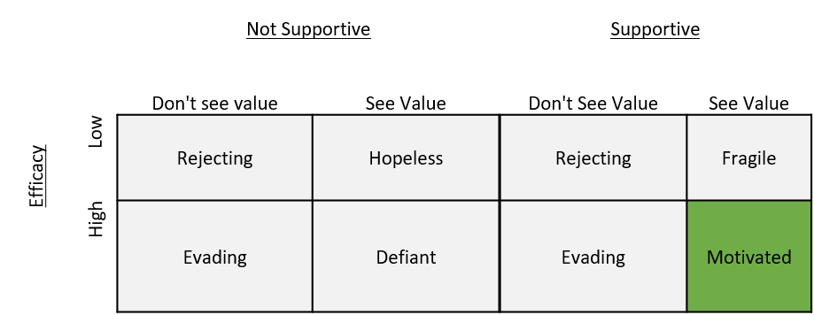

I come from the world of startups. Companies with interesting products fail every day. Despite novel products, customers are disinterested and avoidant.

In software, unit tests are widely acknowledged to be good practice. However, few developers write them.

These two cases are prime examples of motivation failures.
<!--more-->

Motivation has two main components

1.  Value: ‘Students’ (customers, etc) must believe an action can lead to a desired outcome

2.  Efficacy: They must believe that they are capable of realizing the desired outcome

Value propositions are a core concept in the business and sales. Customers, employees, etc. all bring their goals and beliefs into an interaction. Mis-aligned goals cause frustration and disinterest. It feels like there is no unified purpose or value.

A clear value proposition addresses this disconnect. Know the value your product or lesson provides and identify overlap with the student’s goals. Goals will never align completely, but highlighting the overlap clarifies a relationship and aligns individuals to a common outcome.

Efficacy is sneakier. It is one’s belief in their ability to accomplish a given outcome. Low efficacy is often identified by statements like “I’m not good at…” or “I can’t…”.

Efficacy is largely determined by one’s past experiences and the attribution for success or failure. Students perform best when they attribute success to intrinsic factors (e.g. skill, intelligence) and effort, and failure to external factors (e.g. lack of info) and lack of effort.

Perception of support also plays a key role. Here is a nice summative chart

|                 |      | <u>Not Supportive</u> | <u>Supportive</u> |                 |           |
| --------------- | ---- | --------------------- | ----------------- | --------------- | --------- |
| <u>Efficacy</u> |      | Don't see value       | See Value         | Don't See Value | See Value |
|                 | Low  | Rejecting             | Hopeless          | Rejecting       | Fragile   |
|                 | High | Evading               | Defiant           | Evading         | **Motivated** |

## Signs of Failure

  - Disinterest, avoidance, low effort

  - Undermining or guarded behavior

  - “I not good at __”, “I’m not a __”, “_\_ isn’t my subject”

## Tools

  - Real-world tasks, connect to goals

  - Clear expectations (rubrics)

  - Clear ways you provide support

  - Early success opportunities

  - Interest curves: vary the challenge with peaks and breaks

  - Give students opportunity for choices and reflection
  - [Principled Negotiation](https://www.amazon.com/Getting-Yes-Negotiating-Agreement-Without/dp/0143118757)

