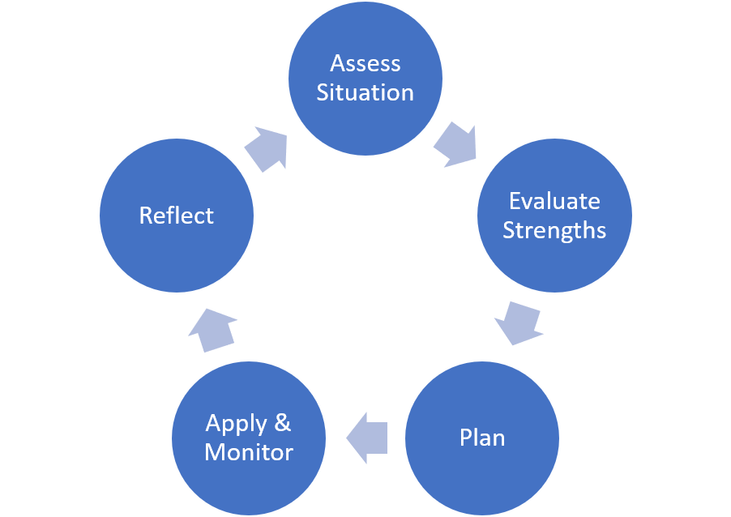

I see programming as an extended application of problem solving, and problem solving is just a different view on self-learning. Encouraging self-learning makes a team skillful and robust.
<!--more-->

**Learning is a skill like any other**. It requires practice, feedback, and ways of organizing knowledge.

The component skills of self-learning are.

  - Assessing what needs to be done

  - Comparing current resources and abilities to the task

  - Plan an approach accounting for the task and current abilities

  - Evaluate effectiveness while applying the plan

  - Reflect and make changes based for future attempts

These boil down to monitoring and controlling one’s own actions. In Japanese culture, the process of constantly monitoring and making small improvements is called *kaizen*.

I favor a variant of this process by Building a Discipling Culture called the circle. It builds in accountability and feedback in addition to personal monitoring and control.

Research shows that masters spend proportionately much more time planning an approach while novices tend to blindly apply whatever approach they think of first. Further, more mature problem solvers will recognize when an approach is failing and try a new one. Immature problem solvers with try the same approach many times independent of the result.

Kaizen or metacognitive process can be developed in students by asking why questions and providing self-learning frameworks. This causes students to reflect on their own processes and equips them to improve.

It is also important to address views on knowledge. Students perform better when they see knowledge as malleable, as something that can be intentionally improved. Statements of that paint knowledge as static should be addressed (e.g. “I’m not good at math”, “Math isn’t my subject”).

## Signs of failure 

  - Overdependence: things fall apart when you are away

  - Spend most of your time answering questions for a few

  - Frequently a bottleneck for efforts

  - Students/Employees are uncomfortable making decisions independently

## Tools

  - Why Questions: boundary cases, contrasting examples

  - Self-reflection: Prompt students to reflect on how they practice and learn. Perhaps compare against recommended strategies.

  - Learning Process Examples: the circle, 5-step learning loop

  - Exam Wrappers: When handing back an exam, have students fill out a brief reflective survey identifying trends in their errors, how they studied, and how they can improve practice strategies for next time. Hand them back before the next exam.

  - View on Knowledge: Make it clear that knowledge is malleable and can be intentionally improved

  - Interest curves: Vary the challenge. Alternate between building confidence and stretching abilities
