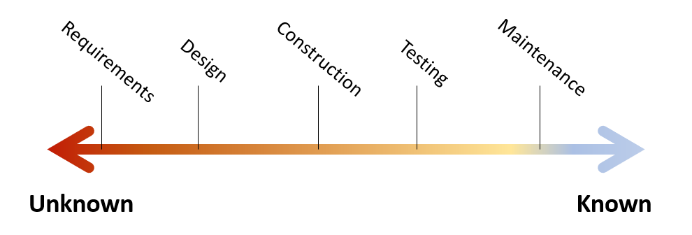

This series is about design process and organizing our thoughts for effective development. The main goal is to establish a mental model and intuition for effective design process. This post explores the key questions "What is programming?", "What is Software Engineering?", and how these answers relate to our design process.
<!--more-->

If you haven't considered these questions yourself, take a few moments to write down your thoughts. It [aid the learning process](../../posts/2022-03-07-Small-Teaching-Review.md#predicting).

## The Nature of Software 

Let's first tackle the first motivational question: "What is programming?".

I'm a firm believer that [programming is problem modeling](../../posts/2022-02-18-Programming-is-Problem-Modeling.md). I love the quote from Fred Brooks

> The programmer, like the poet, works only slightly removed from pure thought-stuff. He builds his castles in the air, from air, creating by exertion of the imagination.  
> \- Fred Brooks, Mythical Man-month

As programmers, we take problems of all kinds and we translate them into the exact language of software. We can encode almost anything our imagination can grapple.

Real world problems are often messy and partially self-conflicting. Unwinding the many facets of such problems into automated processes is a difficult, non-deterministic, and a beautiful [act of design](https://www.developerdotstar.com/mag/articles/reeves_design.html). Programs are designs, and programming is an act of design. 

Software Engineering is then the repeatable process for encoding ideas in software both economically and reliably.

## Spectrum of Clarity

The high-level of software process is often known as the [software development life cycle](https://en.wikipedia.org/wiki/Systems_development_life_cycle). The Software Engineering Body of Knowledge (SWEBOK) [imagines this process as a series of clarifying translations](../../posts/2021-08-13-Swebok-transform-view.md). I tend to view the software life cycle as a spectrum of clarity.

The spectrum starts with much unknown and ends with most elements known. At the beginning, we know relatively little about the problem we're solving. Each development stage (i.e. requirements, design, construction, ...) is a [checkpoint in how well we've defined the problem](../../posts/2022-02-18-Programming-is-Problem-Modeling.md#increment-to-good-enough). Eventually the problem is clear enough for a computer to execute.

I don't mean to profess a strict linear flow like [waterfall](https://en.wikipedia.org/wiki/Waterfall_model). Remember that programming is a design activity and design is messy. It's common to uncover questions in a later phase that force us to reconsider decisions we made in an earlier phase. This is natural and part of understanding the problem. What we want to avoid is cycling back frequently or back multiple stages. Cycling back, especially multiple stages back, undermines previous work and is expensive. 

This spectrum from unknown to known plays out both at the work item level and system level. A work item is clarified through this spectrum until it can be released. A system is clarified as completed work enables feedback and new possibilities. [Agile](https://en.wikipedia.org/wiki/Agile_software_development) emphasizes small complete units of work for this reason. Better wrong than vague, and try to discover "wrong" early.

## Better Wrong Than Vague

> Better wrong than vague  
> \- Fred Brooks, Design of Design

This quote is the single most important idea you can take from this series. If you remember nothing else, remember it's better to be wrong than vague.

Clarity is key to effective design, and software itself is a complex design activity. We deal with messy problems and problems that often change. It's inevitable that we will get some elements wrong. What matters is [when and how we discover errors](https://stevemcconnell.com/articles/an-ounce-of-prevention/).

Vague ideas can still be wrong, it's just less likely that anyone will notice. Vague problems get swept down the line and pile up until they're nearly insurmountable. Software has coined the derogatory term "legacy" for such software, and it's often a place projects go to die.

Favoring clarity means identifying and communicating our assumptions. It means encoding what we think we know about the problem we're solving and how we're solving it. It's about ordering our thoughts well.

Clearly communicated ideas, unlike vague ideas, enable collaboration, comparison, reviews, and future reference.

Everything that follows in this series builds a framework to order thoughts well. The next step is achieving incremental progress using the [Design Tree](./2022-06-16-2-Design-Tree-and-Incremental-Progress.md).

