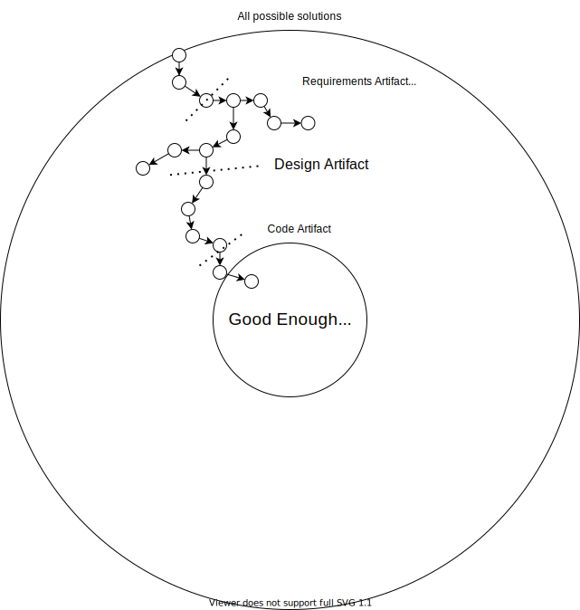

This series is about design process and organizing our thoughts for effective development. The main goal is to establish a mental model and intuition for effective design process. This post explores the fundamental questions "How do we effectively break down problems?", "Can software be perfect?", and "What makes software good?"
<!--more-->

If you haven't considered these questions yourself, take a few moments to write down your thoughts. It [aids the learning process](../../posts/2022-03-07-Small-Teaching-Review.md#predicting).

## Design Tree and Effective Work Increments

We previously explored how software is a design process, and the software lifecycle is a spectrum of clarity. This sets the big picture, but leaves the fine-grained process unclear. The design tree can help us zoom in and understand the second motivational question "How do we effectively break down problems?".

The design tree is the idea that we can represent all possible design routes as a [graph](https://en.wikipedia.org/wiki/Graph_(discrete_mathematics)).
- Each graph node is is a possible decision we could make
- Edges show how later decisions depend on earlier ones
- The furthest nodes in the graph (or leaves) represent complete solutions.

Every path to a leaf represents a series of decisions we can make to arrive at a final solution.

Humans have a natural tendency toward depth-first approaches. We try to find complete solutions all at once.

The problem is that depth-first tends to lead to a lot of wasted work. We generally don't have all the information we need at first. Our solution probably wont quite match our need, and a lot of work ends up thrown away.

Breadth-first search, where every next option is considered before making a choice, is not feasible. There are often effectively infinite options for any given decision in a design. 

A healthy design process uses an incremental approach. 
- First identify the next *key* decision
- Identify a few (3+) *likely* solutions to the decision
- Explore each route in enough depth to lock in an answer
- Lock in the answer and repeat until there are no more key decisions, at which point you have a complete solution.

Such a process nearly guarantees we'll reach a solution that meets our current understanding of the problem with as little rework as possible. It also meshes well with how our brains work. We break off smaller problems that are easier to solve. Each decision reduces the solution space, making downstream decisions easier with fewer unknowns to consider. 

## Self-Similar Process

Fortunately, this design exploration is [self-similar](https://en.wikipedia.org/wiki/Self-similarity). The thought process is about the same no matter what scale or type of problem we face. This includes each sub-problem we explore while iterating through the design tree. In each increment we consider

- **Must haves (Requirements)**: Any qualites that *must* be satisfied to consider the problem solved
- **Nice to haves (Secondary goals)**: Qualities we'd like have, but are not essential to call the problem solved
- **Constraints**: Qualities that aren't essential to the problem in all cases, but must be met in our case. Common examples include budgets, timelines, available personnel, and hardware limitations
- **Solution Fit**: How we compare solutions against the enumerated goals and constraints.

First enumerate any known requirements, goals, and constraints. The list will probably evolve as we explore solutions, but it should serve as a strong initial filter for possible solutions.

Second, enumerate likely solutions. Consider how each solution category matches up to the goals and constraints. Possibly add new solutions based on your findings, and stop when you have a solution that meets all known needs. 

Break off another sub-problem if there isn't enough information to define the problem clearly or choose a solution. Repeat until the higher-level problem is clear enough to solve.

This process is similar for each sub-problem, but that doesn't mean it's mechanical or formulaic. Asking good questions and identifying the nature of a problem is a skill like any other. It gets better with experience and practice.

## Thread Matrix: How much effort

Enumerating requirements, goals, and constraints for evaluating solutions may sound like a lot of work, but it doesn't have to be. This process can fall anywhere from a few options weighed in your head, to sticky notes, to design documents, to expansive interviews and studies. A threat matrix helps us evaluate how important each decision is and how much effort we put into it.

On one axis we have impact should our decision be wrong, and on the other we have likelihood the decision is wrong. Decisions that are low-impact or unlikely to change don't need much consideration. Just pick something and move on. The higher impact or likelihood of change, the more time is worth investing to make sure the descision is right.

## Iterate to Good Enough

This brings us to our third and fourth motivating questions "Can software be perfect?" and "What makes software good?"

Think of how we iterate along the design tree. At each step we break off a problem, identify criteria we need to solve the problem, and stop when we have a solution that meets all criteria.

This is true for the overall process too. There is no one perfect solution. There are only solutions that meet our need as we understand it.

The increments help us refine our understanding of the problem, and step us closer to a satisfactory solution. Our enumerated understanding of need creates a "definition of done". This definition of done is our benchmark for "good" work. Any solution that meets those critera is "good". Any solution that doesn't meet the criteria is not a complete solution. Any work beyond this definition is speculative "gold plating". It solves a problem we don't currently need, which often translates into wasted work.

## Next
With this we've established the core ideas for effective design process. Next up we'll look at a particular technique for applying them, [ducks](./2022-06-16-3-Ducks.md).